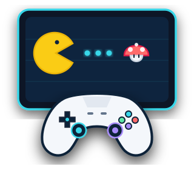
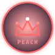
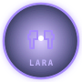
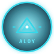
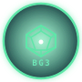

<!-- _class: title-slide -->
<!-- _paginate: false -->
<!-- _footer: "" -->

  

    
    UNIVERSITÀ DI ROMA TOR VERGATA · INFORMATICA
  

  <h1>Donne, gaming e inclusione</h1>
  

    Donne e cultura videoludica: radici storiche, dati di settore e considerazioni sui futuri sviluppi tra codice e società
  

  
  

    
01 <strong>Luca Gugliotta</strong> 0342634

    
02 <strong>Valerio Bernardi</strong> 0349538

    
03 <strong>Samuele De Santis</strong> 0348324

  

  
  
GENDER & INCLUSION · A.A. 2025–2026 · 4/09/2026

  

---

01 · LUCA GUGLIOTTA

01 / LA PROSPETTIVA INFORMATICA

## Perché parlarne da informatici?

  I videogiochi sono spazi sociali: le scelte di codice e design determinano chi può partecipare in sicurezza.

  

    

    

      

        

        
01

      

      <h3>CHI GIOCA</h3>
      

        
Voice chat & matchmaking

        
Tossicità, sicurezza e moderazione

      

    

  

  

    

    

      

        

        
02

      

      <h3>COSA VEDIAMO</h3>
      

        
Narrazione e stereotipi

        
Evoluzione del character design

      

    

  

  

    

    

      

        

        
03

      

      <h3>CHI SVILUPPA</h3>
      

        
Donne nella carriera del gaming

        
Ruoli tecnici, leadership e divario

      

    

  

  

  

    Il modo in cui programmiamo uno spazio digitale determina chi potrà viverlo.
  

---

01 · LUCA GUGLIOTTA

02 / DEMOGRAFIA E MERCATO

## La realtà è quasi paritaria. La percezione no.

Il paradosso percettivo: la partecipazione reale sfiora la parità, ma lo stereotipo del gamer resta maschile.

PUBBLICO GLOBALE · ESA 2025

48% DONNE
52% UOMINI

Quasi 1 gamer su 2
Soglia parità (50%)
ESA 2025

<strong>Europa:</strong> 47,8% donne · 55 milioni di giocatrici (VGE)

<strong>Italia:</strong> 41,0% donne · 5,7 milioni su 14M gamer (IIDEA)

CRESCITA ANNUALE · ITALIA (IIDEA)

  

    
Traino del mercato

    
+14,0%

    
GIOCATRICI DONNE

  

  

    
Crescita stabile

    
+2,5%

    
GIOCATORI UOMINI

  

<strong>Dinamica di settore:</strong> l'espansione dei videogiocatori in Italia è trainata in modo predominante dall'ingresso del pubblico femminile.

Il problema non è l'assenza delle donne nel gaming, ma la loro invisibilità culturale.

---

02 · VALERIO BERNARDI

03 / ESPERIENZA ONLINE

## Quando basta una voce per diventare un bersaglio

L'attivazione del microfono, il più delle volte, rivela l'identità femminile esponendo l'individuo a un'immediata ostilità nei suoi confronti.

  

    

    

      
ADL · HATE IS NO GAME REPORT 2024

      
76%

      
ha subito <strong>molestie nelle partite online</strong>

      
Insulti, minacce e comportamenti tossici durante il gioco competitivo

    

  

  

    

    

      
PRIMO TARGET IDENTITY-BASED DAL 2019

      
48%

      
delle giocatrici: <strong>molestie mirate al genere</strong>

      
Bersaglio più frequente rispetto a qualsiasi altra categoria d'identità

    

  

COME SI DIFENDONO LE GIOCATRICI ONLINE

  

    

    

      
Microfono in mute

      
Rinuncia forzata alla <strong>voice chat</strong> di squadra

    

  

  

    

    

      
Nickname neutro

      
Mascheramento dell'<strong>identità di genere</strong>

    

  

  

    

    

      
Solo party chiusi

      
Ritiro dal <strong>matchmaking pubblico</strong>

    

  

  FONTI: WELLS ET AL., 2025 (RITIRO DALLA CHAT O ABBANDONO) · GAMERGATE 2014–15 (UN PRECEDENTE ANCORA ATTUALE)

---

02 · VALERIO BERNARDI

04 / CHARACTER DESIGN & RAPPRESENTAZIONE

## Da contorno a Soggetto: L'Evoluzione femminile nei videogiochi

Dall'oggettificazione passiva degli esordi alla complessità psicologica e all'identità modulare contemporanea.

  

    

      
    

    
ARCHETIPO · ANNI '80

    <h3>Princess Peach</h3>
    
Donna in pericolo

    
Personaggio passivo privo di agentività: <strong>esiste per essere salvata</strong>.

  

  

    

      
    

    
1996 · TOMB RAIDER

    <h3>Lara Croft</h3>
    
Male gaze & azione

    
Costruita per il <strong>male gaze</strong>, ma <strong>autonoma e coraggiosa</strong>.

  

  

    

      
    

    
2017–2020 · REALISMO

    <h3>Aloy · Senua · Ellie</h3>
    
Complessità & vissuto

    
<strong>Competenza, salute mentale</strong> e <strong>corpi non standardizzati</strong>.

  

  

    

      
    

    
OGGI · LIBERTÀ

    <h3>Identità modulare</h3>
    
Disaccoppiamento

    
Corpo, voce e pronomi si <strong>separano liberamente</strong> (BG3, The Sims 4).

  

  

  

    La figura femminile passa da oggetto della narrazione a soggetto della narrazione.
  

---

03 · SAMUELE DE SANTIS

05 / DIETRO LO SCHERMO: IL LAVORO

## Quasi metà gioca. Solo un quarto sviluppa.

La parità nel consumo non si riflette nella composizione dei team di produzione e ingegneria software.

  

    

    

      
GDC · STATE OF THE GAME INDUSTRY 2024–2025

      
23–25%

      
donne nella <strong>forza lavoro videoludica</strong>

      

        Quota che si riduce a <strong>≈20%</strong> nei ruoli tecnici core e programming (UE)
      

    

  

  

    

    

      
DALLA FRUIZIONE AL CODICE

      

        

          
01 · CHI GIOCA

          
48%

          
Pubblico Gaming

          
Parità tra chi gioca

        

        

          
02 · CHI LAVORA

          
25%

          
Forza Lavoro

          
Negli studi di sviluppo

        

        

          
03 · CHI PROGRAMMA

          
≈20%

          
Ruoli Tecnici Core

          
Ingegneria e codice

        

      

      

        Il divario aumenta avvicinandosi alla scrittura del codice e ai ruoli apicali.
      

    

  

  

    
↔

    

      
Segregazione orizzontale

      
uomini e donne concentrati in ruoli diversi

    

  

  

    
↥

    

      
Segregazione verticale

      
meno presenza femminile salendo nella gerarchia

    

  

---

03 · SAMUELE DE SANTIS

06 / POTERE ECONOMICO E COMPETITIVO

## Il gap cresce salendo di livello

Dalle asimmetrie retributive alle barriere d'accesso nei circuiti professionistici eSports.

  

    

    

      
DIVARIO RETRIBUTIVO

      
−24%

      
gender pay gap medio negli studi USA

    

  

  

    

    

      
SENIORITY & COMPENSI

      

        

          UOMINI
          68%
        

        

          vs
        

        

          DONNE
          38%
        

      

      

        Oltre 125k$ tra game designer con 6+ anni di esperienza
      

    

  

  

    

    

      
PUBBLICO ESPORTS GLOBALE

      
33%

      
Spettatrici femminili (Deloitte)

      
Presenza attiva limitata dall'ambiente ostile

    

  

SPAZI COMPETITIVI INCLUSIVI

  

    
◆

    

      
VCT Game Changers

      
<strong>Valorant · Riot Games:</strong> circuito professionistico ufficiale e Academy per creare visibilità e carriere esports sostenibili.

    

  

  

    
◆

    

      
ESL Impact

      
<strong>Counter-Strike · ESL:</strong> ecosistema competitivo dedicato per abbattere le barriere d'ingresso nel panorama storico di CS2.

    

  

---

03 · SAMUELE DE SANTIS

07 / DALLA DIVERSITÀ ALL'INCLUSIONE

## Non basta essere presenti: bisogna poter partecipare

Dalla semplice rappresentazione numerica alla progettazione attiva di spazi e ambienti equi.

  

    

    

      

        
01

      

      
Design inclusivo

      
Personaggi e sistemi di personalizzazione meno stereotipati.

    

  

  

    

    

      

        
02

      

      
Community sicure

      
Moderazione efficace, reporting chiaro e contrasto all’hate speech.

    

  

  

    

    

      

        
03

      

      
Opportunità eque

      
Accesso ai ruoli tecnici, alla leadership e ai percorsi competitivi.

    

  

  

  

    L'inclusione non è un'aggiunta al prodotto: è un requisito fondamentale di progettazione.
  

---

<!-- _class: closing -->

03 · SAMUELE DE SANTIS

08 / SINTESI E CONCLUSIONI

## La presenza non è ancora piena inclusione

Dalla constatazione dei divari alla costruzione consapevole di ambienti di gioco e lavoro paritari.

  

    Le donne nel gaming ci sono già.
  

  

    La sfida è capire come questo mondo possa cambiare, affinché tutte e tutti possano viverlo, lavorarci e competere alle stesse condizioni.
  

  

    

    

      L’inclusione parte dalla valorizzazione dell’unicità della persona.
    

  

  

    
    GENDER & INCLUSION · TOR VERGATA · 2025–2026
  

  

    
⚡ FONTI PRINCIPALI

    <ul class="sources-list">
      <li><strong>ESA (2025)</strong> Global Power of Play Report</li>
      <li><strong>ADL (2024)</strong> Hate is No Game Report</li>
      <li><strong>IIDEA (2025)</strong> I videogiochi in Italia nel 2024</li>
      <li><strong>GDC (2025)</strong> State of the Game Industry</li>
      <li><strong>VGE (2024)</strong> Key Facts Report (GameTrack)</li>
      <li><strong>Wells et al. (2025)</strong> Frontiers in Psychology</li>
      <li><strong>Botto (2025)</strong> AboutGender Journal</li>
    </ul>
  

  DOSSIER ACCADEMICO COMPLETO CON BIBLIOGRAFIA IN FORMATO APA DISPONIBILE NEGLI ATTI DEL CORSO

