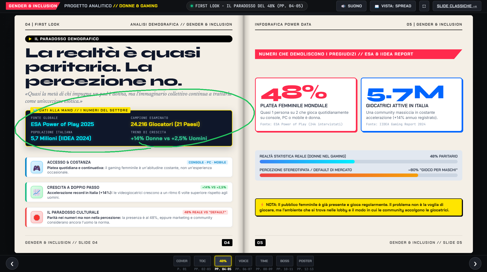
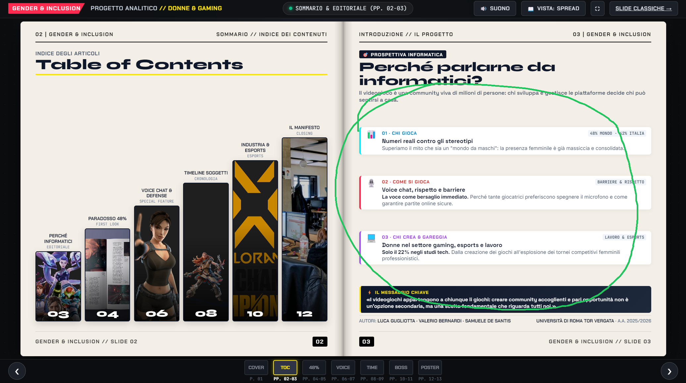
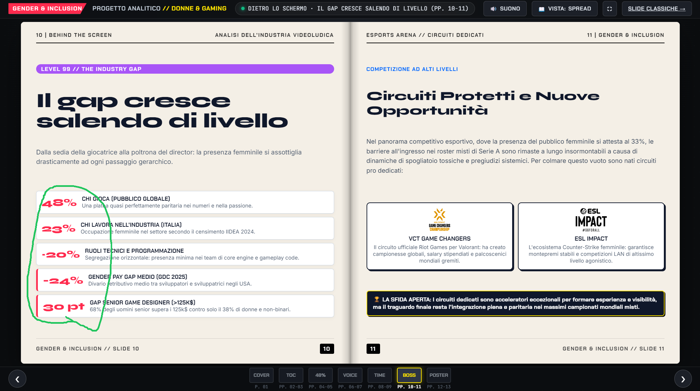
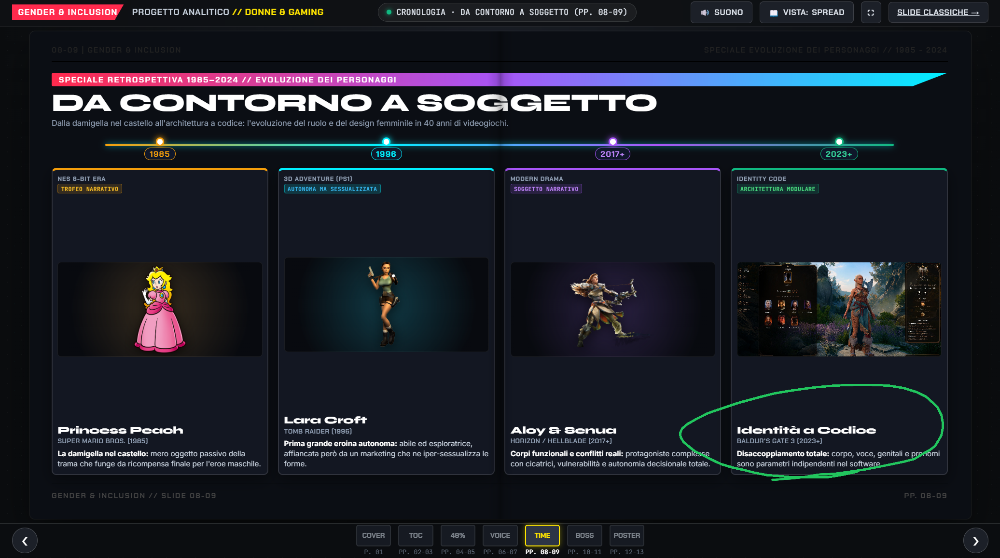
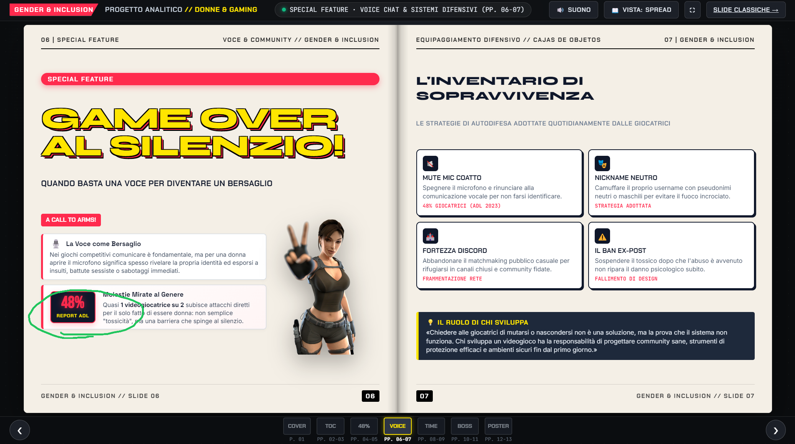
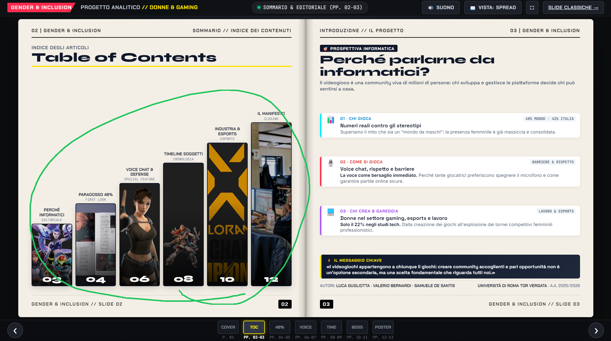

# 🚀 Report Revisione UI (Generato da Visual AI Bug Tracker)

**Data Sessione:** 9/14/2026 - 2:36:00 PM
**Totale Bug Rilevati:** 6

---

## 🐛 Bug #1: Desktop
* **Rotta / URL:** `file:///C:/Users/Luca/Desktop/UNI2/quartz/content/UNI/ANNO%203/GENDER%20INCLUSION/SLIDE/magazine.html#spread-2`
* **Dispositivo / Viewport:** Desktop
* **Ora scatto:** 2:32:11 PM

### 📝 Descrizione del Problema:
> prendi in considerazione questo e applicalo a quello che sto dicendo nel secondo bug

### 📸 Riferimento Visivo Annotato:


<details>
<summary>🔎 Clicca per espandere il Frammento HTML / DOM</summary>

```html
<main class="mag-workspace">
    <div class="mag-spread-viewport">

      <!-- ---------------------------------------------------------------------
           SPREAD 0: LA COPERTINA (CLUB NINTENDO / GAME INFORMER STYLE)
           --------------------------------------------------------------------- -->
      <!-- ---------------------------------------------------------------------
           SPREAD 0: LA COPERTINA WIDESCREEN 16:9 (CLUB NINTENDO / GAME INFORMER STYLE)
           --------------------------------------------------------------------- -->
      <section class="mag-spread single-page" id="spread-0" data-label="COPERTINA · EDIZIONE SPECIALE">
        <div class="mag-cover">
          <div class="cover-chequered-border"></div>

          <div class="cover-top-bar">
            <span>VOLUME 01</span>
            <span>UNIVERSITÀ DI ROMA TOR VERGATA · DIPARTIMENTO DI INFORMATICA</span>
            <span>EDIZIONE SPECIALE</span>
          </div>

          <!-- Embossed Beveled Masthead Bar -->
          <div class="cover-masthead-container">
            <div class="cover-masthead-pill">
              <h1 class="cover-masthead-title">GENDER &amp; INCLUSION</h1>
            </div>
            <div class="cover-masthead-subtitle">
              UTILIZZO DEI DATI PER CONTESTUALIZZARE IL MONDO DELLE DONNE NEL GAMING
            </div>
          </div>

          <!-- Widescreen 16:9 Body Grid -->
          <div class="cover-widescreen-grid">
            
            <!--
```
</details>

---

## 🐛 Bug #2: Desktop
* **Rotta / URL:** `file:///C:/Users/Luca/Desktop/UNI2/quartz/content/UNI/ANNO%203/GENDER%20INCLUSION/SLIDE/magazine.html#spread-1`
* **Dispositivo / Viewport:** Desktop
* **Ora scatto:** 2:32:45 PM

### 📝 Descrizione del Problema:
> a destra qui applica lo stesso concetto che ti avevo fatto applicare a slide 4, evidenzia i dati importanti per bene

### 📸 Riferimento Visivo Annotato:


<details>
<summary>🔎 Clicca per espandere il Frammento HTML / DOM</summary>

```html
<main class="mag-workspace">
    <div class="mag-spread-viewport">

      <!-- ---------------------------------------------------------------------
           SPREAD 0: LA COPERTINA (CLUB NINTENDO / GAME INFORMER STYLE)
           --------------------------------------------------------------------- -->
      <!-- ---------------------------------------------------------------------
           SPREAD 0: LA COPERTINA WIDESCREEN 16:9 (CLUB NINTENDO / GAME INFORMER STYLE)
           --------------------------------------------------------------------- -->
      <section class="mag-spread single-page" id="spread-0" data-label="COPERTINA · EDIZIONE SPECIALE">
        <div class="mag-cover">
          <div class="cover-chequered-border"></div>

          <div class="cover-top-bar">
            <span>VOLUME 01</span>
            <span>UNIVERSITÀ DI ROMA TOR VERGATA · DIPARTIMENTO DI INFORMATICA</span>
            <span>EDIZIONE SPECIALE</span>
          </div>

          <!-- Embossed Beveled Masthead Bar -->
          <div class="cover-masthead-container">
            <div class="cover-masthead-pill">
              <h1 class="cover-masthead-title">GENDER &amp; INCLUSION</h1>
            </div>
            <div class="cover-masthead-subtitle">
              UTILIZZO DEI DATI PER CONTESTUALIZZARE IL MONDO DELLE DONNE NEL GAMING
            </div>
          </div>

          <!-- Widescreen 16:9 Body Grid -->
          <div class="cover-widescreen-grid">
            
            <!--
```
</details>

---

## 🐛 Bug #3: Desktop
* **Rotta / URL:** `file:///C:/Users/Luca/Desktop/UNI2/quartz/content/UNI/ANNO%203/GENDER%20INCLUSION/SLIDE/magazine.html#spread-5`
* **Dispositivo / Viewport:** Desktop
* **Ora scatto:** 2:33:13 PM

### 📝 Descrizione del Problema:
> metti i dati effettivi ed evidenzia le effettive statistiche e dati di analisi utili

### 📸 Riferimento Visivo Annotato:


<details>
<summary>🔎 Clicca per espandere il Frammento HTML / DOM</summary>

```html
<main class="mag-workspace">
    <div class="mag-spread-viewport">

      <!-- ---------------------------------------------------------------------
           SPREAD 0: LA COPERTINA (CLUB NINTENDO / GAME INFORMER STYLE)
           --------------------------------------------------------------------- -->
      <!-- ---------------------------------------------------------------------
           SPREAD 0: LA COPERTINA WIDESCREEN 16:9 (CLUB NINTENDO / GAME INFORMER STYLE)
           --------------------------------------------------------------------- -->
      <section class="mag-spread single-page" id="spread-0" data-label="COPERTINA · EDIZIONE SPECIALE">
        <div class="mag-cover">
          <div class="cover-chequered-border"></div>

          <div class="cover-top-bar">
            <span>VOLUME 01</span>
            <span>UNIVERSITÀ DI ROMA TOR VERGATA · DIPARTIMENTO DI INFORMATICA</span>
            <span>EDIZIONE SPECIALE</span>
          </div>

          <!-- Embossed Beveled Masthead Bar -->
          <div class="cover-masthead-container">
            <div class="cover-masthead-pill">
              <h1 class="cover-masthead-title">GENDER &amp; INCLUSION</h1>
            </div>
            <div class="cover-masthead-subtitle">
              UTILIZZO DEI DATI PER CONTESTUALIZZARE IL MONDO DELLE DONNE NEL GAMING
            </div>
          </div>

          <!-- Widescreen 16:9 Body Grid -->
          <div class="cover-widescreen-grid">
            
            <!--
```
</details>

---

## 🐛 Bug #4: Desktop
* **Rotta / URL:** `file:///C:/Users/Luca/Desktop/UNI2/quartz/content/UNI/ANNO%203/GENDER%20INCLUSION/SLIDE/magazine.html#spread-4`
* **Dispositivo / Viewport:** Desktop
* **Ora scatto:** 2:33:36 PM

### 📝 Descrizione del Problema:
> tutto perfetto ma migliora di poco il font e la lettura nell'ambito di dimensione testuale

### 📸 Riferimento Visivo Annotato:


<details>
<summary>🔎 Clicca per espandere il Frammento HTML / DOM</summary>

```html
<main class="mag-workspace">
    <div class="mag-spread-viewport">

      <!-- ---------------------------------------------------------------------
           SPREAD 0: LA COPERTINA (CLUB NINTENDO / GAME INFORMER STYLE)
           --------------------------------------------------------------------- -->
      <!-- ---------------------------------------------------------------------
           SPREAD 0: LA COPERTINA WIDESCREEN 16:9 (CLUB NINTENDO / GAME INFORMER STYLE)
           --------------------------------------------------------------------- -->
      <section class="mag-spread single-page" id="spread-0" data-label="COPERTINA · EDIZIONE SPECIALE">
        <div class="mag-cover">
          <div class="cover-chequered-border"></div>

          <div class="cover-top-bar">
            <span>VOLUME 01</span>
            <span>UNIVERSITÀ DI ROMA TOR VERGATA · DIPARTIMENTO DI INFORMATICA</span>
            <span>EDIZIONE SPECIALE</span>
          </div>

          <!-- Embossed Beveled Masthead Bar -->
          <div class="cover-masthead-container">
            <div class="cover-masthead-pill">
              <h1 class="cover-masthead-title">GENDER &amp; INCLUSION</h1>
            </div>
            <div class="cover-masthead-subtitle">
              UTILIZZO DEI DATI PER CONTESTUALIZZARE IL MONDO DELLE DONNE NEL GAMING
            </div>
          </div>

          <!-- Widescreen 16:9 Body Grid -->
          <div class="cover-widescreen-grid">
            
            <!--
```
</details>

---

## 🐛 Bug #5: Desktop
* **Rotta / URL:** `file:///C:/Users/Luca/Desktop/UNI2/quartz/content/UNI/ANNO%203/GENDER%20INCLUSION/SLIDE/magazine.html#spread-3`
* **Dispositivo / Viewport:** Desktop
* **Ora scatto:** 2:35:15 PM

### 📝 Descrizione del Problema:
> non mi paice questa cosa del 48% quando dico di evidenziare meglio i dati non intendo di creare questo ma di metterli in risalto con semplicemente dimensione font colori glow ecc

### 📸 Riferimento Visivo Annotato:


<details>
<summary>🔎 Clicca per espandere il Frammento HTML / DOM</summary>

```html
<main class="mag-workspace">
    <div class="mag-spread-viewport">

      <!-- ---------------------------------------------------------------------
           SPREAD 0: LA COPERTINA (CLUB NINTENDO / GAME INFORMER STYLE)
           --------------------------------------------------------------------- -->
      <!-- ---------------------------------------------------------------------
           SPREAD 0: LA COPERTINA WIDESCREEN 16:9 (CLUB NINTENDO / GAME INFORMER STYLE)
           --------------------------------------------------------------------- -->
      <section class="mag-spread single-page" id="spread-0" data-label="COPERTINA · EDIZIONE SPECIALE">
        <div class="mag-cover">
          <div class="cover-chequered-border"></div>

          <div class="cover-top-bar">
            <span>VOLUME 01</span>
            <span>UNIVERSITÀ DI ROMA TOR VERGATA · DIPARTIMENTO DI INFORMATICA</span>
            <span>EDIZIONE SPECIALE</span>
          </div>

          <!-- Embossed Beveled Masthead Bar -->
          <div class="cover-masthead-container">
            <div class="cover-masthead-pill">
              <h1 class="cover-masthead-title">GENDER &amp; INCLUSION</h1>
            </div>
            <div class="cover-masthead-subtitle">
              UTILIZZO DEI DATI PER CONTESTUALIZZARE IL MONDO DELLE DONNE NEL GAMING
            </div>
          </div>

          <!-- Widescreen 16:9 Body Grid -->
          <div class="cover-widescreen-grid">
            
            <!--
```
</details>

---

## 🐛 Bug #6: Desktop
* **Rotta / URL:** `file:///C:/Users/Luca/Desktop/UNI2/quartz/content/UNI/ANNO%203/GENDER%20INCLUSION/SLIDE/magazine.html#spread-1`
* **Dispositivo / Viewport:** Desktop
* **Ora scatto:** 2:35:58 PM

### 📝 Descrizione del Problema:
> infine qui metti gli screenshot delle slide effettive al posto di questi, metti gli screenshot sostituisci queste foto con gli screenshot delle relative slide e basta non fare altro modifica solo il sorgente

### 📸 Riferimento Visivo Annotato:


<details>
<summary>🔎 Clicca per espandere il Frammento HTML / DOM</summary>

```html
<main class="mag-workspace">
    <div class="mag-spread-viewport">

      <!-- ---------------------------------------------------------------------
           SPREAD 0: LA COPERTINA (CLUB NINTENDO / GAME INFORMER STYLE)
           --------------------------------------------------------------------- -->
      <!-- ---------------------------------------------------------------------
           SPREAD 0: LA COPERTINA WIDESCREEN 16:9 (CLUB NINTENDO / GAME INFORMER STYLE)
           --------------------------------------------------------------------- -->
      <section class="mag-spread single-page" id="spread-0" data-label="COPERTINA · EDIZIONE SPECIALE">
        <div class="mag-cover">
          <div class="cover-chequered-border"></div>

          <div class="cover-top-bar">
            <span>VOLUME 01</span>
            <span>UNIVERSITÀ DI ROMA TOR VERGATA · DIPARTIMENTO DI INFORMATICA</span>
            <span>EDIZIONE SPECIALE</span>
          </div>

          <!-- Embossed Beveled Masthead Bar -->
          <div class="cover-masthead-container">
            <div class="cover-masthead-pill">
              <h1 class="cover-masthead-title">GENDER &amp; INCLUSION</h1>
            </div>
            <div class="cover-masthead-subtitle">
              UTILIZZO DEI DATI PER CONTESTUALIZZARE IL MONDO DELLE DONNE NEL GAMING
            </div>
          </div>

          <!-- Widescreen 16:9 Body Grid -->
          <div class="cover-widescreen-grid">
            
            <!--
```
</details>

---

