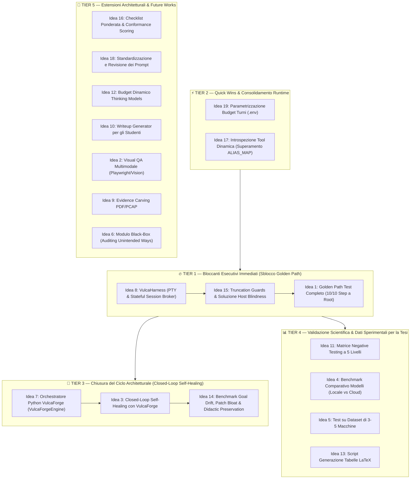

# 💡 Idee Future di Progetto & Roadmap Prioritizzata (VulcaTest)

> **Documento di Roadmap Strategica e Registro Evolutivo di Tesi**  
> Classificazione, analisi di fattibilità e ordinamento per priorità operativa delle 19 direttrici di sviluppo del framework **VulcaTest**.

---

## 🗺️ Matrice dei Tier e Ordine di Esecuzione

Per massimizzare l'efficacia dello sviluppo e garantire la validità scientifica della tesi, le idee sono articolate in **5 Tier sequenziali**. Il principio cardine è lo **sblocco del Golden Path completo (Tier 1)**: senza sessioni interattive e PTY, l'agente non può raggiungere `root`, bloccando a monte i benchmark e il self-healing.



---

## 📑 Quadro Sinottico dei 5 Tier

| Tier | Focus Principale | Idee Incluse | Valore Chiave per la Tesi |
| :--- | :--- | :--- | :--- |
| **🔥 TIER 1** | **Bloccanti Esecutivi Immediati** | **Idea 8**, **Idea 15**, **Idea 1** | Risolve il freeze TTY e l'Host Blindness; sblocca per la prima volta il percorso nominale 100% conforme fino alla Root Flag. |
| **⚡ TIER 2** | **Quick Wins & Robustezza Runtime** | **Idea 19**, **Idea 17** | Pulizia del debito tecnico in mezza giornata (configurazione da `.env`, tool dinamici senza dizionari statici). |
| **🔄 TIER 3** | **Closed-Loop Self-Healing** | **Idea 7**, **Idea 3**, **Idea 14** | Il vertice metodologico: connessione dell'Healing Ticket a VulcaForge per autoriparare i playbook Ansible e re-testare. |
| **📊 TIER 4** | **Dati Sperimentali & Benchmark** | **Idea 11**, **Idea 4**, **Idea 5**, **Idea 13** | Rigore quantitativo: confronto modelli, matrice di difetti iniettati, testing multi-ambiente e tabelle LaTeX per la tesi. |
| **🌟 TIER 5** | **Perfezionamento & Future Works** | **Idea 16**, **Idea 18**, **Idea 12**, **Idea 10**, **Idea 2**, **Idea 9**, **Idea 6** | Raffinamenti qualitativi, prompt engineering avanzato e direttrici di ricerca per il capitolo delle conclusioni. |

---

## 🔥 TIER 1: Bloccanti Esecutivi Immediati (Sblocco Golden Path)

*Questi tre punti costituiscono la priorità operativa assoluta. Senza di essi, l'Executor non può superare la FASE_6 e la macchina non può essere promossa a `[CONFORME]`.*

---

### 8. Gestione Sessioni Interattive & Reverse Shell: VulcaHarness (Stateful Session Broker)
* **Il Limite Teorico degli Agenti LLM (Stateless RPC vs Stateful Stream):**
  - Tutti i framework correnti per agenti di cybersecurity (HexStrike, AutoGen, CrewAI, OpenAI tools) operano nel paradigma **Stateless Request/Response (RPC)**: l'agente invia una stringa di comando, il server lancia `subprocess.run()`, attende la morte del processo e restituisce l'output.
  - La realtà dell'Offensive Security e del Penetration Testing richiede invece canali bidirezionali a stati (**Stateful Duplex Channels / PTY / TCP Sockets**):
    1. *Prompt interattivi a metà esecuzione:* comandi come `ssh`, `su`, `sudo -i`, `passwd`, o database client (`mysql`) chiedono input su TTY e con i runner sincroni vanno in hang/timeout (come visto in FASE_6 di Pizzeria B2R).
    2. *Connessioni asincrone in ingresso (Reverse Shells):* payload da `revshells.com` (bash `/dev/tcp`, python, netcat, php) richiedono che la macchina attaccante tenga aperta una porta in ascolto (`listen`), non bloccante, per poi interagire con la shell catturata lungo più turni dell'LLM.
    3. *Persistenza dello stato operativo (Context & Working Directory):* senza sessioni a stati, ogni turno perde `cd`, variabili d'ambiente (`export`) e privilegi acquisiti.
    4. *Sequenze GTFOBins / Escape interattivi:* l'interazione con editor come `sudo nano /etc/passwd` o `vi` richiede l'invio di byte di controllo (`Ctrl+O`, `\r`, `Ctrl+X`) dentro un terminale già allocato.

* **L'Architettura di VulcaHarness (Micro-modulo di ~160 righe su Kali):**
  - Un demone leggero in Python (`vulca_harness.py`) residente sulla macchina attaccante (Kali Linux) ed esposto come server indipendente **FastMCP** (es. su porta `8889`), mentre HexStrike continua a gestire i suoi 150 tool batch sulla porta `8888` senza alcun conflitto.
  - Gestisce un registro di sessioni in memoria `sessions = {id: SessionObject}` e implementa un multiplexer I/O non-bloccante tramite `pty` e `asyncio`.
  - **Le 4 Primitive Universali esposte all'Agente:**
    1. `harness_spawn(command, pty=True) -> session_id`: lancia comandi locali allocando un vero pseudo-terminale (es. SSH, GDB, `su`, client DB).
    2. `harness_listen(port, protocol="tcp") -> session_id`: apre un listener server TCP asincrono in background per catturare qualsiasi reverse shell senza bloccare il flusso dell'agente.
    3. `harness_interact(session_id, input_data=None, timeout=2.0) -> output`: invia byte/comandi/password alla sessione attiva e legge l'output con idle-drain non-bloccante e pulizia codici ANSI.
    4. `harness_close(session_id)` e `harness_list()`: ispezione e distruzione controllata dei socket e dei processi figli.

* **Scalabilità e Aggiunta a Costo Zero di Nuovi Tool e Driver:**
  - L'Harness rende l'agente **completamente agnostico rispetto al mezzo di comunicazione**. L'LLM interagisce sempre e solo con `interact(session_id, command)`:
    - *Container & Cloud:* `docker exec -it` o `kubectl exec` vengono gestiti come semplici sessioni PTY.
    - *Framework C2:* sessioni Metasploit (`meterpreter`) o agenti Sliver/Havoc possono essere incapsulati nello stesso broker.
    - *Tooling Helper di alto livello:* permette di costruire sopra l'Harness tool composti come `session_upload_file` (trasferimento file in base64 dentro la sessione attiva) o `session_privesc_check`.

* **Disaccoppiamento Pulito (Separation of Concerns):**
  - **VulcaTest (Windows / LangGraph):** il *Cervello* (logica di pianificazione, FSM a stati finiti, validazione contratti Pydantic, self-healing).
  - **HexStrike (Kali / Porta 8888):** la *Cassetta degli attrezzi batch* (Nmap, Gobuster, Nikto, Nuclei per scansioni pesanti una tantum).
  - **VulcaHarness (Kali / Porta 8889):** il *Sistema nervoso interattivo* (canali I/O persistenti, reverse shell e PTY streaming).

* **Valore Scientifico e Accademico per la Tesi:**
  - Dimostra che il framework non si limita a usare wrapper di terze parti o workaround fragili (`expect` inline), ma affronta e risolve formalmente uno dei problemi aperti più discussi nella letteratura degli agenti autonomi di sicurezza: la transizione da *stateless tool-use* a *stateful reactive environments*.

---

### 15. Il Caso FASE_7: Host Blindness, Context Explosion & Truncation Guards
* **L'Incidente:** In FASE_7 l'agente doveva cercare `/opt/test.sh` tramite `find / -name "*.sh"`. Avendo solo `execute_command`, ha lanciato il comando credendo di essere dentro il container, ma il comando è stato eseguito sull'**host Kali dell'attaccante** (Host Blindness).
  - Kali ha restituito oltre 80.000 caratteri (migliaia di righe di script di Metasploit, exploitdb, pacchetti).
  - L'output raw di 86 KB ha fatto esplodere a catena la context window dell'Executor (16.470 token su 8.192) e poi del Final Evaluator (17.286 token su 15.872), bloccando il report.
* **Le 3 Soluzioni Architetturali da Implementare:**
  1. *Truncation Guard su `mcp_bridge.py`:* Tagliare l'output di qualsiasi comando a max 4.000 caratteri con warning esplicito per l'agente (`[Output troncato: usa grep o head]`), impedendo a monte qualsiasi crash da token overflow.
  2. *Target Execution Wrapper (Post-Exploitation):* Nelle fasi successive all'ottenimento della shell (FASE 6+), imporre che i comandi vengano eseguiti dentro la sessione SSH (`harness_interact` o comando incapsulato), evitando che l'agente confonda la shell di Kali con quella del bersaglio.
  3. *Prompt Sanitizer nel Final Evaluator (`nodes.py`):* Troncare gli output dei tool calls a max 1.500 caratteri prima di passarli a Qwen 3.8 per la RCA.

---

### 1. Golden Path Test (Verifica del Successo Completo a 10 Step)
* **Cosa significa:** Finora abbiamo testato e dimostrato il ramo in cui la macchina fallisce (`FASE_2 [FAIL]` per assenza chat, `FASE_4 [FAIL]` per errore soppresso `@include`). Dobbiamo testare e convalidare il ramo in cui la macchina è sana e conforme al 100%.
* **Come fare:** Eseguire `attack_plan_golden_path.md` (con LFI diretta ed estrazione credenziali `user:user`) e far girare tutta la catena: Recon $\rightarrow$ LFI $\rightarrow$ estrazione password $\rightarrow$ SSH login $\rightarrow$ Privilege Escalation con sudo nano $\rightarrow$ Flag di root `[PASS]`.
* **Valore per la tesi:** Dimostra che il sistema sa sia bocciare una macchina rotta sia promuovere e certificare con verdetto `[CONFORME]` una macchina perfetta, estraendo la Root Flag `VDSI{r00t_pwn3d_p1zz4_m4rgh3r1t4}`.

---

## ⚡ TIER 2: Quick Wins & Consolidamento Runtime

*Interventi a basso sforzo e ad alto impatto per eliminare debito tecnico residuo e blindare la flessibilità del motore.*

---

### 19. Parametrizzazione del Budget dei Turni via Ambiente (.env e config.py)
* **Il Limite Attuale:** Nel metodo `run_step()` di `executor/executor.py`, il budget iniziale dei turni (`initial_budget = 6`) e il tetto massimo invalicabile (`hard_limit = 15`) sono definiti come valori di default cablati nella firma del metodo Python.
* **L'Intuizione:** Estendere il modulo unificato `config.py` per leggere tali parametri dall'ambiente:
  - `EXECUTOR_INITIAL_BUDGET` (default: 6)
  - `EXECUTOR_HARD_LIMIT` (default: 15)
* **Vantaggi e Valore per la Tesi:**
  1. *Flessibilità Operativa:* In una pipeline di CI/CD veloce per testare sanity check leggeri, un ricercatore può impostare `EXECUTOR_INITIAL_BUDGET=3` risparmiando token e tempo. Per challenge complesse che richiedono enumerazione estesa o password cracking, può alzarlo a 10 o 20 direttamente dal file `.env` senza dover modificare il codice.
  2. *Coerenza Architetturale (12-Factor App):* Completa la totale esternalizzazione dei parametri di runtime del motore agentico.

---

### 17. Superamento del Debito Tecnico di ALIAS_MAP: Registry-Aware Planning & Dynamic Tool Introspection
* **Il Problema di Debito Tecnico (Hardcoding statico):** In `executor/mcp_bridge.py`, l'adozione di un dizionario cablato a mano (`ALIAS_MAP = {"nmap": "nmap_scan", ...}`) rappresenta una soluzione fragile: se una challenge richiede tool aggiuntivi (es. `gobuster`, `sqlmap`, `nikto`, `wfuzz`), il bridge fallisce nell'esporre il tool corretto a meno di non aggiornare manualmente il codice Python.
* **La Soluzione a Monte: Registry-Aware Planning (Design by Contract):** Invece di far inventare nomi generici all'LLM durante la redazione del piano, `planner/planner.py` interroga preventivamente FastMCP via introspezione (`list_tools`), ricavando il catalogo ufficiale dei tool attivi. Nel prompt di compilazione di `ATTACK_PLAN.md`, il campo `allowed_tools` viene vincolato ai soli identificatori ufficiali.
* **La Soluzione a Valle: Dynamic Tool Introspection & Prefix Matching:** Per garantire robustezza anche contro Attack Plan scritti manualmente, il bridge adotta un matcher dinamico:
  ```python
  match = next((name for name in tools_dict if name.startswith(f"{key}_") or name == f"{key}_scan"), None)
  ```
* **Valore per la Tesi:** Loose Coupling e Design by Contract garantiti tra layer didattico e runtime di sicurezza.

---

## 🔄 TIER 3: Chiusura del Ciclo Architetturale (Closed-Loop Self-Healing)

*Il punto più alto e innovativo della tesi: collegare la diagnosi di VulcaTest al builder VulcaForge per autoriparare i container difettosi in un loop chiuso.*

---

### 7. Ingegnerizzazione dell'Orchestratore di Generazione in Python (VulcaForgeEngine)
* **L'intuizione:** Tenere Ansible per la configurazione dei servizi dentro i container (è lo standard del settore e funziona benissimo), ma **unificare e ripulire tutta la logica di generazione delle macchine in moduli Python moderni**.
* **Come strutturarlo:** Sostituire eventuali script bash sparsi con classi Python tipizzate (es. `VulcaForgeEngine`) per leggere i manifesti, gestire i template Jinja2 e invocare le build Docker programmaticamente.
* **Valore per la tesi:** Rende immediato e naturale l'aggancio programmatico tra VulcaForge e VulcaTest per il Self-Healing a zero interventi manuali.

---

### 3. Closed-Loop Self-Healing con VulcaForge
* **L'intuizione:** VulcaTest genera già `healing_ticket.json` con il componente colpevole (es. `webapps/pizzeria/index.php`), la causa radice (`IAC_GENERATION_DEFECT`) e la patch consigliata. Ora dobbiamo chiudere il cerchio collegandolo a VulcaForge.
* **Come implementarlo:**
  - Creare un agente riparatore (o script di patching) dentro VulcaForge che riceve il ticket JSON.
  - L'agente applica la modifica al template o al playbook Ansible, ricompila il container e re-innesca in automatico `main.py` di VulcaTest.
  - Se il secondo test passa `[PASS]`, il ciclo di autoriparazione è concluso con successo!
* **Valore per la tesi:** Dimostra una piattaforma completamente autonoma capace di auto-diagnosticarsi e auto-ripararsi.

---

### 14. Benchmark su Goal Drift, Patch Bloat & Didactic Preservation nel Self-Healing
* **Il problema:** Quando un LLM riceve il compito di riparare un file sorgente o un playbook Ansible sulla base del ticket di healing, rischia di subire drift:
  - *Patch Bloat:* Riscrive 100 righe di CSS o layout quando bastava inserire un form minimale di 5 righe.
  - *Scope Creep:* Aggiunge librerie o funzionalità extra non richieste dalla storyline didattica.
  - *Il "Paradosso del Secure-by-Default":* I modelli di coding tendono a sanificare le vulnerabilità. Se il riparatore vede una falla didattica (es. l'LFI `include($_GET['file'])`), rischia di "sanificarla", rendendo la sfida impossibile per gli studenti!
* **Metriche di Misura per la Tesi:**
  - *Diff Bloat Ratio:* Rapporto tra righe modificate dall'agente e righe strettamente necessarie.
  - *Didactic Invariant Preservation:* Verifica che dopo la patch lo step bloccato passi `[PASS]`, ma soprattutto che le vulnerabilità delle fasi successive siano rimaste intatte e sfruttabili.
  - *Guardrail della Minimal Invasive Patch:* Vincolare il riparatore a generare un formato `diff -u` minimale con divieto assoluto di refactoring estetico o bonifica di vulnerabilità didattiche intenzionali.

---

## 📊 TIER 4: Validazione Scientifica, Benchmark & Dati per la Tesi

*Fornisce la base empirica, le tabelle comparative e le metriche formali per i capitoli sperimentali della tesi.*

---

### 11. Matrice di Iniezione Guasti (Negative Testing Sistematico a 5 Livelli)
* **L'intuizione:** Per validare scientificamente la capacità diagnostica di VulcaTest, non basta testare un guasto casuale, ma serve una batteria di difetti controllati iniettati apposta nei sorgenti IaC.
* **I 5 livelli di difetto da testare (Suite a 14 Scenari):**
  1. *Rete:* Porta chiusa o bindata solo su `127.0.0.1` invece che su `0.0.0.0` (`NT-NET-01/02`).
  2. *Web/Backend:* Socket FastCGI/PHP-FPM spento (`502 Bad Gateway`) o file mancanti in webroot (`NT-WEB-01..04`).
  3. *Autenticazione:* Password errata o permessi errati su chiavi SSH (`StrictModes`) (`NT-AUTH-01..03`).
  4. *Privilege Escalation:* Bit SUID mancante su un binario o sintassi errata in `/etc/sudoers` (`NT-PRIV-01..04`).
  5. *Flag:* Permessi errati su `/root/flag.txt` o file vuoto (`NT-FLAG-01/02`).
* **Valore per la tesi:** Permette di calcolare la *Confusion Matrix* della Root Cause Analysis (Precision, Recall, F1-Score).

---

### 4. Benchmark Comparativo tra Modelli (Locale vs Cloud)
* **L'intuizione:** Dimostrare *perché* abbiamo adottato l'architettura ibrida o full-local con dati sperimentali alla mano.
* **Cosa confrontare:** Far girare lo stesso test su diversi modelli: **Qwen 3 Coder 30B**, **Qwen 3.8 27B**, **Gemini 3.8 Flash**, **Claude 3.5 Sonnet**, **Llama 3.3 70B**.
* **Metriche da misurare:**
  - *Success Rate:* Quanti step completano correttamente?
  - *Refusal Rate:* Quante volte il modello cloud si rifiuta di eseguire comandi per via dei safety filter?
  - *Tempo e Velocità:* Token al secondo e durata totale del test.
  - *Costi:* 0€ della workstation locale con AMD RX 9070 XT vs costo in token delle API cloud.

---

### 5. Benchmark su un Dataset di più Macchine del Laboratorio
* **L'intuizione:** Pizzeria B2R è stata il banco di prova principale. Per dare validità scientifica generale al framework, dobbiamo testarlo su più ambienti eterogenei.
* **Come implementarlo:**
  - Selezionare 3-5 macchine create per esami o per VulcAIn con vulnerabilità differenti (SQL Injection, Command Injection, path traversal, exploit su permessi SUID).
  - Creare uno script runner batch che esegue VulcaTest su tutte le macchine e compila una tabella riassuntiva con le metriche complessive.

---

### 13. Script di Benchmark & Generazione Tabelle LaTeX per la Tesi
* **L'intuizione:** Dopo aver eseguito decine di test su varie macchine, avremo molti file `run_summary.json` nell'Evidence Store con metriche preziose (tempi, tool calls, ratei di conformità).
* **Come implementarlo:** Uno script Python dedicato (`generate_thesis_tables.py`) che aggrega tutti i JSON dell'Evidence Store, calcola medie e deviazioni standard e genera direttamente tabelle formattate in sintassi **LaTeX** (`\begin{tabular}...`), pronte da incollare nel testo della tesi.

---

## 🌟 TIER 5: Estensioni Architetturali, Perfezionamento & Future Works

*Raffinamenti qualitativi, feature ad alto valore didattico e prospettive di ricerca ideali per il capitolo delle conclusioni e sviluppi futuri.*

---

### 16. Flessibilità del Verdetto di Conformance: Checklist Ponderata (Hard vs Soft Constraints), Early Exit e Conformance Scoring
* **Il Limite Attuale (Invariante Rigida "All-or-Nothing"):** Oggi il sistema applica una logica booleana pura: se anche un solo item su 5 della checklist è `passed=False`, l'intero step diventa `FAILED` (Fail-Fast).
* **Le 3 Evoluzioni da Introdurre:**
  1. *Checklist Ponderata (Hard vs Soft Constraints):*
     - **Hard Constraint (`[CRITICAL]`):** Condizione necessaria per la risolvibilità (porta aperta, LFI accessibile). Se fallisce $\rightarrow$ Step `FAILED` e blocco Fail-Fast.
     - **Soft Constraint (`[WARNING]` o `[INFO]`):** Requisito didattico o di usabilità (banner di benvenuto, layout conforme). Se non soddisfatto $\rightarrow$ genera una segnalazione nel report finale, ma consente alla pipeline di procedere per valutare il resto della catena.
  2. *Early Exit su Fallimento Incurabile:* Se al turno 2 l'agente constata con certezza che una risorsa non esiste (404 confermato), non consuma inutilmente i turni successivi e dichiara uscita anticipata risparmiando token.
  3. *Conformance Score Continuo:*
     $$\text{Conformance Score} = \frac{\sum w_{\text{passed}}}{\sum w_{\text{total}}} \times 100$$
     Permette di quantificare: *"La macchina è conforme al 92% (catena di attacco valida), con difetti minori di presentazione grafica (8%)"*.

---

### 18. Ottimizzazione, Standardizzazione e Miglioramento Generale di Tutti i Prompt
* **La Necessità di Revisione:** I prompt degli agenti si sono evoluti in modo incrementale. Per massimizzare affidabilità e rigore, è utile una campagna sistematica di revisione (*Prompt Engineering & System Directives*):
  1. *Prompt del Planner:* Aggiunta di few-shot examples per checklist atomiche e mapping esatto dei tool.
  2. *System Prompt dell'Executor:* Rafforzare il divieto di comandi ridondanti e standardizzare l'estrazione dei valori.
  3. *Prompt del Final Evaluator:* Strutturazione analitica dei capitoli di RCA (distinzione tra difetto di design didattico, errore IaC Ansible, o anomalia di runtime Docker).
  4. *Prompt del Ticket di Healing:* Formato strict diff-u senza preamboli discorsivi.
* **Esternalizzazione dei Prompt:** Separare i template dei prompt dal codice Python (in cartella `prompts/` o file Markdown/Jinja2), facilitando il versionamento e l'A/B testing.

---

### 12. Adattamento Dinamico del Budget di Thinking per Modelli di Reasoning
* **Il problema:** I modelli "ragionatori" (come Qwen 3.8) su prompt didattici lunghi rischiano di generare oltre 10.000 token di ragionamento interno, esaurendo il limite (`max_tokens`) prima di emettere il Markdown.
* **Come risolverlo:** Un middleware dinamico nell'SDK che calcola la finestra utile e forza parametri controllati (`reasoning_effort: "medium"` o `enable_thinking: False` a seconda se il nodo richiede sintesi o codice), prevenendo a monte qualsiasi blocco da saturazione token.

---

### 10. Writeup Generator Automatico per gli Studenti (Da Trace a Guida Didattica)
* **L'intuizione:** Quando una macchina supera tutti gli step (`[CONFORME]`), abbiamo nell'Evidence Store l'audit trail perfetto: comandi esatti funzionanti, log di output reali, flag estratti e screenshot.
* **Come implementarlo:** Un modulo downstream che rielabora questo trace e compila automaticamente la guida illustrata ufficiale della challenge (`WRITEUP_GENERATED.md`), garantendo che la guida per gli studenti corrisponda al 100% alla macchina reale.

---

### 2. Sistema di Screenshot & Ispezione Visiva (Visual QA Multimodale)
* **L'intuizione:** Spesso le web app didattiche usano JavaScript, bottoni o form grafici. Con un semplice `curl` rischi di non vedere se un elemento è nascosto da una regola CSS (`display: none`) o se il layout è rotto.
* **Come implementarlo:** Aggiungere un tool Playwright/Chromium che cattura screenshot e li passa a un modello Vision (Qwen2.5-VL o Gemini Flash Vision) per verificare se il pulsante o form è visibile e cliccabile a schermo.

---

### 9. Evidence Carving & OCR per Artefatti Complessi (PDF, PCAP, Immagini)
* **Il problema:** Se una challenge nasconde una password in un PDF, in una cattura di rete `.pcap` o in un'immagine steganografica, l'agente via `curl` è cieco.
* **Come risolverlo:** Tool su Kali per carving (`pdftotext`, `tshark`, `strings`, `exiftool`) e OCR tramite `tesseract` o modelli multimodali, isolando i binari pesanti e registrando in `verified_values` solo il dato atomico estratto.

---

### 6. Modulo Black-Box (Ricerca di Unintended Ways & Bypass)
* **L'intuizione:** Solo DOPO che la macchina è stata certificata conforme via White-Box, possiamo chiederci: *"Ci sono scorciatoie che permettono a uno studente di diventare root senza fare la strada voluta dal professore?"*.
* **Come implementarlo:** Agente auditor "cieco" (conosce solo l'IP del target e il toolbox autorizzato) che cerca backdoor, file `.bak`, permessi `777` o porte dimenticate aperte. Se trova una via alternativa per diventare root, segnala l'Unintended Bypass.