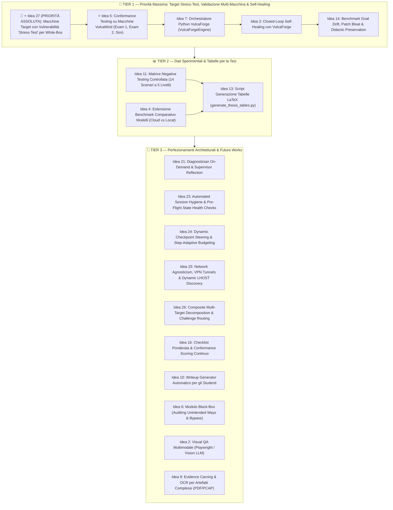

# 💡 Roadmap di Sviluppo & Idee Future (VulcaTest)

> **Documento di Pianificazione Strategica e Registro Evolutivo di Tesi**  
> Classificazione per priorità operativa, analisi di fattibilità e registro delle direttrici evolutive per il framework **VulcaTest**.

---

## 🗺️ Matrice dei Tier Operativi (Cosa Resta da Fare)

I task rimanenti per il completamento della tesi e i successivi sviluppi accademici sono organizzati in **3 Tier azionabili**, ordinati per priorità strategica:



---

## 📑 Quadro Sinottico delle Attività Rimanenti

| Tier | Obiettivo Primario | Idee Incluse | Output Concreto per la Tesi |
| :--- | :--- | :--- | :--- |
| **🚀 TIER 1** | **(TOP PRIORITY) Target Stress-Test, Validazione Macchine VulcaMind & Self-Healing** | **🚨 ⭐ Idea 27 (Priorità Assoluta)**, **⭐ Idea 5**, **Idea 7**, **Idea 3**, **Idea 14** | Progettazione macchine con vulnerabilità per stressare i limiti dell'architettura white-box, generalità su target d'esame reali (`Exam_1APP26`, `Exam_2APP26`, `Sim_01/02`) e chiusura del ciclo con VulcaForge. |
| **📊 TIER 2** | **Dati Sperimentali & Tabelle Tesi** | **Idea 11**, **Idea 4**, **Idea 13** | Validazione scientifica: matrice confusionale negative testing, benchmark comparativo modelli esteso e tabelle LaTeX pronte. |
| **🌟 TIER 3** | **Perfezionamenti & Future Works** | **Idea 21**, **Idea 23**, **Idea 24**, **Idea 25**, **Idea 26**, **Idea 16**, **Idea 10**, **Idea 6**, **Idea 2**, **Idea 9** | Contributi teorici e capitolo di sviluppi futuri ad alto impatto accademico. |

---

## 🚀 TIER 1: Priorità Massima — Validazione Multi-Macchina VulcaMind & Chiusura del Ciclo

*Obiettivo: Progettare macchine didattiche mirate a stressare i confini dell'architettura white-box, validare la generalizzabilità di VulcaTest sull'intero corpus di macchine didattiche VulcaMind, ed estendere il framework al self-healing a ciclo chiuso con VulcaForge.*

---

### 🚨 ⭐ 27. (PRIORITÀ ASSOLUTA) Creazione di Macchine Target con Vulnerabilità "Stress-Test" per l'Architettura White-Box (Vulnerabilità Utili ad Alto Rischio di Fallimento)

* **L'intuizione Fondamentale:**  
  Per elevare al massimo livello il valore metodologico e scientifico della tesi di laurea, la validazione sperimentale di VulcaTest non deve limitarsi a macchine didattiche in cui l'agente esegue linearmente catene standard o dove emergono solo bug accidentali di configurazione (es. permessi, percorsi o user drift come in `06.Web_Exploitation`). È indispensabile **progettare e realizzare deliberatamente macchine target con vulnerabilità reali, didatticamente utili ed efficaci**, ma specificamente concepite per **stressare i limiti e le criticità note o potenziali dell'attuale architettura white-box**.
* **Obiettivo Scientifico ed Operativo:**
  - Sfidare i presupposti intrinseci del framework: interazione sincrona request-response vs listener asincroni, gestione del tempo reale, canali interattivi non-lineari, stateful multi-stage exploit, vincoli di budget turni ed espansione del contesto.
  - Mappare empiricamente e formalizzare nella tesi quali classi di vulnerabilità e pattern offensivi sono pienamente risolvibili dall'agente white-box e quali invece provocano il blocco del framework o richiedono evoluzioni architetturali.
* **Valore Accademico (Boundary Testing & Negative Findings):**
  - Dimostra che la tesi affronta con onestà e rigore scientifico il problema dei confini operativi dell'IA (*"Boundary Exploration & Falsification"*), trasformando i limiti tecnici dell'architettura in risultati sperimentali di prim'ordine.
* **Stato dell'Attività & Prossimi Passi:**
  > [!IMPORTANT]
  > **Nota Operativa:** L'elenco dettagliato, la tassonomia e la selezione puntuale delle vulnerabilità e dei servizi specifici da implementare in questo pool di macchine stress-test verranno discussi e definiti in una sessione di lavoro dedicata.

---

### ⭐ 5. (PRIORITÀ 1) Conformance Testing su Macchine Out di VulcaMind (Dataset Eterogeneo)
* **L'intuizione:** Dopo aver dimostrato il 100% di conformità su *Pizzeria B2R* (`output_29`), il passo operativo a massima priorità per la tesi è sottoporre a VulcaTest le altre macchine didattiche generate nel progetto **VulcaMind**, verificando che il framework sia pienamente generalizzabile e non soffra di overfitting su una singola configurazione.
* **Corpus delle Macchine Target Disponibili:**
  1. **`09.Exam_1APP26`** (e bundle compilati `vulcaforge/out/exam_1app26`, `exam_1app26_stnda`, `exam_1app26_stndb`): Macchina d'esame universitaria ufficiale con web application articolata, architettura modulare, pivoting e privilege escalation locale.
  2. **`10.Exam_2APP26`**: Seconda prova d'esame completa con storyline ramificata, interazione multi-servizio (database/backend) e relative domande orali.
  3. **`07.Sim_Exam_01` & `08.Sim_Exam_02`** (template `exam_sim01`, `exam_sim02`): Ambienti di simulazione d'esame completi creati per la preparazione degli studenti (vettori di ricognizione di rete, exploit web, privilege escalation differenziate).
  4. **`06.Web_Exploitation` & `02.Privilege_Escalation`**: Laboratori tematici verticali (`web_exploitation`, `esercitazione_privesc`) ideali per isolare e validare step di attacco mirati.
* **Pipeline Operativa di Validazione:**
  1. *Generation/Ingestion Piano:* Esecuzione del Planner (`planner/planner.py`) direttamente sui file `STORYLINE*.md`, `DESCRIPTION.md` e `WRITEUP.md` presenti nella cartella target in `vulcAIN/vulcamind/<machine>` per generare `ATTACK_PLAN.md` senza modifiche manuali.
  2. *Target Deployment:* Avvio del container target pre-compilato (da `vulcaforge/out/<machine>`) o generazione pulita via `vulcaforge/generator` con mapping IP/porte sul bridge Docker.
  3. *Execution & Conformance Run:* Esecuzione del test orchestrato (`main.py`) con il modello di riferimento (`unsloth/Qwen3.8-27B-GGUF`), sfruttando la gestione PTY interattiva su Kali.
  4. *Raccolta Dati & RCA:* Registrazione dei log nell'Evidence Store (`output_X`), verifica della tenuta dei guardrail (es. gestione prompt, TUI, escape sequence) e calcolo del Conformance Pass Rate complessivo.
* **Impatto Fondamentale per la Tesi:**
  - Trasforma la validazione sperimentale da un singolo "Proof-of-Concept su Pizzeria" a uno **studio comparativo esaustivo su un intero corpus didattico universitario reale**.
  - Dimostra che il disaccoppiamento *Storyline → Planner → Executor → Evaluator* funziona su stack tecnologici e pattern eterogenei (Nginx, Apache, Node/Express, PHP, SQLite/MySQL, cronjob, SUID, sudoers, socket Unix).

---

### 7. Ingegnerizzazione dell'Orchestratore di Generazione in Python (VulcaForgeEngine)
* **L'intuizione:** Sostituire gli script bash sparsi di build con un modulo orientato agli oggetti (`VulcaForgeEngine`) in Python.
* **Vantaggi:** Permette a LangGraph di invocare programmaticamente la rigenerazione del target ed eseguire il Clean Slate in modo nativo e tipizzato.

---

### 3. Closed-Loop Self-Healing con VulcaForge
* **L'intuizione:** VulcaTest genera deterministicamente `healing_ticket.json` con la diagnosi esatta della causa radice (`IAC_GENERATION_DEFECT` o `DIDACTIC_MISMATCH`), il componente incriminato (es. `webapps/pizzeria/index.php`) e la raccomandazione di correzione.
* **Come implementarlo:**
  1. Un modulo agentico riparatore (`IaC-Healer`) all'interno di VulcaForge riceve il ticket JSON.
  2. L'agente genera la modifica chirurgica al template Jinja2 o al playbook Ansible corrispondente.
  3. VulcaForge ricompila ed esegue il container target.
  4. Viene re-innescato automaticamente `main.py` di VulcaTest: la transizione da `[FAILED]` a `[COMPLETED / PASS]` senza alcun intervento umano chiude formalmente il loop.
* **Valore per la Tesi:** Rappresenta il vertice metodologico del progetto: un'infrastruttura didattica capace di auto-collaudarsi e auto-ripararsi.

---

### 14. Benchmark su Goal Drift, Patch Bloat & Didactic Preservation nel Self-Healing
* **Il Problema:** I modelli di coding che riparano file IaC rischiano di subire *drift*:
  - *Patch Bloat:* Riscrivono decine di righe di stile o codice non pertinenti.
  - *Scope Creep:* Aggiungono librerie o funzionalità extra non richieste dalla storyline.
  - *Il Paradosso del Secure-by-Default:* Tendono a sanificare le vulnerabilità didattiche (es. correggere l'LFI invece di renderlo conforme), rendendo la macchina irrisolvibile per gli studenti!
* **Metriche Formali per la Tesi:**
  - *Diff Bloat Ratio:* $\frac{\text{Righe modificate}}{\text{Righe strettamente necessarie}}$.
  - *Didactic Invariant Preservation:* Verifica che la patch sblocchi la fase fallita senza sanificare per errore le vulnerabilità degli step successivi.
  - *Guardrail Minimal Invasive Patch:* Forzatura del formato `diff -u` minimale con divieto esplicito di refactoring estetico.

---

## 📊 TIER 2: Validazione Scientifica, Benchmark & Dati per la Tesi

*Obiettivo: Raccogliere dati empirici rigorosi e automatizzare la produzione delle tabelle e dei grafici per i capitoli 4 e 5 della tesi.*

---

### 11. Matrice di Iniezione Guasti (Negative Testing Sistematico a 5 Livelli)
* **L'intuizione:** Validare scientificamente l'accuratezza diagnostica di VulcaTest tramite una suite controllata di difetti sintetici iniettati appositamente nei sorgenti IaC.
* **I 5 Livelli di Difetto (Suite a 14 Scenari):**
  1. *Rete:* Porta chiusa o bindata solo su `127.0.0.1` (`NT-NET-01/02`).
  2. *Web/Backend:* FastCGI/PHP-FPM spento (`502 Bad Gateway`) o file mancanti in webroot (`NT-WEB-01..04`).
  3. *Autenticazione:* Password errata o permessi errati su chiavi SSH (`StrictModes`) (`NT-AUTH-01..03`).
  4. *Privilege Escalation:* SUID mancante o sintassi errata in `/etc/sudoers` (`NT-PRIV-01..04`).
  5. *Flag:* Permessi errati su `/root/root.txt` o file vuoto (`NT-FLAG-01/02`).
* **Valore per la Tesi:** Calcolo della *Confusion Matrix* della Root Cause Analysis (Precision, Recall, F1-Score).

---

### 4. Estensione del Benchmark Comparativo tra Modelli (Locale vs Cloud)
* **Stato Attuale:** Primo confronto completato con successo tra **Qwen 3.8 27B Reasoning** (`output_29`, 12/12 PASS) e **Qwen3-Coder 30B Instruct** (`output_30`, FAIL a FASE_11).
* **Estensione Proposta:** Valutare altri modelli di riferimento: **Claude 3.5 Sonnet**, **Gemini 2.5 Flash**, **Llama 3.3 70B**.
* **Metriche da Misurare:**
  - *Success Rate:* Tasso di superamento della catena completa.
  - *Refusal Rate:* Frequenza con cui i modelli cloud bloccano i payload offensivi didattici per filtri etici.
  - *Latenza e Costi:* Tempo di inferenza e costo in token (€ 0.00 locale vs API esterne).

---

### 13. Script di Aggregazione & Generazione Tabelle LaTeX (`generate_thesis_tables.py`)
* **L'intuizione:** Uno script Python dedicato che legge tutti i file `run_summary.json` nell'Evidence Store, calcola medie, deviazioni standard, turni consumati e conformità, e stampa direttamente codice LaTeX (`\begin{tabular}...\end{tabular}`) pronto da incollare nei capitoli della tesi.

---

## 🌟 TIER 3: Perfezionamenti Architetturali & Future Works

*Obiettivo: Materiale ad alto valore concettuale ideale per arricchire il capitolo delle Conclusioni e Sviluppi Futuri.*

---

### 21. Diagnostician On-Demand & Supervisor Reflection Node
* **Il Problema:** Se l'agente esecutivo incontra un disorientamento temporaneo (*Agent Stumble*, es. un comando shell digitato dentro un programma interattivo), dichiarare la macchina didattica non conforme rappresenta un falso negativo metodologico.
* **La Soluzione:**
  - L'Executor primario (modello snello e veloce) gestisce il 90% degli step nominali a costo minimo.
  - Se uno step dichiara `FAILED` o esaurisce il budget, LangGraph devia condizionalmente al nodo `Diagnostician` (modello con reasoning profondo).
  - *Biforcazione:* se il target è realmente difettoso $\rightarrow$ emissione dell'Healing Ticket; se si tratta di un *Agent Stumble* $\rightarrow$ iniezione di un **Reflection Hint** autoritativo e concessione di una micro-estensione (+2 turni) per riprendere la catena.

---

### 23. Automated Session Hygiene & Pre-Flight State Health Checks
* **La Soluzione:** Un controllo non invasivo dello stato del canale PTY prima di avviare ogni step: verifica se il processo in foreground è la shell principale (`$`, `#`) o se sono rimasti processi orfani (`nano`, `less`), prevenendo a monte che uno stato sporco si propaghi alle fasi successive.

---

### 24. Dynamic Checkpoint Steering & Step-Adaptive Budgeting
* **La Soluzione:** Il Planner classifica gli step come `cli_stateless` (budget 4-6 turni) o `tui_interactive` (budget 12-16 turni), allocando dinamicamente il budget ideale per ciascuna tipologia di interazione.

---

### 25. Network Environment Agnosticism, Dynamic Multi-Homed Routing & VPN Tunnels (Cyber Range Adaptability)
* **Il Problema:** Nelle cyber range universitarie reali e nelle piattaforme CTF (es. Proxmox, OpenStack, CyberSecurity National Lab), le macchine didattiche e gli agenti operano spesso attraverso architetture di rete eterogenee e tunnel cifrati:
  1. *Divergenza Topologica tra Docker e Cyber Range:* Nei laboratori remoti, gli studenti accedono tramite una VPN dedicata (OpenVPN o WireGuard con subnet `10.8.0.0/24` instradata tramite gateway `192.168.14.2`), mentre nel collaudo locale di conformità le macchine girano in container Docker minimali (`172.17.0.0/16`).
  2. *Crash IaC da Rotte Statiche Cablate:* Come osservato empiricamente in `Exam_1APP26` (`setup_reverse.yml`), script di provisioning pensati per VM Proxmox tentano di scrivere in `/etc/network/if-up.d/` o riavviare il servizio `networking`; su container Docker leggeri privi di `ifupdown`, questo provoca il fallimento immediato dell'installazione (`code 2`).
  3. *Il Paradosso dell'LHOST nelle Reverse Shell:* Quando l'agente o lo studente innesca una reverse shell (es. `socat`, payload Python, Bash TCP), il target deve connettersi all'IP dell'attaccante (`LHOST`). In Docker locale `LHOST` è l'interfaccia bridge (`172.17.0.1`) o la LAN (`192.168.1.x`), mentre in un cyber range su VPN `LHOST` **deve obbligatoriamente** essere l'IP assegnato dinamicamente sull'interfaccia tunnel (`tun0` / `wg0`, es. `10.8.0.15`). Un hardcoding o un errore di selezione dell'interfaccia fa fallire la connessione o attiva i blocchi del firewall.
  4. *Risoluzione VHost su Interfacce Multi-Homed:* Sfide con Name-Based Virtual Hosts (`socialipsilon.vdsi`, `api.socialipsilon.vdsi`) falliscono se il DNS della VPN non propaga i suffissi interni o se la macchina host non dispone di record `/etc/hosts` sincronizzati.
* **La Soluzione e Architettura Adattiva:**
  1. *IaC Provisioning Condizionale (`is_docker` vs `is_vm`):* Formalizzare nei template VulcaForge il disaccoppiamento tra ambiente container e virtual machine completa. Le direttive di routing statico (`setup_reverse`) vengono marcate con guardrail Ansible `when: not (is_docker | default(false))`, consentendo la compilazione ed esecuzione trasparente sia in locale che nel cluster universitario.
  2. *Dynamic Attacker LHOST Discovery (Kernel Route Introspection):* Il modulo `mcp_bridge` e l'Executor non devono mai cablare l'IP dell'attaccante. Prima di configurare listener o iniettare reverse shell, il framework interroga il kernel Linux di Kali:
     ```bash
     ip route get <TARGET_IP> | awk '{for(i=1;i<=NF;i++) if($i=="src") print $(i+1)}'
     ```
     Questo comando restituisce in modo deterministico e universale l'IP esatto della scheda di rete usata per parlare con il target (`172.17.0.1` su bridge Docker, `10.8.0.x` su tunnel VPN, o l'IP di rete LAN), iniettandolo dinamicamente nei payload.
  3. *Pre-Flight Network Health & MTU Probe:* Verifica preventiva che calcola RTT, verifica l'assenza di filtri ICMP e controlla la MTU dell'interfaccia (critico su VPN dove una MTU < 1500 può frammentare pacchetti HTTP o bloccare payload exploit estesi).
  4. *VHost Agnostic Testing:* Forzatura sistematica dell'header `Host: <vhost>` nelle chiamate di rete o aliasing dinamico effimero, eliminando la necessità per lo studente o l'auditor di modificare manualmente il DNS di sistema.
  5. *Tassonomia di Errore Differenziata nell'Evaluator:* L'Evaluator distingue formalmente tra guasto didattico del target (`CHALLENGE_DEFECT`, es. porta chiusa o servizio web in errore 500) e anomalia dell'infrastruttura di rete (`NETWORK_TUNNEL_FAULT`, es. tunnel VPN caduto o route flap), prevenendo l'emissione di falsi negativi sulla qualità della macchina didattica.
* **Valore per la Tesi:** Dimostra che VulcaTest non è un semplice script da banco per container locali, ma un framework di conformance testing di livello enterprise pronto per operare agnosticamente su Cyber Range accademici complessi e reti federate.

---

### 26. Composite Multi-Target Decomposition & Challenge Routing (Disaccoppiamento di Ambienti d'Esame Eterogenei)
* **Il Problema e i Limiti delle Euristiche Ingenue:**
  Nelle sessioni d'esame reali (es. `Exam_1APP26`, `Exam_2APP26`, `Sim_Exam_01/02`), i repository didattici non contengono una singola macchina monolitica, ma un *ecosistema composito multi-target*:
  1. *Eterogeneità Strutturale:* La documentazione include contemporaneamente una macchina principale in stile Boot to Root (B2R) con una storyline narrativa profonda (porte 22, 80, 20000) e molteplici sfide indipendenti (*Standalone A*, *Standalone B*) ospitate su container Docker satellite e porte separate (`58090`, `58022`).
  2. *Fragilità delle Soluzioni "Naive" (String Splitting / Regex):* Tentare di separare le sfide a valle nel codice del Planner tramite un banale split su stringhe o parole chiave (es. cercare `## Standalone` o `# Independent Challenge`) è una scorciatoia fragile e inaffidabile. È sufficiente una minima deviazione sintattica introdotta dal docente o dal compilatore Markdown (convenzioni bilingui, elenchi numerati invece di intestazioni, inversione dell'ordine dei capitoli) per far fallire il parser o tagliare erroneamente porzioni legittime della catena B2R.
  3. *Cecità Infrastrutturale e Mancato Collaudo Satellite:* Se il framework si limita a ignorare o tagliare via le challenge secondarie per far spazio nel contesto, le sfide standalone rimangono completamente prive di verifica di conformità. Gli studenti potrebbero quindi ricevere un ambiente d'esame con una sfida standalone difettosa o non funzionante senza che l'auditor se ne accorga.
* **La Soluzione Architetturale Robusta:**
  1. *Pre-Planner Semantic Decomposer & Challenge Manifest:* Sviluppare un modulo di scomposizione semantica a monte (o estendere il generatore VulcaMind con un manifest strutturato `challenge_topology.yml`). Tale modulo identifica formalmente i confini logici e fisici di ogni singola unità didattica presente nella cartella:
     - Unità 1: `b2r_primary` (container `exam_1app26`, porte 22/80/20000, target SSH/Web/CLI, flag `user.txt` e `root.txt`).
     - Unità 2: `standalone_a` (container `exam_1app26_stnda`, porta 58090, target diagnostico web, flag `VDSI{...}`).
     - Unità 3: `standalone_b` (container `exam_1app26_stndb`, porta 58022, target cronjob/privesc, flag `get_flag`).
  2. *Multi-Plan Attack Generation (Piani d'Attacco Disaccoppiati):* Il Planner non genera un unico file monolitico, ma una matrice di piani indipendenti (`ATTACK_PLAN_b2r.md`, `ATTACK_PLAN_stnda.md`, `ATTACK_PLAN_stndb.md`). Ciascun piano viene compilato fornendo al modello LLM esclusivamente la porzione documentale pertinente, garantendo:
     - Zero inquinamento cross-challenge del prompt.
     - Riduzione fisiologica del prompt a <6.000 token, consentendo al modello di operare sempre al 100% in VRAM GPU senza degradare le prestazioni.
  3. *Target Routing & Suite Execution nell'Orchestratore:* L'Orchestratore LangGraph acquisisce la capacità di instradare i test su target multipli:
     - Esecuzione mirata: `uv run main.py --unit b2r` o `uv run main.py --unit standalone_a`.
     - Esecuzione a suite completa (`--all-units`): collaudo sequenziale o parallelo di tutti i container della sessione d'esame, con reset Clean Slate dedicato per ogni singolo container e produzione di un report unificato d'esame.
* **Valore per la Tesi:** Formalizza il passaggio da un verificatore "single-machine" a un sistema di test architetturale per ambienti d'esame compositi ed eterogenei, superando le euristiche sintattiche fragili a favore di una scomposizione semantica rigorosa.

---

### 16. Checklist Ponderata & Conformance Scoring Continuo
* **La Soluzione:** Distinzione formale tra vincoli critici (`[CRITICAL]`, necessari alla risolvibilità) e vincoli informativi (`[INFO]`, usabilità o cosmetica), introducendo un indice di conformità continuo:
  $$\text{Conformance Score} = \frac{\sum w_{\text{passed}}}{\sum w_{\text{total}}} \times 100$$

---

### 10. Writeup Generator Automatico per gli Studenti
* **La Soluzione:** Modulo downstream che riutilizza l'audit trail verificato (comandi esatti, output di shell, flag) per redigere automaticamente la guida didattica illustrata ufficiale della challenge (`WRITEUP_GENERATED.md`).

---

### 6. Modulo Black-Box (Auditing Unintended Ways & Bypass)
* **La Soluzione:** Un agente auditor che opera senza piano di attacco per cercare scorciatoie non intenzionali (backdoor residue, file di backup, permessi world-writable) che permettano di raggiungere root aggirando la storyline didattica.

---

### 2. Visual QA Multimodale (Playwright / Vision LLM)
* **La Soluzione:** Tool Playwright headless per catturare screenshot delle web app ed estrazione visiva tramite modelli Vision (es. Qwen-VL o Gemini Flash Vision) per validare pulsanti, layout e form non ispezionabili via semplice `curl`.

---

### 9. Evidence Carving & OCR per Artefatti Complessi (PDF, PCAP, Immagini)
* **La Soluzione:** Tool specialistici su Kali (`pdftotext`, `tshark`, `exiftool`) e OCR integrato (`tesseract`) per estrarre evidenze nascoste in documenti, catture di traffico o immagini steganografiche.

---

## 📦 Archivio Obiettivi Completati (Milestones Realizzate)

Tutti i seguenti moduli e idee sono stati **completamente implementati, integrati e validati con successo**:

| ID | Modulo / Idea | Descrizione e Risoluzione | Run di Riferimento |
| :---: | :--- | :--- | :---: |
| **Idea 1** | **Golden Path 100% Pass** | Esecuzione nominale completa di tutti i 12 step da recon a root flag (`VDSI{r00t...}`). | `output_29`, `output_32` (Record: 452s) |
| **Idea 8** | **VulcaHarness (Session Broker)** | Micro-servizio `terminal_gateway.py` (porta 8889) su Kali con PTY persistente e multi-sessione. | `output_14+` |
| **Idea 15** | **Truncation & Host Blindness** | Truncation Guard a 4000 char in `mcp_bridge.py` e disaccoppiamento `execute_command` vs `terminal_exec`. | `output_14` |
| **Idea 17** | **Introspezione Tool Dinamica** | Superamento di `ALIAS_MAP` tramite discovery dinamica e prefix matching FastMCP. | `output_15+` |
| **Idea 18** | **Prompt Engineering & Regola 9** | Revisione del `SYSTEM_PROMPT` con Auditor Mode, TUI cleanup e distinzione comandi/macro. | `output_29`, `output_32` |
| **Idea 19** | **Parametrizzazione Budget .env** | Budget iniziale (`8`) e tetto massimo (`20`) esternalizzati in `.env` e `config.py`. | `output_15+` |
| **Idea 20** | **Profiling Temporale Disaccoppiato** | Scorporo tra tempo attivo di rete/tool (63.86s), tempo di inferenza LLM e durata totale. | `output_29`, `output_32` |

---

## ❌ Registro Decisioni Architetturali Rifiutate (ADR - Negative Findings)

| ID | Soluzione Valutata | Verdetto | Motivazione Tecnica di Scarto |
| :---: | :--- | :---: | :--- |
| **Idea 22** | **Virtual Terminal Screen Adapter (`pyte` / 2D Diffing)** | ❌ **SCARTATA** | **Over-Engineering:** agisce sul canale di lettura (dove l'agente non aveva problemi), non risolve il bug di scrittura (`\r` vs `\n`) e introduce latenza/fragilità computazionale superflua. Sostituita con successo dalla mappatura low-level `\r` (20 righe pulite in `mcp_bridge.py`). |
