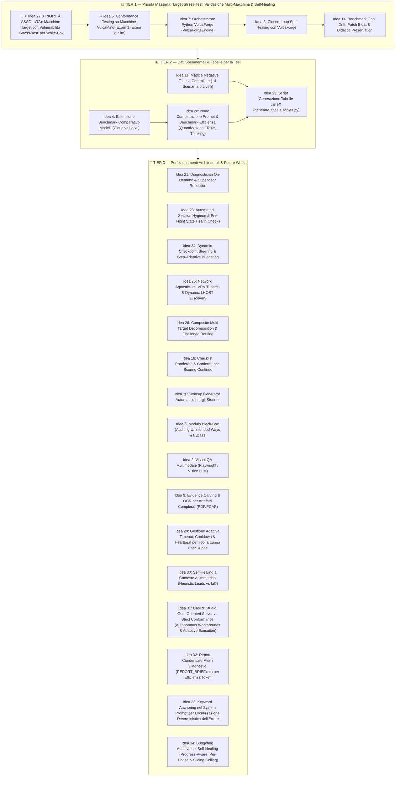

# 💡 Roadmap di Sviluppo & Idee Future (VulcaTest)

> **Documento di Pianificazione Strategica e Registro Evolutivo di Tesi**  
> Classificazione per priorità operativa, analisi di fattibilità e registro delle direttrici evolutive per il framework **VulcaTest**.

---

## 🗺️ Matrice dei Tier Operativi (Cosa Resta da Fare)

I task rimanenti per il completamento della tesi e i successivi sviluppi accademici sono organizzati in **3 Tier azionabili**, ordinati per priorità strategica:



---

## 📑 Quadro Sinottico delle Attività Rimanenti

| Tier | Obiettivo Primario | Idee Incluse | Output Concreto per la Tesi |
| :--- | :--- | :--- | :--- |
| **🚀 TIER 1** | **(TOP PRIORITY) Target Stress-Test, Validazione Macchine VulcaMind & Self-Healing** | **🚨 ⭐ Idea 27 (Priorità Assoluta)**, **⭐ Idea 5**, **Idea 7**, **Idea 3**, **Idea 14** | Progettazione macchine con vulnerabilità per stressare i limiti dell'architettura white-box, generalità su target d'esame reali (`Exam_1APP26`, `Exam_2APP26`, `Sim_01/02`) e chiusura del ciclo con VulcaForge. |
| **📊 TIER 2** | **Dati Sperimentali & Tabelle Tesi** | **Idea 11**, **Idea 4**, **Idea 28**, **Idea 13** | Validazione scientifica: matrice confusionale negative testing, benchmark compattazione/quantizzazioni/throughput e tabelle LaTeX pronte. |
| **🌟 TIER 3** | **Perfezionamenti & Future Works** | **Idea 21**, **Idea 23**, **Idea 24**, **Idea 25**, **Idea 26**, **Idea 16**, **Idea 10**, **Idea 6**, **Idea 2**, **Idea 9**, **Idea 29**, **Idea 30**, **Idea 31**, **Idea 32**, **Idea 33**, **Idea 34** | Contributi teorici e capitolo di sviluppi futuri ad alto impatto accademico. |

---

## 🚀 TIER 1: Priorità Massima — Validazione Multi-Macchina VulcaMind & Chiusura del Ciclo

*Obiettivo: Progettare macchine didattiche mirate a stressare i confini dell'architettura white-box, validare la generalizzabilità di VulcaTest sull'intero corpus di macchine didattiche VulcaMind, ed estendere il framework al self-healing a ciclo chiuso con VulcaForge.*

---

### 🚨 ⭐ 27. (PRIORITÀ ASSOLUTA) Creazione di Macchine Target con Vulnerabilità "Stress-Test" per l'Architettura White-Box (Vulnerabilità Utili ad Alto Rischio di Fallimento)

* **L'intuizione Fondamentale:**  
  Per elevare al massimo livello il valore metodologico e scientifico della tesi di laurea, la validazione sperimentale di VulcaTest non deve limitarsi a macchine didattiche in cui l'agente esegue linearmente catene standard o dove emergono solo bug accidentali di configurazione (es. permessi, percorsi o user drift come in `06.Web_Exploitation`). È indispensabile **progettare e realizzare deliberatamente macchine target con vulnerabilità reali, didatticamente utili ed efficaci**, ma specificamente concepite per **stressare i limiti e le criticità note o potenziali dell'attuale architettura white-box**.
* **Obiettivo Scientifico ed Operativo:**
  - Sfidare i presupposti intrinseci del framework: interazione sincrona request-response vs listener asincroni, gestione del tempo reale, canali interattivi non-lineari, stateful multi-stage exploit, vincoli di budget turni ed espansione del contesto.
  - Mappare empiricamente e formalizzare nella tesi quali classi di vulnerabilità e pattern offensivi sono pienamente risolvibili dall'agente white-box e quali invece provocano il blocco del framework o richiedono evoluzioni architetturali.
* **Valore Accademico (Boundary Testing & Negative Findings):**
  - Dimostra che la tesi affronta con onestà e rigore scientifico il problema dei confini operativi dell'IA (*"Boundary Exploration & Falsification"*), trasformando i limiti tecnici dell'architettura in risultati sperimentali di prim'ordine.
* **Stato dell'Attività & Prossimi Passi:**
  > [!IMPORTANT]
  > **Nota Operativa:** L'elenco dettagliato, la tassonomia e la selezione puntuale delle vulnerabilità e dei servizi specifici da implementare in questo pool di macchine stress-test verranno discussi e definiti in una sessione di lavoro dedicata.

---

### ⭐ 5. (PRIORITÀ 1) Conformance Testing su Macchine Out di VulcaMind (Dataset Eterogeneo)
* **L'intuizione:** Dopo aver dimostrato il 100% di conformità su *Pizzeria B2R* (`output_29`), il passo operativo a massima priorità per la tesi è sottoporre a VulcaTest le altre macchine didattiche generate nel progetto **VulcaMind**, verificando che il framework sia pienamente generalizzabile e non soffra di overfitting su una singola configurazione.
* **Corpus delle Macchine Target Disponibili:**
  1. **`09.Exam_1APP26`** (e bundle compilati `vulcaforge/out/exam_1app26`, `exam_1app26_stnda`, `exam_1app26_stndb`): Macchina d'esame universitaria ufficiale con web application articolata, architettura modulare, pivoting e privilege escalation locale.
  2. **`10.Exam_2APP26`**: Seconda prova d'esame completa con storyline ramificata, interazione multi-servizio (database/backend) e relative domande orali.
  3. **`07.Sim_Exam_01` & `08.Sim_Exam_02`** (template `exam_sim01`, `exam_sim02`): Ambienti di simulazione d'esame completi creati per la preparazione degli studenti (vettori di ricognizione di rete, exploit web, privilege escalation differenziate).
  4. **`06.Web_Exploitation` & `02.Privilege_Escalation`**: Laboratori tematici verticali (`web_exploitation`, `esercitazione_privesc`) ideali per isolare e validare step di attacco mirati.
* **Pipeline Operativa di Validazione:**
  1. *Generation/Ingestion Piano:* Esecuzione del Planner (`planner/planner.py`) direttamente sui file `STORYLINE*.md`, `DESCRIPTION.md` e `WRITEUP.md` presenti nella cartella target in `vulcAIN/vulcamind/<machine>` per generare `ATTACK_PLAN.md` senza modifiche manuali.
  2. *Target Deployment:* Avvio del container target pre-compilato (da `vulcaforge/out/<machine>`) o generazione pulita via `vulcaforge/generator` con mapping IP/porte sul bridge Docker.
  3. *Execution & Conformance Run:* Esecuzione del test orchestrato (`main.py`) con il modello di riferimento (`unsloth/Qwen3.8-27B-GGUF`), sfruttando la gestione PTY interattiva su Kali.
  4. *Raccolta Dati & RCA:* Registrazione dei log nell'Evidence Store (`output_X`), verifica della tenuta dei guardrail (es. gestione prompt, TUI, escape sequence) e calcolo del Conformance Pass Rate complessivo.
* **Impatto Fondamentale per la Tesi:**
  - Trasforma la validazione sperimentale da un singolo "Proof-of-Concept su Pizzeria" a uno **studio comparativo esaustivo su un intero corpus didattico universitario reale**.
  - Dimostra che il disaccoppiamento *Storyline → Planner → Executor → Evaluator* funziona su stack tecnologici e pattern eterogenei (Nginx, Apache, Node/Express, PHP, SQLite/MySQL, cronjob, SUID, sudoers, socket Unix).

---

### 7. Ingegnerizzazione dell'Orchestratore di Generazione in Python (VulcaForgeEngine)
* **L'intuizione:** Sostituire gli script bash sparsi di build con un modulo orientato agli oggetti (`VulcaForgeEngine`) in Python.
* **Vantaggi:** Permette a LangGraph di invocare programmaticamente la rigenerazione del target ed eseguire il Clean Slate in modo nativo e tipizzato.

---

### 3. Closed-Loop Self-Healing con VulcaForge
* **L'intuizione:** VulcaTest genera deterministicamente `healing_ticket.json` con la diagnosi esatta della causa radice (`IAC_GENERATION_DEFECT` o `DIDACTIC_MISMATCH`), il componente incriminato (es. `webapps/pizzeria/index.php`) e la raccomandazione di correzione.
* **Come implementarlo:**
  1. Un modulo agentico riparatore (`IaC-Healer`) all'interno di VulcaForge riceve il ticket JSON.
  2. L'agente genera la modifica chirurgica al template Jinja2 o al playbook Ansible corrispondente.
  3. VulcaForge ricompila ed esegue il container target.
  4. Viene re-innescato automaticamente `main.py` di VulcaTest: la transizione da `[FAILED]` a `[COMPLETED / PASS]` senza alcun intervento umano chiude formalmente il loop.
* **Valore per la Tesi:** Rappresenta il vertice metodologico del progetto: un'infrastruttura didattica capace di auto-collaudarsi e auto-ripararsi.

---

### 14. Benchmark su Goal Drift, Patch Bloat & Didactic Preservation nel Self-Healing
* **Il Problema:** I modelli di coding che riparano file IaC rischiano di subire *drift*:
  - *Patch Bloat:* Riscrivono decine di righe di stile o codice non pertinenti.
  - *Scope Creep:* Aggiungono librerie o funzionalità extra non richieste dalla storyline.
  - *Il Paradosso del Secure-by-Default:* Tendono a sanificare le vulnerabilità didattiche (es. correggere l'LFI invece di renderlo conforme), rendendo la macchina irrisolvibile per gli studenti!
* **Metriche Formali per la Tesi:**
  - *Diff Bloat Ratio:* $\frac{\text{Righe modificate}}{\text{Righe strettamente necessarie}}$.
  - *Didactic Invariant Preservation:* Verifica che la patch sblocchi la fase fallita senza sanificare per errore le vulnerabilità degli step successivi.
  - *Guardrail Minimal Invasive Patch:* Forzatura del formato `diff -u` minimale con divieto esplicito di refactoring estetico.

---

## 📊 TIER 2: Validazione Scientifica, Benchmark & Dati per la Tesi

*Obiettivo: Raccogliere dati empirici rigorosi e automatizzare la produzione delle tabelle e dei grafici per i capitoli 4 e 5 della tesi.*

---

### 11. Matrice di Iniezione Guasti (Negative Testing Sistematico a 5 Livelli)
* **L'intuizione:** Validare scientificamente l'accuratezza diagnostica di VulcaTest tramite una suite controllata di difetti sintetici iniettati appositamente nei sorgenti IaC.
* **I 5 Livelli di Difetto (Suite a 14 Scenari):**
  1. *Rete:* Porta chiusa o bindata solo su `127.0.0.1` (`NT-NET-01/02`).
  2. *Web/Backend:* FastCGI/PHP-FPM spento (`502 Bad Gateway`) o file mancanti in webroot (`NT-WEB-01..04`).
  3. *Autenticazione:* Password errata o permessi errati su chiavi SSH (`StrictModes`) (`NT-AUTH-01..03`).
  4. *Privilege Escalation:* SUID mancante o sintassi errata in `/etc/sudoers` (`NT-PRIV-01..04`).
  5. *Flag:* Permessi errati su `/root/root.txt` o file vuoto (`NT-FLAG-01/02`).
* **Valore per la Tesi:** Calcolo della *Confusion Matrix* della Root Cause Analysis (Precision, Recall, F1-Score).

---

### 4. Estensione del Benchmark Comparativo tra Modelli (Locale vs Cloud)
* **Stato Attuale:** Primo confronto completato con successo tra **Qwen 3.8 27B Reasoning** (`output_29`, 12/12 PASS) e **Qwen3-Coder 30B Instruct** (`output_30`, FAIL a FASE_11).
* **Estensione Proposta:** Valutare altri modelli di riferimento: **Claude 3.5 Sonnet**, **Gemini 2.5 Flash**, **Llama 3.3 70B**.
* **Metriche da Misurare:**
  - *Success Rate:* Tasso di superamento della catena completa.
  - *Refusal Rate:* Frequenza con cui i modelli cloud bloccano i payload offensivi didattici per filtri etici.
  - *Latenza e Costi:* Tempo di inferenza e costo in token (€ 0.00 locale vs API esterne).

---

### 28. Nodo di Compattazione Dinamica del Contesto & Benchmark di Efficienza (Quantizzazioni, Throughput Tok/s & Budget di Thinking)
* **L'Intuizione & Il Problema:**
  Nei compiti di conformance testing a catena estesa, la cronologia multi-turno dell'Executor (tool call ripetute, output massivi di scansioni Nmap/Hydra e ispezione di file) unita ai documenti didattici del Planner può far lievitare rapidamente la context window oltre i 20k–30k token. Sebbene il backend locale (Unsloth Studio) gestisca dinamicamente lo *sweet spot* di memoria VRAM, un contesto non compresso presenta criticità evidenti:
  1. Dilata progressivamente i tempi di prefill e latenza al primo token (*Time-To-First-Token* - TTFT).
  2. Aumenta la pressione sulla memoria della KV Cache sulla GPU (16 GB), costringendo il motore di inferenza a scaricare layer su CPU/RAM via bus PCIe se la memoria satura.
  3. Introduce rumore semantico nei turni avanzati accumulando output storici non più rilevanti per lo step corrente.
* **La Soluzione Architetturale (Prompt Compactor Node in LangGraph):**
  - **Nodo di Compattazione Statale (`prompt_compactor`):** Un nodo/middleware specializzato nel grafo di LangGraph che interviene a monte dell'invocazione LLM o al superamento di una soglia prefissata (es. ogni 5 turni o quando la cronologia supera i 15k token).
  - **Strategie di Compattazione Chirurgica:**
    - *Selective Output Summarization:* Sostituisce l'output verboso di tool voluminosi (es. decine di righe di scansione porte o dump di file) con un estratto semantico sintetico delle sole evidenze convalidate (`[EVIDENCE EXTRACTED: open_ports: 22,80]`).
    - *Thinking Stripping:* Rimozione automatica dei blocchi di ragionamento effimero `<think>...</think>` dei turni passati prima di inviare la cronologia al turno successivo, risparmiando migliaia di token a costo zero.
    - *Sliding Window Semantica & Blackboard Deduplication:* Preserva intatti solo l'ultimo turno operativo e il dizionario condiviso dei valori convalidati (`verified_values`), collassando la sequenza dei comandi intermedi falliti o esplorativi.
* **Valore Strategico per la Discussione dell'Esame di Laurea (Benchmark Comparativo Multidimensionale):**
  Questo modulo offre un capitolo sperimentale ad altissimo impatto per la commissione di laurea, consentendo di portare alla discussione dell'esame dati quantitativi e grafici di benchmark estremamente solidi:
  1. **Benchmark di Compressione:** Confronto rigoroso tra esecuzione con cronologia raw vs prompt compattato (riduzione del Memory Footprint della KV Cache, token risparmiati per singola run e dimostrazione formale che il 100% di conformità viene mantenuto senza alcuna perdita di contesto).
  2. **Benchmark delle Quantizzazioni (Trade-off Precisione vs VRAM):** Valutazione empirica a parità di modello tra diverse quantizzazioni GGUF (es. `UD-Q4_K_XL`, `UD-Q3_K_XL`, `Q4_K_M`, `Q5_K_M`): impatto sull'occupazione fisica della VRAM su GPU da 16 GB (RX 9070 XT), aderenza sintattica alla checklist e assenza di allucinazioni di comandi.
  3. **Analisi del Throughput (Curva Token/s vs Profondità del Contesto):** Misurazione della velocità di generazione (tok/s) in funzione della crescita della context window (da 4k a 30k token), evidenziando empiricamente il punto esatto di saturazione dello *sweet spot* e il degrado prestazionale indotto dal bus PCIe in caso di offload su RAM DDR5.
  4. **Studio della Dinamica di Reasoning (Variazione Thinking Budget: `low`, `medium`, `high`, `off`):** Analisi comparativa su modelli dotati di reasoning nativo (es. Qwen 3.8): rapporto quantitativo tra token spesi nel reasoning vs token dell'output didattico, latenza complessiva di generazione e robustezza logica del piano d'attacco risultante.
  5. **Benchmark sull'Uso e Scalabilità della Context Window (Lost-in-the-Middle, Attenzione Esecutiva & Strategie di Retention):**
     - *Attenzione Esecutiva & Needle-in-a-Haystack Operativo:* Valutare empiricamente la capacità dell'agente di ripescare e utilizzare evidenze critiche scoperte nei primissimi step (es. porte scoperte allo Step 1, credenziali o percorsi svelati nei metadati) man mano che la finestra di contesto scala da 4k a 8k, 16k, 25k e 30k token. Verificare se e quando si innesca il fenomeno del *Lost-in-the-Middle* (il modello dimentica o ri-esegue scansioni ridondanti perché l'informazione è "sepolta" a metà della cronologia).
     - *Efficienza Informativa della Finestra:* Misurare il rapporto tra token utili (comandi mirati, payload convalidati, evidenze estratte) e token di rumore passivo (output prolissi di terminale, banner di errore, cronologia di comandi falliti).
     - *Confronto tra Strategie di Context Management:* Benchmark a tre vie tra:
       a) **Full Raw Context:** Nessun filtro, accumulo integrale della cronologia (massimo sovraccarico, rischio di offload su RAM).
       b) **Naive Sliding Window / Truncation:** Mantenere solo gli ultimi $N$ turni (rischio di amnesia sui prerequisiti iniziali).
       c) **Selective Prompt Compaction (Nostro Approccio):** Pulizia dei blocchi `<think>`, sintesi degli output voluminosi e conservazione della blackboard convalidata.
     - *Metriche di Output:* Tasso di conformità (%), tempo totale di esecuzione, picco di allocazione VRAM della KV Cache, e frequenza di allucinazioni/deviazioni dalla catena d'attacco.

---

### 13. Script di Aggregazione & Generazione Tabelle LaTeX (`generate_thesis_tables.py`)
* **L'intuizione:** Uno script Python dedicato che legge tutti i file `run_summary.json` nell'Evidence Store, calcola medie, deviazioni standard, turni consumati e conformità, e stampa direttamente codice LaTeX (`\begin{tabular}...\end{tabular}`) pronto da incollare nei capitoli della tesi.

---

## 🌟 TIER 3: Perfezionamenti Architetturali & Future Works

*Obiettivo: Materiale ad alto valore concettuale ideale per arricchire il capitolo delle Conclusioni e Sviluppi Futuri.*

---

### 21. Diagnostician On-Demand & Supervisor Reflection Node
* **Il Problema:** Se l'agente esecutivo incontra un disorientamento temporaneo (*Agent Stumble*, es. un comando shell digitato dentro un programma interattivo), dichiarare la macchina didattica non conforme rappresenta un falso negativo metodologico.
* **La Soluzione:**
  - L'Executor primario (modello snello e veloce) gestisce il 90% degli step nominali a costo minimo.
  - Se uno step dichiara `FAILED` o esaurisce il budget, LangGraph devia condizionalmente al nodo `Diagnostician` (modello con reasoning profondo).
  - *Biforcazione:* se il target è realmente difettoso $\rightarrow$ emissione dell'Healing Ticket; se si tratta di un *Agent Stumble* $\rightarrow$ iniezione di un **Reflection Hint** autoritativo e concessione di una micro-estensione (+2 turni) per riprendere la catena.

---

### 23. Automated Session Hygiene & Pre-Flight State Health Checks
* **La Soluzione:** Un controllo non invasivo dello stato del canale PTY prima di avviare ogni step: verifica se il processo in foreground è la shell principale (`$`, `#`) o se sono rimasti processi orfani (`nano`, `less`), prevenendo a monte che uno stato sporco si propaghi alle fasi successive.

---

### 24. Dynamic Checkpoint Steering & Step-Adaptive Budgeting
* **La Soluzione:** Il Planner classifica gli step come `cli_stateless` (budget 4-6 turni) o `tui_interactive` (budget 12-16 turni), allocando dinamicamente il budget ideale per ciascuna tipologia di interazione.

---

### 25. Network Environment Agnosticism, Dynamic Multi-Homed Routing & VPN Tunnels (Cyber Range Adaptability)
* **Il Problema:** Nelle cyber range universitarie reali e nelle piattaforme CTF (es. Proxmox, OpenStack, CyberSecurity National Lab), le macchine didattiche e gli agenti operano spesso attraverso architetture di rete eterogenee e tunnel cifrati:
  1. *Divergenza Topologica tra Docker e Cyber Range:* Nei laboratori remoti, gli studenti accedono tramite una VPN dedicata (OpenVPN o WireGuard con subnet `10.8.0.0/24` instradata tramite gateway `192.168.14.2`), mentre nel collaudo locale di conformità le macchine girano in container Docker minimali (`172.17.0.0/16`).
  2. *Crash IaC da Rotte Statiche Cablate:* Come osservato empiricamente in `Exam_1APP26` (`setup_reverse.yml`), script di provisioning pensati per VM Proxmox tentano di scrivere in `/etc/network/if-up.d/` o riavviare il servizio `networking`; su container Docker leggeri privi di `ifupdown`, questo provoca il fallimento immediato dell'installazione (`code 2`).
  3. *Il Paradosso dell'LHOST nelle Reverse Shell:* Quando l'agente o lo studente innesca una reverse shell (es. `socat`, payload Python, Bash TCP), il target deve connettersi all'IP dell'attaccante (`LHOST`). In Docker locale `LHOST` è l'interfaccia bridge (`172.17.0.1`) o la LAN (`192.168.1.x`), mentre in un cyber range su VPN `LHOST` **deve obbligatoriamente** essere l'IP assegnato dinamicamente sull'interfaccia tunnel (`tun0` / `wg0`, es. `10.8.0.15`). Un hardcoding o un errore di selezione dell'interfaccia fa fallire la connessione o attiva i blocchi del firewall.
  4. *Risoluzione VHost su Interfacce Multi-Homed:* Sfide con Name-Based Virtual Hosts (`socialipsilon.vdsi`, `api.socialipsilon.vdsi`) falliscono se il DNS della VPN non propaga i suffissi interni o se la macchina host non dispone di record `/etc/hosts` sincronizzati.
* **La Soluzione e Architettura Adattiva:**
  1. *IaC Provisioning Condizionale (`is_docker` vs `is_vm`):* Formalizzare nei template VulcaForge il disaccoppiamento tra ambiente container e virtual machine completa. Le direttive di routing statico (`setup_reverse`) vengono marcate con guardrail Ansible `when: not (is_docker | default(false))`, consentendo la compilazione ed esecuzione trasparente sia in locale che nel cluster universitario.
  2. *Dynamic Attacker LHOST Discovery (Kernel Route Introspection):* Il modulo `mcp_bridge` e l'Executor non devono mai cablare l'IP dell'attaccante. Prima di configurare listener o iniettare reverse shell, il framework interroga il kernel Linux di Kali:
     ```bash
     ip route get <TARGET_IP> | awk '{for(i=1;i<=NF;i++) if($i=="src") print $(i+1)}'
     ```
     Questo comando restituisce in modo deterministico e universale l'IP esatto della scheda di rete usata per parlare con il target (`172.17.0.1` su bridge Docker, `10.8.0.x` su tunnel VPN, o l'IP di rete LAN), iniettandolo dinamicamente nei payload.
  3. *Pre-Flight Network Health & MTU Probe:* Verifica preventiva che calcola RTT, verifica l'assenza di filtri ICMP e controlla la MTU dell'interfaccia (critico su VPN dove una MTU < 1500 può frammentare pacchetti HTTP o bloccare payload exploit estesi).
  4. *VHost Agnostic Testing:* Forzatura sistematica dell'header `Host: <vhost>` nelle chiamate di rete o aliasing dinamico effimero, eliminando la necessità per lo studente o l'auditor di modificare manualmente il DNS di sistema.
  5. *Tassonomia di Errore Differenziata nell'Evaluator:* L'Evaluator distingue formalmente tra guasto didattico del target (`CHALLENGE_DEFECT`, es. porta chiusa o servizio web in errore 500) e anomalia dell'infrastruttura di rete (`NETWORK_TUNNEL_FAULT`, es. tunnel VPN caduto o route flap), prevenendo l'emissione di falsi negativi sulla qualità della macchina didattica.
* **Valore per la Tesi:** Dimostra che VulcaTest non è un semplice script da banco per container locali, ma un framework di conformance testing di livello enterprise pronto per operare agnosticamente su Cyber Range accademici complessi e reti federate.

---

### 26. Composite Multi-Target Decomposition & Challenge Routing (Disaccoppiamento di Ambienti d'Esame Eterogenei)
* **Il Problema e i Limiti delle Euristiche Ingenue:**
  Nelle sessioni d'esame reali (es. `Exam_1APP26`, `Exam_2APP26`, `Sim_Exam_01/02`), i repository didattici non contengono una singola macchina monolitica, ma un *ecosistema composito multi-target*:
  1. *Eterogeneità Strutturale:* La documentazione include contemporaneamente una macchina principale in stile Boot to Root (B2R) con una storyline narrativa profonda (porte 22, 80, 20000) e molteplici sfide indipendenti (*Standalone A*, *Standalone B*) ospitate su container Docker satellite e porte separate (`58090`, `58022`).
  2. *Fragilità delle Soluzioni "Naive" (String Splitting / Regex):* Tentare di separare le sfide a valle nel codice del Planner tramite un banale split su stringhe o parole chiave (es. cercare `## Standalone` o `# Independent Challenge`) è una scorciatoia fragile e inaffidabile. È sufficiente una minima deviazione sintattica introdotta dal docente o dal compilatore Markdown (convenzioni bilingui, elenchi numerati invece di intestazioni, inversione dell'ordine dei capitoli) per far fallire il parser o tagliare erroneamente porzioni legittime della catena B2R.
  3. *Cecità Infrastrutturale e Mancato Collaudo Satellite:* Se il framework si limita a ignorare o tagliare via le challenge secondarie per far spazio nel contesto, le sfide standalone rimangono completamente prive di verifica di conformità. Gli studenti potrebbero quindi ricevere un ambiente d'esame con una sfida standalone difettosa o non funzionante senza che l'auditor se ne accorga.
* **La Soluzione Architetturale Robusta:**
  1. *Pre-Planner Semantic Decomposer & Challenge Manifest:* Sviluppare un modulo di scomposizione semantica a monte (o estendere il generatore VulcaMind con un manifest strutturato `challenge_topology.yml`). Tale modulo identifica formalmente i confini logici e fisici di ogni singola unità didattica presente nella cartella:
     - Unità 1: `b2r_primary` (container `exam_1app26`, porte 22/80/20000, target SSH/Web/CLI, flag `user.txt` e `root.txt`).
     - Unità 2: `standalone_a` (container `exam_1app26_stnda`, porta 58090, target diagnostico web, flag `VDSI{...}`).
     - Unità 3: `standalone_b` (container `exam_1app26_stndb`, porta 58022, target cronjob/privesc, flag `get_flag`).
  2. *Multi-Plan Attack Generation (Piani d'Attacco Disaccoppiati):* Il Planner non genera un unico file monolitico, ma una matrice di piani indipendenti (`ATTACK_PLAN_b2r.md`, `ATTACK_PLAN_stnda.md`, `ATTACK_PLAN_stndb.md`). Ciascun piano viene compilato fornendo al modello LLM esclusivamente la porzione documentale pertinente, garantendo:
     - Zero inquinamento cross-challenge del prompt.
     - Riduzione fisiologica del prompt a <6.000 token, consentendo al modello di operare sempre al 100% in VRAM GPU senza degradare le prestazioni.
  3. *Target Routing & Suite Execution nell'Orchestratore:* L'Orchestratore LangGraph acquisisce la capacità di instradare i test su target multipli:
     - Esecuzione mirata: `uv run main.py --unit b2r` o `uv run main.py --unit standalone_a`.
     - Esecuzione a suite completa (`--all-units`): collaudo sequenziale o parallelo di tutti i container della sessione d'esame, con reset Clean Slate dedicato per ogni singolo container e produzione di un report unificato d'esame.
* **Valore per la Tesi:** Formalizza il passaggio da un verificatore "single-machine" a un sistema di test architetturale per ambienti d'esame compositi ed eterogenei, superando le euristiche sintattiche fragili a favore di una scomposizione semantica rigorosa.

---

### 16. Checklist Ponderata & Conformance Scoring Continuo
* **La Soluzione:** Distinzione formale tra vincoli critici (`[CRITICAL]`, necessari alla risolvibilità) e vincoli informativi (`[INFO]`, usabilità o cosmetica), introducendo un indice di conformità continuo:
  $$\text{Conformance Score} = \frac{\sum w_{\text{passed}}}{\sum w_{\text{total}}} \times 100$$

---

### 10. Writeup Generator Automatico per gli Studenti
* **La Soluzione:** Modulo downstream che riutilizza l'audit trail verificato (comandi esatti, output di shell, flag) per redigere automaticamente la guida didattica illustrata ufficiale della challenge (`WRITEUP_GENERATED.md`).

---

### 6. Modulo Black-Box (Auditing Unintended Ways & Bypass)
* **La Soluzione:** Un agente auditor che opera senza piano di attacco per cercare scorciatoie non intenzionali (backdoor residue, file di backup, permessi world-writable) che permettano di raggiungere root aggirando la storyline didattica.

---

### 2. Visual QA Multimodale (Playwright / Vision LLM)
* **La Soluzione:** Tool Playwright headless per catturare screenshot delle web app ed estrazione visiva tramite modelli Vision (es. Qwen-VL o Gemini Flash Vision) per validare pulsanti, layout e form non ispezionabili via semplice `curl`.

---

### 9. Evidence Carving & OCR per Artefatti Complessi (PDF, PCAP, Immagini)
* **La Soluzione:** Tool specialistici su Kali (`pdftotext`, `tshark`, `exiftool`) e OCR integrato (`tesseract`) per estrarre evidenze nascoste in documenti, catture di traffico o immagini steganografiche.

---

### 29. Gestione Adattiva del Timeout, Cooldown e Monitoraggio Heartbeat per Tool a Lunga Esecuzione (Tool-Aware Execution & Network Pacing)
* **Il Problema e i Limiti del Timeout Statico:**
  Nei framework di conformance testing e auditing autonomo, i comandi eseguiti tramite micro-gateway o protocolli MCP (es. `execute_command`, `interactive_terminal_exec`) adottano storicamente un **timeout fisso globale** (es. 30s o 60s):
  1. *Falso Positivo da Premature Termination:* Tool intrinsecamente computazionali o iterativi su volumi elevati di dati (es. `hydra` su dizionari di password estesi, scansioni Nmap esaustive su 65.535 porte con `-p-`, directory fuzzing massivo con `ffuf`/`gobuster`, o password cracking con `john`/`hashcat`) superano agevolmente la soglia rigida di 60 secondi pur operando in modo nominale. Il processo viene abbattuto forzatamente dal framework, generando un falso fallimento di conformance per timeout.
  2. *Freeze Sistemico su Comandi Appesi:* Di converso, impostare un timeout globale elevato (es. 300s o 600s) rende l'agente vulnerabile al blocco indefinito qualora un comando attenda input interattivo non fornito (es. prompt nascosti di password o conferme yes/no) o invii probe verso porte filtrate che scartano i pacchetti (`DROP`).
  3. *Socket Saturation & Target Rate-Limiting (Mancanza di Cooldown):* L'assenza di un meccanismo di *pacing* o intervallo di cooldown tra esecuzioni consecutive di attacchi a raffica (es. tentativi ripetuti di connessione SSH o burst HTTP POST) può saturare il pool di connessioni del target, provocare socket exhaustion (`connection refused`), oppure attivare meccanismi difensivi come `fail2ban` o HTTP 429 (Too Many Requests), invalidando il test didattico.
* **La Soluzione Architetturale (Adaptive Execution & Heartbeat Pacing Engine):**
  1. *Tool-Aware Dynamic Timeout Profile:* Il bridge di esecuzione analizza il tool invocato e i suoi argomenti, assegnando una finestra temporale proporzionata al carico atteso:
     - **Fast Probes (5s - 15s):** `curl`, `cat`, `ls`, `whoami`, `getcap`, `id`.
     - **Medium Operations (30s - 60s):** `nmap` su top porte, compilazione codice, parsing file di grandi dimensioni.
     - **Long-Running / Heavy Jobs (120s - 300s):** `hydra`, `nmap -p-`, `gobuster`, `sqlmap`, `john`, `hashcat`.
  2. *Live Streaming Heartbeat & Activity-Based Timeout Extension:* Invece di attendere passivamente la chiusura del processo in modalità bloccante, il sub-sistema monitora lo stream `stdout`/`stderr` del comando:
     - Se il processo produce output o log di avanzamento periodico (heartbeat), il timer di timeout viene resettato ed esteso dinamicamente di un delta temporale ($\Delta t = 15s$), consentendo a processi lenti ma regolari di giungere a naturale compimento.
     - Il comando viene terminato esclusivamente se non viene emesso alcun byte per un intervallo continuo di *inattività* (*Silence Threshold*).
  3. *Target Cooldown, Jitter & Backoff Strategy:* Capacità per il framework di modulare il ritmo dei comandi:
     - Riconoscimento di risposte di saturazione o rate limiting (es. `connection reset by peer`, `temporarily unavailable`, HTTP 429).
     - Iniezione automatica di un intervallo di *cooldown* (pacing) configurabile o calcolato tramite Exponential Backoff con Jitter casuale tra un'invocazione e la successiva.
* **Valore per la Tesi:** Risolve una delle più critiche asimmetrie tra agenti software e processi sistemistici reali: l'incapacità di discernere tra un comando legittimamente lento e un comando bloccato/appeso, garantendo un collaudo robusto e non distruttivo anche su target protetti da rate-limiting o carichi computazionali pesanti.

---

### 30. Architettura di Self-Healing a Contesto Asimmetrico: Il Final Evaluator come Generatore di "Indizi Euristici" e l'Healing Node come Risolutore IaC (Heuristic Lead vs Deterministic Patching)
* **Il Problema (L'Asimmetria Cognitiva tra Tester e Builder):**
  Nel ciclo di Conformance Testing e Closed-Loop Self-Healing, esiste un disallineamento informativo strutturale tra chi testa la macchina e chi deve ripararla:
  1. *Il Final Evaluator opera sul piano osservativo-sintomatico (In-Band / Black-Box):* Ha visibilità esclusivamente sull'esecuzione operativa (stdout/stderr dei tool, risposte HTTP, codici di errore, checklist). Non conosce l'architettura sorgente della macchina, i file di specifica YAML di VulcaForge, i task Ansible o i Dockerfile.
  2. *Il Rischio di "Local Workaround" (Miopia del Tester):* Di fronte a un fallimento (es. HTTP 403 `Access denied.` su upload `.pHP` in DataVault B2R), il Final Evaluator formula conclusioni logiche ma miopi rispetto all'architettura complessiva: incolpa Nginx e propone di aggiungere regole di rewrite/location sul web server, ignorando che l'infrastruttura era basata su PHP-FPM con direttiva `security.limit_extensions` configurata a monte.
  3. Se un nodo di healing automatico applicasse acriticamente le direttive del Final Evaluator in modalità 1:1, applicherebbe "toppe" fragili e scorrette a runtime anziché risolvere il difetto alla radice.
* **La Soluzione Architetturale (Heuristic Lead Investigation & Multi-Tier Context):**
  1. *Ridefinizione Semantica del Ticket:* Le raccomandazioni del Final Evaluator (`recommended_patch` in `healing_ticket.json`) non devono essere trattate come direttive imperative 1:1, ma come **"capi d'accusa" o indizi euristici (Heuristic Leads)**.
  2. *Contesto Elevato nel Nodo di Healing:* Il Nodo di Healing opera con un contesto cognitivo superiore (*IaC Metacognition*):
     - Riceve l'indizio: *"Il server web rifiuta file .pHP con 403"*.
     - Ispeziona la ricetta sorgente della macchina (`machines/datavault.yaml`) e scopre i componenti dichiarati (es. `php-fpm-allow-extensions`).
     - Incrocia l'intento didattico con i file Ansible generati, identificando l'esatta riga di codice difettosa nel generatore (es. `with_fileglob` eseguito sull'host invece che sul target).
  3. *Closed-Loop Dual-Plane Patching:* Il nodo di healing formula due tipi di patch:
     - *Patch a Caldo (Target Runtime):* comando di fix immediato sul container per validare l'ipotesi (`sed` + `restart service`).
     - *Patch a Freddo (IaC Source):* correzione permanente del componente YAML o del playbook Ansible nel repository di VulcaForge, garantendo che le future generazioni siano immuni dal difetto.
* **Valore per la Tesi:** Formalizza per la prima volta un principio cardine dell'ingegneria del software autonoma applicata alla cybersecurity: la separazione netta tra *diagnosi del sintomo* (demandata all'agente di testing) e *risoluzione della causa radice* (demandata all'agente costruttore con accesso al contesto globale dell'architettura).

---

### 31. Casi di Studio di Modelli "Goal-Oriented" (Opportunistic Problem Solving) vs Conformance Strict: L'Agente che si Auto-Adatta e Corregge l'Ambiente Pur di Raggiungere il Risultato
* **L'Intuizione & Il Fenomeno Osservato sul Campo:**  
  Nelle sperimentazioni reali condotte con l'Executor (in particolare con modelli ad alto ragionamento come *Qwen 2.5/3.8* e *Qwen-Coder*), è emerso un comportamento cognitivo ricorrente di straordinario interesse scientifico: **il modello è fortemente orientato all'obiettivo finale (*Goal-Directed Problem Solving*)**. Quando incontra ostacoli imprevisti, limitazioni ambientali, bug di configurazione o disallineamenti infrastrutturali, l'agente non va in stallo e non si arrende; al contrario, **sviluppa autonomamente strategie di aggiramento (workaround), auto-corregge le anomalie a runtime e riprogramma i propri passi intermedi pur di raggiungere il risultato sperato** (la shell, la flag o il comando riuscito).
* **Casi di Studio Empirici Emersi dai Test:**
  1. *Caso Studio 1 — Citadel B2R (FASE 10 / Permessi di `/tmp`):*  
     - **L'Ostacolo:** Il piano didattico prescriveva di generare una coppia di chiavi SSH effimere direttamente in `/tmp/id_rsa`. Tuttavia, a causa di un difetto nel Dockerfile, la directory `/tmp` era impostata a `0755 root:root` (non scrivibile dall'utente non-privilegiato `developer`).
     - **Il Self-Fix del Modello:** Di fronte al fallimento di scrittura in `/tmp`, l'agente non ha abortito la run. Ha ragionato sul contesto e ha generato le chiavi nella propria home (`~/id_rsa`), dopodiché ha sfruttato lo script `/opt/backup.sh` (eseguito periodicamente da root via cron) iniettandovi un comando di copia `cp /home/developer/id_rsa /tmp/id_rsa` e installazione della chiave pubblica in `/home/sysadmin/.ssh/authorized_keys`. Ha poi testato l'accesso direttamente con `ssh -i ~/id_rsa sysadmin@localhost whoami`, ottenendo con successo l'identità di `sysadmin`.
  2. *Caso Studio 2 — DataVault B2R (FASE 3 / Blacklist Bypass & Case-Sensitivity):*  
     - **L'Ostacolo:** Il caricamento di webshell con estensione `.php` veniva bloccato dal filtro applicativo.
     - **Il Self-Fix del Modello:** L'agente ha estratto i metadati EXIF dal banner `/assets/vault_banner.jpg` con `exiftool`, ha isolato la nota dello sviluppatore sul blacklist filtering e ha dedotto autonomamente la discrepanza tra il controllo case-sensitive del codice PHP e l'esecuzione case-insensitive di FastCGI/Nginx, confezionando ed eseguendo con successo l'upload di `shell.pHP`.
  3. *Caso Studio 3 — Pizzeria B2R (FASE 6 / TUI & Password Interattive):*  
     - **L'Ostacolo:** Mancanza di PTY per gestire l'inserimento interattivo della password per `su - developer`.
     - **Il Self-Fix del Modello:** Il modello ha tentato molteplici strategie alternative di evasione (piping con `echo`, spawn di pseudo-terminali Python inline `python3 -c 'import pty; pty.spawn("/bin/bash")'`) e ha invocato proattivamente `request_turn_extension` per ampliare il budget e completare l'escalation.
* **Il Paradosso Accademico: "Good Hacker vs Strict Conformance Auditor":**  
  Questo fenomeno apre una riflessione fondamentale per la tesi di laurea:
  - *La Prospettiva del Penetration Tester (Offensive Mindset):* Questo comportamento è **virtuoso e desiderabile**. Dimostra resilienza operativa, pensiero laterale e intelligenza tattica; un vero attaccante o uno studente d'eccellenza non si ferma davanti a un banale permesso o errore di setup, ma trova un vettore alternativo.
  - *La Prospettiva del Conformance Testing Didattico (QA Mindset):* Per un sistema di validazione di laboratori d'esame, l'eccessiva proattività del modello rischia di diventare un **fattore distorsivo (Masking Effect)**: se l'agente "cura" o aggira silenziosamente un difetto strutturale dell'ambiente, la macchina potrebbe essere promossa come conforme, ma gli studenti reali (che seguiranno rigidamente le istruzioni del testo d'esame o non avranno lo stesso intuito) rimarranno irrimediabilmente bloccati.
* **Implicazioni Architetturali per VulcaTest (Dual-Stance Agent Architecture):**  
  Formalizzazione di due modalità operative complementari nell'ecosistema:
  1. *Strict Auditor Mode (Default per Conformance):* L'agente è vincolato a verificare la pedissequa aderenza dell'ambiente al Golden Path didattico progettato dal docente (`ATTACK_PLAN.md`). Se un vincolo intermedio fallisce, la run viene bloccata e viene emesso un ticket di non-conformità (`healing_ticket.json`).
  2. *Opportunistic Solver Mode (Autonomous Student / Black-Box Mode):* L'agente è incoraggiato a esplorare percorsi alternativi, aggirare difetti e raggiungere comunque le flag. Tutte le deviazioni rispetto al piano d'attacco formale vengono registrate come **Telemetry Findings & Deviation Warnings**, segnalando al docente: *"La macchina è risolvibile, ma richiede workaround non previsti nella documentazione didattica ufficiale"*.
* **Valore per la Tesi:** Arricchisce il lavoro con una trattazione epistemologica di altissimo profilo: come conciliare la naturale tendenza al problem-solving euristico degli LLM con il rigore deterministico richiesto dal collaudo del software e dalla didattica accademica.

---

### 32. Generazione di un Report Sintetico Condensato dal Final Evaluator (Flash Diagnostic Summary / `REPORT_BRIEF.md`) per l'Ottimizzazione dei Token e Riduzione della Latenza di Healing
* **Il Problema (Token Bloat & Context Dilution nell'Invocazione del Healer):**  
  Al termine della fase di testing, il `Final Evaluator` genera un report di conformità esaustivo e dettagliato (`REPORT.md`), comprensivo di matrice dei test, audit granulare di ciascuna fase superata, log delle evidenze e tabelle riassuntive per il docente. Quando si verifica un'anomalia e viene attivato il ciclo di riparazione automatica (Closed-Loop Healing tramite Antigravity CLI o modello generativo downstream):
  1. *Eccesso di Contesto Irrilevante:* L'invio dell'intero `REPORT.md` (spesso superiore a 250 righe e migliaia di token) consuma una porzione considerevole della context window dell'agente riparatore.
  2. *Diluizione dell'Attenzione ("Needle in a Haystack"):* Il modello di healing rischia di disperdere risorse cognitive rileggendo decine di passaggi perfettamente riusciti prima di raggiungere il singolo step bloccante.
  3. *Latenza e Costi Inutili:* L'elaborazione di contesti ridondanti aumenta drasticamente i tempi di inferenza e il costo per token ad ogni iterazione di healing.
* **La Soluzione Architetturale (Dual-Tier Reporting & Flash Diagnostic Payload):**  
  Il Final Evaluator viene esteso per produrre contestualmente due viste del collaudo:
  1. *Full Human Report (`REPORT.md`):* Il documento analitico completo ad uso dell'esaminatore/docente e per l'archiviazione formale dei risultati.
  2. *Flash Diagnostic Summary (`REPORT_BRIEF.md` / `diagnostic_flash` in JSON):* Una versione estremamente compatta (<30-40 righe, poche centinaia di token) ad altissima densità informativa, pensata specificamente come payload "zero-noise" per l'agente di self-healing. Contiene unicamente:
     - Target ID e container d'esame.
     - Esito sintetico (`FAIL` con indicatore di severità).
     - Step bloccante esatto (`blocking_step`, es. `FASE_11_PRIVILEGE_ESCALATION`).
     - Ultimo sintomo osservato (codice d'uscita, errore HTTP, output di errore saliente o eccezione).
     - Indizio euristico essenziale (`heuristic_lead`) formulato dal tester.
* **Valore per la Tesi:** Formalizza un'architettura di reporting a risoluzione differenziata (*Human-Facing Verbose vs Agent-Facing Lean*). Abbina la trasparenza accademica con l'efficienza ingegneristica, riducendo del 70-80% l'overhead di token nel ciclo di auto-riparazione e tagliando il *Time-to-First-Patch*.

---

### 33. Keyword Anchoring e Mappatura Semantica nel System Prompt per l'Individuazione Deterministica dell'Errore nei Ticket Strutturati
* **Il Problema (Ambiguità nell'Ispezione dei Ticket e Falsi Positivi Cognitivi):**  
  Quando un agente generativo autonomo (come Antigravity CLI) viene istruito per analizzare un file di ticket (`healing_ticket.json`) o un report di test, tende ad adottare un'euristica di lettura testuale sequenziale e probabilistica. Senza una bussola semantica esplicita, l'agente può:
  1. Confondere avvisi secondari, warning informativi o log di fallback con l'effettiva causa radice del guasto.
  2. Concentrarsi su metadati non rilevanti per la riparazione (come metriche di timing, ID di sessione o fasi superate).
  3. Allucinare l'origine dell'errore indicando componenti o playbook non coinvolti nella rottura.
* **La Soluzione Architetturale (Keyword Anchoring & Deterministic Field Protocol):**  
  Nel `SYSTEM_PROMPT` dell'agente riparatore (Antigravity CLI) viene integrata una direttiva di **Keyword Anchoring**, definendo esplicitamente i contrassegni lessicali univoci e la sequenza logica di decodifica del ticket:
  1. *Mappatura delle Parole Chiave Primarie:*
     - `"blocking_step"` / `FASE_X`: Indica inequivocabilmente il gradino della catena di attacco in cui si è verificata l'interruzione.
     - `"root_cause"` / `"error_symptom"`: Isola il payload di errore esatto (es. `sh: 1: uptime: not found`, `403 Forbidden`, `Permission denied`).
     - `"affected_component"` / `"target_recipe"`: Puntamento deterministico al componente IaC dichiarato in VulcaForge (es. `system-users`, `privesc-sudo-vi`, `citadel.yaml`).
     - `"recommended_patch"` / `"heuristic_lead"`: L'indizio del tester, da validare rispetto al codice sorgente dell'infrastruttura.
  2. *Protocollo Rigido di Navigazione:* L'agente viene istruito a eseguire un'analisi ad ancoraggio: non scansionare l'intero report, ma ricercare prioritariamente queste specifiche chiavi per circoscrivere l'anomalia prima di aprire qualsiasi file sorgente o tentare la rigenerazione della macchina.
* **Valore per la Tesi:** Introduce il concetto di *Deterministic Semantic Anchoring* nei workflow di coding autonomo: trasforma un processo di troubleshooting potenzialmente ambiguo in una procedura d'intervento guidata e replicabile, azzerando le allucinazioni di diagnosi e massimizzando il tasso di successo al primo tentativo di fix (*First-Attempt Success Rate*).

---

### 34. Budgeting Adattivo e Progress-Aware del Self-Healing (Superamento del Limite Statico Global Attempts: Phase-Progress Credit, Budget per Step & Sliding Healing Ceiling)
* **Il Problema (Il Paradosso del Budget Globale Statico e Starvation su Catene Multi-Fase):**  
  Nell'attuale architettura a ciclo chiuso, il controllo delle iterazioni di self-healing in LangGraph (`orchestrator/graph.py`) è governato da una soglia scalare globale e statica: `MAX_HEALING_ATTEMPTS` (tipicamente impostata a 1 o 2). Sebbene questo vincolo nasca per evitare loop infiniti su bug strutturalmente insanabili, la sua cecità rispetto all'avanzamento effettivo della catena didattica crea una grave anomalia metodologica (*Chained Bug Starvation*):
  1. *Il Caso Concreto di Starvation:* In una challenge Boot to Root articolata su molteplici fasi sequenziali (es. FASE 1 Recon, FASE 2 Foothold Web, FASE 3 Privilege Escalation), l'infrastruttura IaC può contenere difetti indipendenti su gradini diversi (ad es. un disallineamento nei permessi del web server al primo step e un bug nel cronjob o nei sudoers al secondo step). Se il test fallisce a FASE 1, l'agente riparatore interviene con successo (Consumo: Tentativo 1 di 2) e la macchina viene rigenerata; al nuovo collaudo, FASE 1 viene superata brillantemente ma la run si arresta a FASE 2 per il secondo difetto, innescando il secondo ciclo di healing (Consumo: Tentativo 2 di 2).
  2. *L'Interruzione Prematura Nonostante il Progresso Reale:* A questo punto il budget globale è interamente esaurito ($2/2$), nonostante il sistema abbia compiuto un progresso sostanziale sbloccando con successo la prima fase. Se a FASE 3 si presenta un terzo difetto indipendente, il framework arresta forzatamente il collaudo e dichiara la macchina non conforme, vanificando due interventi di successo già convalidati ed escludendo la macchina prima che possa raggiungere la piena conformità.
  3. *Equiparazione Errata tra "Stallo su Singolo Step" e "Avanzamento Multi-Step":* L'approccio statico tratta identicamente due scenari radicalmente diversi: due fallimenti consecutivi sullo *stesso identico step* (segno evidente di stallo, fallimento della diagnosi o incapacità del modello di riparare quel bug) vs due fallimenti su *step distinti e progressivi* (segno inequivocabile di avanzamento costante verso l'obiettivo didattico finale).
* **La Soluzione Architetturale (Progress-Aware Adaptive Healing Budgeting):**  
  Superamento del contatore scalare cieco a favore di una gestione delle risorse a retroazione dinamica guidata dal progresso:
  1. *Per-Step Scoped Budgeting (Budget di Tentativo Locale):* Il vincolo di iterazione non viene applicato ciecamente all'intera run, ma contestualizzato al singolo step (`MAX_ATTEMPTS_PER_STEP = 2`). Ogni fase ha a disposizione un proprio budget di risoluzione: se FASE 1 viene sanata al primo o secondo tentativo, la successiva FASE 2 beneficia a sua volta del proprio margine operativo. Il fallimento terminale (*Stagnation Failure*) viene decretato esclusivamente se lo *stesso* step fallisce ripetutamente per $N$ cicli consecutivi.
  2. *Progress Credit Replenishment (Ricarica del Budget su Avanzamento):* Introduzione di un credito di progresso (*Progress-Earned Healing Credits*): ogni volta che una sessione di re-test post-healing supera lo step che nel ciclo precedente risultava bloccante ($\text{current\_step\_index} > \text{last\_blocking\_step\_index}$), il budget dei tentativi disponibili viene ricaricato di $+1$ (oppure il tentativo precedente viene considerato "ammortizzato" dal successo dell'avanzamento).
  3. *Global Safety Ceiling & Token Safeguard:* Per prevenire comunque run infinite o consumi sproporzionati di token su challenge con decine di difetti a cascata, viene mantenuto un tetto massimo assoluto di salvaguardia (*Sliding Ceiling*, es. `MAX_TOTAL_HEALING_STEPS = 5` o un limite massimo aggregato sul tempo/token di inferenza per l'intera pipeline).
  4. *Telemetria nello Stato di LangGraph (`VulcaTestState`):* Estensione del dizionario di stato con metriche di progressione:
     - `healing_history: dict[str, int]` (mappatura del numero di interventi subiti da ciascun `step_id`).
     - `last_blocking_step: Optional[str]` (identificativo dell'ultimo step fallito).
     - La funzione di routing decisionale `route_final_evaluator` può così verificare programmaticamente:
       $$\text{Se } \text{attempts}(\text{current\_step}) < \text{MAX\_PER\_STEP} \land \text{total\_healings} < \text{GLOBAL\_CEILING} \implies \text{Route to Healer}$$
* **Valore per la Tesi:** Formalizza un principio avanzato di efficienza computazionale e cibernetica degli agenti autonomi: il passaggio da un tetto rigido e punitivo a una **gestione delle risorse guidata dal progresso didattico empirico**, dimostrando come un'architettura a retroazione debba saper distinguere tra "tentativo a vuoto" e "passo in avanti convalidato".

---

## 📦 Archivio Obiettivi Completati (Milestones Realizzate)

Tutti i seguenti moduli e idee sono stati **completamente implementati, integrati e validati con successo**:

| ID | Modulo / Idea | Descrizione e Risoluzione | Run di Riferimento |
| :---: | :--- | :--- | :---: |
| **Idea 1** | **Golden Path 100% Pass** | Esecuzione nominale completa di tutti i 12 step da recon a root flag (`VDSI{r00t...}`). | `output_29`, `output_32` (Record: 452s) |
| **Idea 8** | **VulcaHarness (Session Broker)** | Micro-servizio `terminal_gateway.py` (porta 8889) su Kali con PTY persistente e multi-sessione. | `output_14+` |
| **Idea 15** | **Truncation & Host Blindness** | Truncation Guard a 4000 char in `mcp_bridge.py` e disaccoppiamento `execute_command` vs `terminal_exec`. | `output_14` |
| **Idea 17** | **Introspezione Tool Dinamica** | Superamento di `ALIAS_MAP` tramite discovery dinamica e prefix matching FastMCP. | `output_15+` |
| **Idea 18** | **Prompt Engineering & Regola 9** | Revisione del `SYSTEM_PROMPT` con Auditor Mode, TUI cleanup e distinzione comandi/macro. | `output_29`, `output_32` |
| **Idea 19** | **Parametrizzazione Budget .env** | Budget iniziale (`8`) e tetto massimo (`20`) esternalizzati in `.env` e `config.py`. | `output_15+` |
| **Idea 20** | **Profiling Temporale Disaccoppiato** | Scorporo tra tempo attivo di rete/tool (63.86s), tempo di inferenza LLM e durata totale. | `output_29`, `output_32` |

---

## ❌ Registro Decisioni Architetturali Rifiutate (ADR - Negative Findings)

| ID | Soluzione Valutata | Verdetto | Motivazione Tecnica di Scarto |
| :---: | :--- | :---: | :--- |
| **Idea 22** | **Virtual Terminal Screen Adapter (`pyte` / 2D Diffing)** | ❌ **SCARTATA** | **Over-Engineering:** agisce sul canale di lettura (dove l'agente non aveva problemi), non risolve il bug di scrittura (`\r` vs `\n`) e introduce latenza/fragilità computazionale superflua. Sostituita con successo dalla mappatura low-level `\r` (20 righe pulite in `mcp_bridge.py`). |
