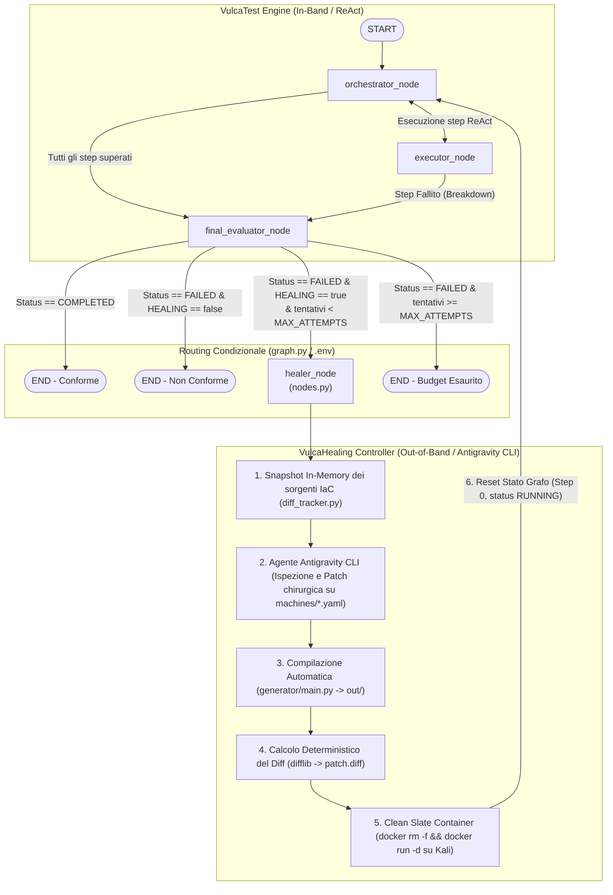

# 🩺 Guida Tecnica: Architettura di Closed-Loop Self-Healing (VulcaHealing)

> **Manuale di Studio e Approfondimento Tecnico per la Tesi di Laurea Magistrale**  
> Questo documento descrive l'architettura formale, le librerie, i contratti dati e le funzioni del modulo di **Closed-Loop Self-Healing** integrato in **VulcaTest White-Box**.  
> È concepito per fornire la piena padronanza del codice, dei flussi di controllo e delle motivazioni scientifiche a supporto della discussione di tesi.

---

## 🗺️ 1. Mappa Concettuale e Paradigma Cibernetico

Nel testing classico di ambienti didattici (es. macchine CTF o cyber range), il collaudo opera tipicamente in modalità **Open-Loop**:
- Un tester (umano o script) esegue un attacco;
- Se un passaggio fallisce, viene registrato un errore;
- L'intervento di diagnosi, correzione dell'infrastruttura (IaC) e riesecuzione del collaudo è completamente manuale.

Con l'integrazione di **VulcaHealing**, VulcaTest evolve in un **sistema cibernetico autonomo a retroazione negativa (Closed-Loop Feedback System)**:



---

## 🧠 2. Il Principio del Contesto Asimmetrico (Idea 30 / Heuristic Lead)

Un punto metodologico cardine da sostenere in sede di tesi è la **disparità informativa** tra l'auditor che rileva il guasto e l'agente che lo ripara:

1. **L'Evaluator opera sul piano del SINTOMO (In-Band):**
   - VulcaTest osserva il comportamento dal terminale (codici HTTP `403 Forbidden`, permessi Linux `0644` rifiutati da SSH, comandi shell non trovati).
   - Nel suo ticket (`healing_ticket.json`), propone una raccomandazione basata solo su ciò che ha visto a runtime.
2. **L'Healer opera sul piano della CAUSA RADICE (Out-of-Band):**
   - L'agente di healing non applica toppe a caldo sul container in esecuzione (una modifica manuale via shell andrebbe persa al successivo riavvio).
   - Tratta il report di VulcaTest come un **Indizio Euristico (Heuristic Lead)**: risale a monte nei file di ricetta Infrastructure-as-Code (`vulcAIN/vulcaforge/machines/<challenge>.yaml`), isola l'incongruenza e rigenera l'intera macchina con il compilatore ufficiale.
3. **Il Vincolo Pedagogico di Non-Sanitizzazione (Anti-Overfitting):**
   - Guidato dal documento formale `knowledge.md`, l'agente di healing ha il divieto assoluto di "risolvere" il problema rimuovendo la falla didattica (es. sanificare l'SQL injection o togliere il SUID). Deve unicamente ripristinare la raggiungibilità tecnica della vulnerabilità prevista dalla storyline di VulcaMind.

---

## ⚙️ 3. Configurazione Dinamica: `.env` e `config.py`

Il comportamento del modulo di healing è completamente disaccoppiato dal codice tramite variabili d'ambiente, consentendo l'abilitazione immediata senza toccare l'architettura.

### 3.1 Variabili nel file `.env`
Collocato in `vulcAIN/vulcatest/white-box/.env`:
```bash
# --- 4. CLOSED-LOOP SELF-HEALING (VulcaHealing & Antigravity CLI) ---
HEALING=true
HEALING_MODEL=gemini-3.8-flash-low
MAX_HEALING_ATTEMPTS=1
HEALING_DRY_RUN=false
HEALING_TIMEOUT=300
```

### 3.2 Esposizione Tipizzata in `config.py`
Nel file `vulcAIN/vulcatest/white-box/config.py`:
```python
# Closed-Loop Self-Healing (VulcaHealing & Antigravity CLI)
HEALING = os.getenv("HEALING", "false").strip().lower() in ("true", "1", "yes")
HEALING_MODEL = os.getenv("HEALING_MODEL", "gemini-3.8-flash-low").strip()
MAX_HEALING_ATTEMPTS = int(os.getenv("MAX_HEALING_ATTEMPTS", "1"))
HEALING_DRY_RUN = os.getenv("HEALING_DRY_RUN", "false").strip().lower() in ("true", "1", "yes")
HEALING_TIMEOUT = int(os.getenv("HEALING_TIMEOUT", "300"))
```

#### Rationale Tecnico:
- **Boolean Parsing Robusto:** `in ("true", "1", "yes")` evita i bug tipici di Python dove `bool("false")` restituisce `True` (essendo una stringa non vuota).
- **Tipizzazione Forte:** `MAX_HEALING_ATTEMPTS` e `HEALING_TIMEOUT` vengono convertiti direttamente a `int` all'avvio del modulo, garantendo che eventuali errori di sintassi nel file `.env` emergano immediatamente.
- **Zero Overhead:** Se `HEALING=false`, l'intero blocco di auto-riparazione rimane inerte.

---

## 📊 4. Modellazione dello Stato: `orchestrator/state.py`

LangGraph gestisce la persistenza e lo scambio dati tra i nodi mediante un tipo `TypedDict` immutabile.

```python
from typing import Any, Literal, Optional
from typing_extensions import TypedDict
from executor.models import TestStep, StepResult

class VulcaTestState(TypedDict):
    target_ip: str
    challenge_name: str
    attack_plan: list[TestStep]
    current_step_index: int
    current_step: Optional[TestStep]
    verified_values: dict[str, Any]
    completed_steps: list[str]
    failed_steps: list[str]
    step_results: list[StepResult]
    status: Literal["RUNNING", "COMPLETED", "FAILED"]
    error_message: Optional[str]
    start_time: float
    start_time_iso: str
    output_dir: str
    active_session_id: Optional[str]
    sessions: dict[str, str]
    
    # --- Estensioni Closed-Loop Self-Healing ---
    healing_attempts: Optional[int]    # Numero progressivo di tentativi di riparazione eseguiti
    healing_status: Optional[str]      # Esito dell'ultimo ciclo (SUCCESS o FAILED)
    healing_dir: Optional[str]         # Directory in cui sono state salvate le evidenze della sessione
```

#### Perché `TypedDict` e `Literal`:
- **`TypedDict`:** Consente a LangGraph di trattare lo stato come un dizionario Python nativo JSON-serializzabile (essenziale per checkpointing e logging), mantenendo la validazione statica dei tipi via linter/IDE.
- **`Literal["RUNNING", "COMPLETED", "FAILED"]`:** Crea un'enumerazione stringa stretta: impedisce che un nodo assegni stati arbitrari (es. `"ERROR"` o `"DONE"`), prevenendo bachi logici nel routing.

---

## 🔀 5. Integrazione nel Grafo LangGraph: `orchestrator/graph.py`

Il grafo LangGraph governa il ciclo di vita del test. L'integrazione di VulcaHealing aggiunge un nodo specializzato e un router condizionale.

### 5.1 Il Router Condizionale Post-Evaluator
```python
def route_final_evaluator(state: VulcaTestState) -> str:
    """
    Se lo stato è COMPLETED, il test ha avuto successo -> END.
    Se lo stato è FAILED e l'healing è abilitato in .env (HEALING=True),
    invia al nodo healer purché non sia stato superato MAX_HEALING_ATTEMPTS.
    Altrimenti termina il grafo a END.
    """
    if not HEALING:
        return END

    if state.get("status") == "COMPLETED":
        return END

    attempts = state.get("healing_attempts") or 0
    if attempts < MAX_HEALING_ATTEMPTS:
        return "healer"

    return END
```

### 5.2 Compilazione della Macchina a Stati
```python
def build_vulcatest_graph():
    """Costruisce e compila lo StateGraph LangGraph"""
    workflow = StateGraph(VulcaTestState)

    # Registrazione dei nodi
    workflow.add_node("orchestrator", orchestrator_node)
    workflow.add_node("executor", executor_node)
    workflow.add_node("final_evaluator", final_evaluator_node)
    workflow.add_node("healer", healer_node)

    # Inizio esecuzione
    workflow.add_edge(START, "orchestrator")

    # Transizioni condizionali ReAct
    workflow.add_conditional_edges(
        "orchestrator", route_orchestrator,
        {"executor": "executor", "final_evaluator": "final_evaluator"}
    )
    workflow.add_conditional_edges(
        "executor", route_executor,
        {"orchestrator": "orchestrator", "final_evaluator": "final_evaluator"}
    )

    # Transizione condizionale post-mortem (Healing Loop)
    workflow.add_conditional_edges(
        "final_evaluator", route_final_evaluator,
        {"healer": "healer", END: END}
    )

    # Edge di retroazione negativa: chiusura del cerchio
    workflow.add_edge("healer", "orchestrator")

    return workflow.compile()
```

#### Dettaglio dei Vincoli Architetturali:
1. **Rientro Incondizionato:** L'arco `workflow.add_edge("healer", "orchestrator")` re-immette deterministicamente l'esecuzione all'inizio del grafo dopo che la riparazione e il Clean Slate sono stati completati.
2. **Terminazione Certa (Halting Guarantee):** La condizione `attempts < MAX_HEALING_ATTEMPTS` impedisce loop infiniti: se l'ambiente non converge entro il numero massimo di tentativi prestabiliti, la macchina a stati evolve irreversibilmente verso il nodo assorbente `END`.

---

## 🛠️ 6. Il Nodo Operativo e Clean Slate: `orchestrator/nodes.py`

Il nodo `healer_node` costituisce il ponte tra la macchina a stati di VulcaTest e il motore di autoriparazione.

```python
def healer_node(state: VulcaTestState) -> dict[str, Any]:
    """
    Nodo di Closed-Loop Self-Healing.
    Viene invocato quando il Final Evaluator riscontra un fallimento di conformance (FAILED).
    1. Esegue il controller di healing (vulcahealing/healer.py) che coordina Antigravity CLI e diff_tracker.
    2. Ripristina il container Docker target con Clean Slate (se TARGET_DOCKER_CONTAINER è configurato).
    3. Resetta lo stato di esecuzione del grafo (step index a 0, status RUNNING) per ritestare la macchina.
    """
    current_attempts = state.get("healing_attempts") or 0
    new_attempts = current_attempts + 1

    print("\n" + "=" * 75)
    print(f"[*] [HEALER NODE] AVVIO CICLO DI SELF-HEALING #{new_attempts}")
    print("=" * 75)

    challenge_name = state.get("challenge_name")

    # Import dinamico per prevenire dipendenze circolari
    from vulcahealing.healer import run_healing

    # Esecuzione del processo di riparazione
    healing_res = run_healing(challenge_name=challenge_name)
    healing_status = healing_res.get("status", "FAILED")
    healing_dir = healing_res.get("healing_dir", "")

    # Clean Slate del container Docker target su Kali Linux
    from config import TARGET_DOCKER_CONTAINER, TARGET_DOCKER_IMAGE
    if TARGET_DOCKER_CONTAINER:
        try:
            from executor.mcp_bridge import MCPBridge
            bridge = MCPBridge()
            image = TARGET_DOCKER_IMAGE or TARGET_DOCKER_CONTAINER
            print(f"[*] [HEALER NODE] Clean Slate: ricreazione container target '{TARGET_DOCKER_CONTAINER}'...")
            bridge.terminal_exec(
                f"docker rm -f {TARGET_DOCKER_CONTAINER} && docker run -d --name {TARGET_DOCKER_CONTAINER} {image}",
                wait_seconds=6.0,
                reset_session=True,
                session_name="healing_reset"
            )
            time.sleep(3)
        except Exception as ce:
            print(f"[!] [HEALER NODE] Warning Clean Slate: {ce}")

    print(f"[+] [HEALER NODE] Ciclo #{new_attempts} completato con esito: {healing_status}")
    print(f"[*] [HEALER NODE] Reset stato del grafo per riesecuzione test sul container risanato...")

    # Ripristino dello stato per rieseguire il test da zero sul container risanato
    return {
        "healing_attempts": new_attempts,
        "healing_status": healing_status,
        "healing_dir": healing_dir,
        "current_step_index": 0,    # Ripartenza dal primo step operativo
        "current_step": None,
        "status": "RUNNING",        # Lo stato torna RUNNING per sbloccare l'orchestratore
        "verified_values": {},      # Azzeramento delle variabili estratte (flag, credenziali vecchie)
        "step_results": [],         # Storico dei comandi azzerato per purezza di log
        "completed_steps": [],
        "failed_steps": [],
        "active_session_id": None,  # Chiusura sessioni interattive pendenti
        "sessions": {},
        "error_message": None,
    }
```

### Perché il Clean Slate è Scientificamente Necessario:
Nel testing di sicurezza, un exploit fallito a metà può lasciare artefatti sul sistema bersaglio (es. file temporanei in `/tmp`, utenti creati, porte impegnate, configurazioni corrotte). Se si rieseguisse il test sullo stesso container, il nuovo collaudo sarebbe invalidato da **effetti collaterali (Side Effects)**. La distruzione e ricreazione atomica dell'istanza Docker garantisce la **ripetibilità scientifica del benchmark**.

---

## 🤖 7. Il Controller di Riparazione: `vulcahealing/healer.py`

Questo modulo funge da orchestratore esterno ed esegue l'integrazione con l'agente specializzato **Antigravity CLI**.

### 7.1 Risoluzione dei Contesti e Percorsi
- Usa `pathlib.Path(__file__).resolve().parent` per ancorare tutti i riferimenti alla root del repository, indipendentemente dalla cartella corrente (`cwd`) di esecuzione.
- `resolve_challenge_context()`: mappa i nomi didattici (es. `Citadel_B2R`) al container slug (`citadel`) e alla cartella delle evidenze.
- `get_next_healing_dir()`: scansiona via regex `^healing_(\d+)$` la directory delle evidenze per creare la sottocartella progressiva `healing_1/`, `healing_2/`, archiviando in modo non distruttivo prompt, diff e report.

### 7.2 Il Prompt Strutturato a Coordinate di Progetto
Invece di affidarsi a un prompt testuale ambiguo, `healer.py` costruisce un prompt basato su **coordinate filesystem assolute**:

```python
prompt = f"""\
Sei l'Agente di Self-Healing autonomo del framework VulcAIn.
Si e' verificato un errore di conformita' durante il collaudo della challenge '{chal_name}'.

COORDINATE DI PROGETTO:
- Guida Architettura & Linee Guida: vulcAIN/vulcatest/vulcahealing/knowledge.md
- Diagnosi Errore (VulcaTest): vulcAIN/vulcatest/white-box/evidence/{chal_folder}/latest/
- Specifiche Didattiche (VulcaMind): vulcAIN/vulcamind/{chal_folder}/
- Sorgenti IaC da Modificare: vulcAIN/vulcaforge/machines/{slug}.yaml
- Output Generato: vulcAIN/vulcaforge/out/{slug}/

IL TUO OBIETTIVO:
1. Consulta 'knowledge.md' per comprendere la cooperazione tra VulcaMind, VulcaForge e VulcaTest (Heuristic Lead principle).
2. Ispeziona con i tuoi tool l'ultimo report di errore in 'vulcAIN/vulcatest/white-box/evidence/{chal_folder}/latest/REPORT.md' (o 'healing_ticket.json').
   Usa le keyword 'blocking_step', 'root_cause' e 'affected_component' per isolare subito il punto di rottura.
3. Identifica la causa radice nei sorgenti di VulcaForge (in particolare 'machines/{slug}.yaml' o i relativi playbook/template).
4. Correggi chirurgicamente il difetto IaC.
   ATTENZIONE: Non rimuovere ne' alterare le vulnerabilita' intenzionali previste per gli studenti! Se hai dubbi, consulta le specifiche in 'vulcamind/{chal_folder}/'.
5. Rigenera gli asset della macchina posizionandoti in 'vulcAIN/vulcaforge' ed eseguendo:
   python generator/main.py generate machines/{slug}.yaml --no-check
6. Salva tutte le modifiche e termina.

DIRETTIVA SUL DIFF:
NON calcolare differenze, non generare file di patch e non scrivere script python per il diff: il framework VulcaHealing cattura automaticamente le differenze prima/dopo e genera deterministamente 'patch.diff' e 'HEALING_REPORT.md' al termine della tua esecuzione.
"""
```

### 7.3 Invocazione Sicura di Antigravity CLI via `subprocess.run`
```python
cmd = [
    "agy",
    "--mode", "accept-edits",
    "--dangerously-skip-permissions",
    "--model", model_name,
    "-p", prompt
]
proc = subprocess.run(
    cmd,
    cwd=str(WORKSPACE_ROOT),
    capture_output=True,
    text=True,
    encoding="utf-8",
    errors="replace",
    timeout=timeout_sec
)
```

#### Dettagli Chiave sui Parametri:
- **`cmd` come Lista:** Impedisce vulnerabilità di command injection evitando l'uso di `shell=True`.
- **`cwd=str(WORKSPACE_ROOT)`:** Assicura che l'agente CLI operi con la vista corretta dell'intero albero di repository.
- **`capture_output=True`:** Isola `stdout` e `stderr` senza inquinare la console dell'orchestratore.
- **`encoding="utf-8", errors="replace"`:** Cruciale su Windows per prevenire eccezioni di decodifica `charmap`/`cp1252` in presenza di caratteri Unicode nei log.
- **`timeout=timeout_sec`:** Impedisce blocchi indefiniti (default: 300 secondi).

---

## 🔍 8. Il Diff Deterministico: `vulcahealing/diff_tracker.py`

Uno dei punti di forza più originali del lavoro di tesi è la separazione tra la modifica del codice e il tracciamento delle differenze.

### Perché Non Far Calcolare il Diff all'LLM?
I modelli linguistici manifestano allucinazioni frequenti quando generano file `.diff`:
1. Calcolano male i numeri di riga negli header unified (`@@ -45,7 +45,8 @@`).
2. Tagliano o alterano gli spazi bianchi e le indentazioni (fatale per YAML e Python).
3. Omettono blocchi intermedi scrivendo commenti come `// ... resto del file invariato ...`.

### La Soluzione Algoritmica Deterministica
Il modulo `diff_tracker.py` impiega la libreria standard Python `difflib` attraverso due funzioni:

#### 8.1 `take_folder_snapshot(folder_path: str) -> dict[str, str]`
Scansiona la cartella prima dell'azione dell'agente:
```python
def take_folder_snapshot(folder_path: str) -> dict[str, str]:
    snapshot: dict[str, str] = {}
    base_dir = Path(folder_path).resolve()

    for root, dirs, files in os.walk(base_dir):
        # Pruning in-place: non scendere nelle cartelle inutili
        dirs[:] = [d for d in dirs if d not in EXCLUDED_DIRS]
        for file in files:
            file_path = Path(root) / file
            if file_path.suffix.lower() in EXCLUDED_EXTS:
                continue

            rel_path = str(file_path.relative_to(base_dir)).replace("\\", "/")
            try:
                with open(file_path, "r", encoding="utf-8", errors="replace") as f:
                    snapshot[rel_path] = f.read()
            except Exception:
                pass
    return snapshot
```
- **Pruning in-place (`dirs[:] = ...`):** Evita la scansione di `.git`, `.venv` e `node_modules`, velocizzando l'I/O.
- **Filtro binari (`EXCLUDED_EXTS`):** Esclude immagini `.png`, `.jpg`, file `.pdf`, archivi `.tar.gz`, database SQLite `.db`.

#### 8.2 `compute_folder_diff(folder_path, snapshot_before, healing_out_dir) -> dict`
Acquisisce il secondo snapshot post-intervento e calcola le differenze matematiche:
```python
# Per ciascun file modificato:
lines_before = snapshot_before[rel_path].splitlines(keepends=True)
lines_after = snapshot_after[rel_path].splitlines(keepends=True)

diff = difflib.unified_diff(
    lines_before, lines_after,
    fromfile=f"a/{rel_path}", tofile=f"b/{rel_path}",
    lineterm=""
)
```
- **`lineterm=""`:** Impedisce il raddoppio dei caratteri di fine riga, garantendo la compatibilità al 100% con gli standard POSIX `patch -p1` e `git apply`.
- **Generazione Output:**
  1. `patch.diff`: File unificato contenente tutte le modifiche apportate alla macchina.
  2. `HEALING_REPORT.md`: Documento Markdown leggibile per gli auditor con la tabella dei file toccati e le metriche di righe inserite (`+`) e rimosse (`-`).

---

## 📚 9. Compendio delle Librerie Utilizzate

| Libreria / Modulo | Componenti Principali | Ruolo nell'Architettura |
| :--- | :--- | :--- |
| **`langgraph`** | `StateGraph`, `START`, `END` | Orchestrazione della macchina a stati ciclica con gestione nativa dei loop di re-test. |
| **`typing_extensions`** | `TypedDict`, `Literal`, `Optional` | Tipizzazione statica formale dello stato del grafo (`VulcaTestState`). |
| **`difflib`** | `unified_diff` | Calcolo deterministico della patch unificata POSIX senza allucinazioni da LLM. |
| **`subprocess`** | `run`, `PIPE`, `TimeoutExpired` | Invocazione controllata di processi esterni (Antigravity CLI) con isolamento I/O e timeout. |
| **`pathlib`** | `Path`, `resolve()`, operatore `/` | Gestione ad oggetti dei percorsi filesystem, neutrale rispetto al sistema operativo. |
| **`re`** | `match`, gruppi di cattura `(\d+)` | Calcolo e indicizzazione sequenziale delle cartelle delle evidenze (`healing_N`). |
| **`dotenv`** | `load_dotenv(override=True)` | Caricamento e prioritizzazione delle variabili d'ambiente di configurazione. |
| **`sys`** | `stdout.reconfigure(encoding="utf-8")` | Protezione della console Windows contro crash da encoding Unicode/emoji. |

---

## 🎓 10. Domande e Risposte per la Discussione di Tesi

### D1: *"Perché avete delegato l'auto-riparazione ad Antigravity CLI invece di creare un nodo LLM interno a LangGraph?"*
> **Risposta:**  
> «LangGraph è eccellente per la gestione di flussi a stati e decisioni logiche ReAct, ma è inadatto a fungere da IDE di programmazione autonomo. Riparare un'infrastruttura IaC richiede di navigare il filesystem, leggere template complessi, applicare modifiche chirurgiche su blocchi di testo ed eseguire generatori CLI esterni.  
> Antigravity CLI è un agente specializzato per il software engineering dotato di tool nativi di editing filesystem avanzati. Delegare l'healing tramite un controller esterno disaccoppia il runtime di collaudo (che gira su modelli quantizzati locali in VRAM) dalle attività di refactoring IaC, preservando la pulizia del contesto di LangGraph ed eliminando il rischio di corruzione dello stato.»

---

### D2: *"Cosa impedisce all'LLM di risolvere l'errore eliminando la vulnerabilità didattica prevista per lo studente?"*
> **Risposta:**  
> «È il problema noto come **over-sanitization**, in cui un modello di AI istruito sulla cybersecurity tende istintivamente a 'chiudere le falle'. Nel nostro framework abbiamo risolto questa criticità applicando il **Principio del Contesto Asimmetrico (Idea 30)**:  
> Nel prompt generato da `healer.py` iniettiamo esplicitamente il file `knowledge.md` e i puntatori alle specifiche di VulcaMind (`DESCRIPTION.md` e `STORYLINE_B2R.md`). L'agente riceve l'istruzione categorica di non rimuovere le vulnerabilità intenzionali previste dal docente. Di conseguenza, l'agente corregge unicamente i difetti infrastrutturali collaterali (es. un percorso file errato, una configurazione Nginx che blocca l'esecuzione o permessi non allineati) senza mai alterare l'itinerario pedagogico della challenge.»

---

### D3: *"Come viene garantito che il grafo LangGraph non entri in un ciclo infinito di healing se l'errore persiste?"*
> **Risposta:**  
> «La convergenza e la terminazione deterministica della macchina a stati sono assicurate da due guardrail formali:  
> 1. Nello stato `VulcaTestState` è presente il contatore `healing_attempts`, incrementato a ogni ciclo da `healer_node`. La funzione di routing `route_final_evaluator` valuta tale valore a runtime: non appena `healing_attempts >= MAX_HEALING_ATTEMPTS` (parametro configurabile in `.env`, tipicamente 1 o 2), il grafo instrada inesorabilmente verso il nodo assorbente `END`.  
> 2. A livello di sistema operativo, `subprocess.run` impone un `timeout` rigido (default 300s): se l'agente CLI si blocca, il processo viene terminato forzatamente e il fallimento viene registrato nell'audit trail.»

---

### D4: *"Perché avete sviluppato `diff_tracker.py` anziché far generare la patch direttamente all'LLM?"*
> **Risposta:**  
> «Chiedere a un modello linguistico di emettere un diff in formato Unified Diff introduce un tasso inaccettabile di allucinazioni: numeri di riga errati negli header, eliminazione di spazi di indentazione o troncamento di codice con commenti discorsivi.  
> Con `diff_tracker.py` abbiamo implementato un approccio **deterministico e agnostico**: memorizziamo uno snapshot in-memory dei file prima dell'intervento e, a riparazione ultimata, calcoliamo la differenza esatta con l'algoritmo standard LCS di `difflib.unified_diff`. La patch generata (`patch.diff`) rispetta rigorosamente lo standard POSIX ed è direttamente applicabile con `git apply`, garantendo la massima fedeltà e trasparenza scientifica per l'audit di conformità.»
