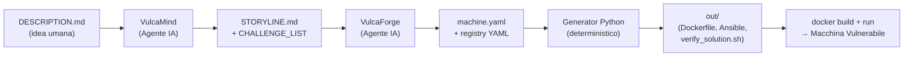
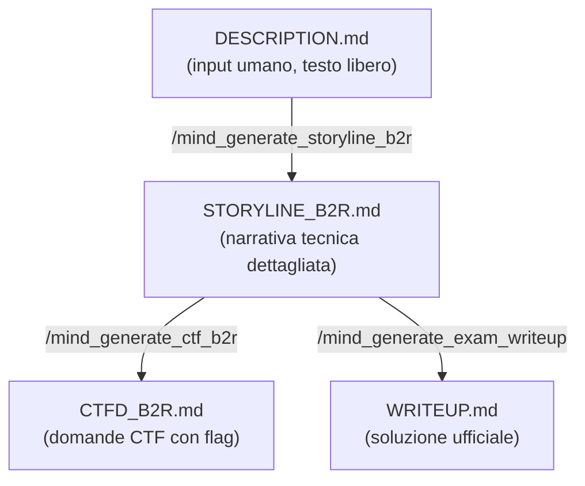
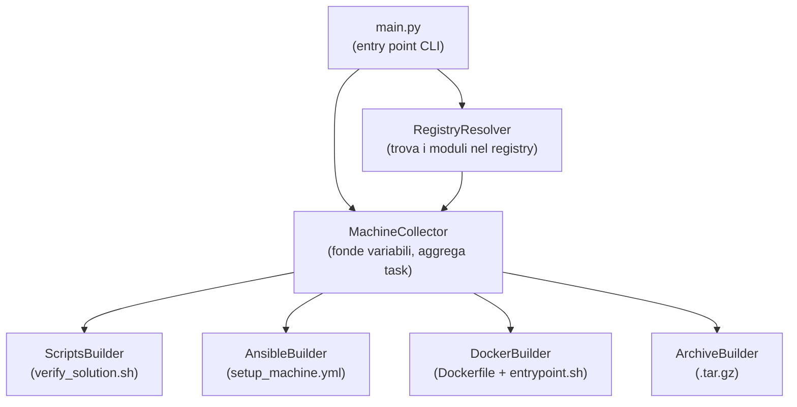
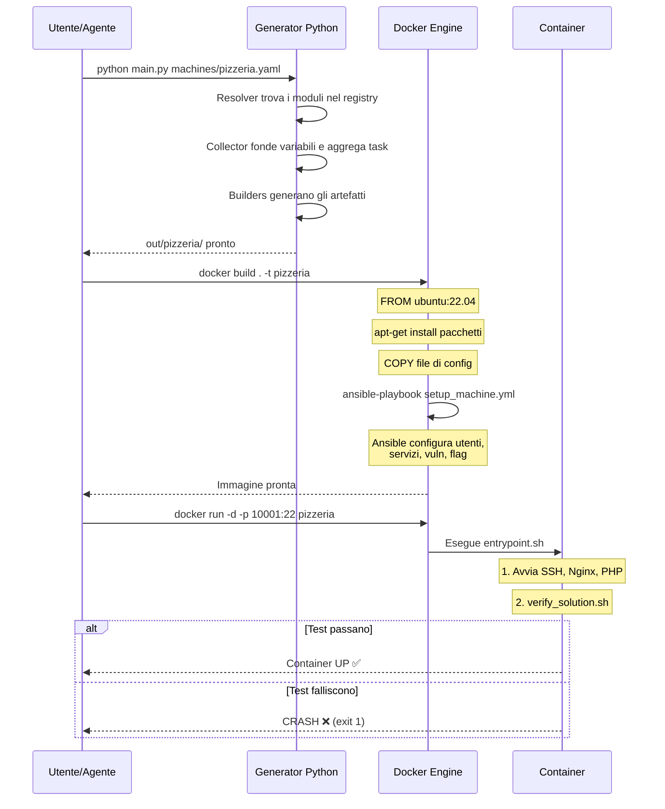
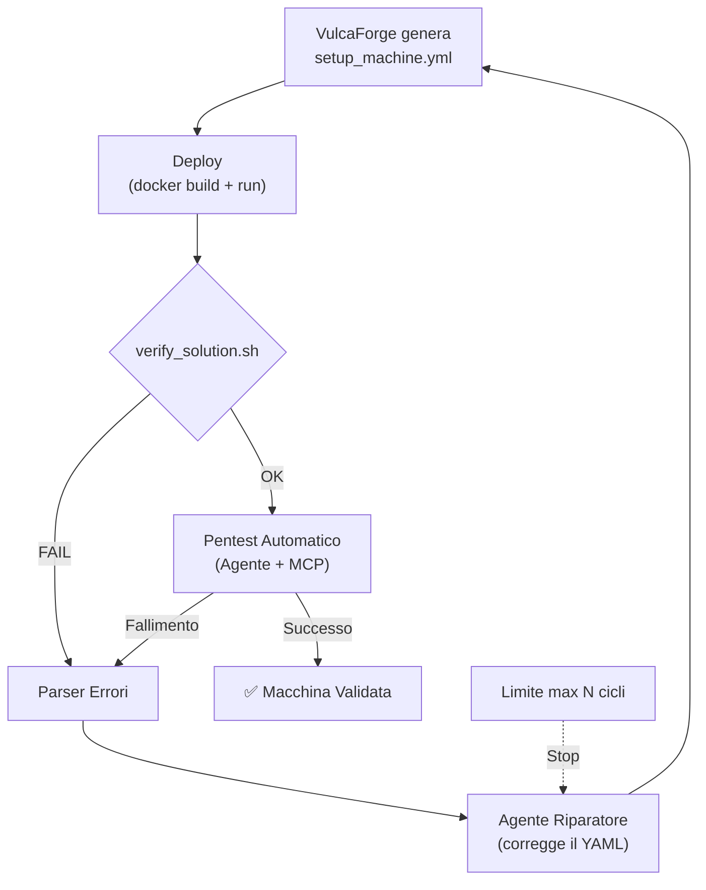

# Architettura Completa: VulcAIn & VulcaTest

> Documento tecnico di riferimento per comprendere ogni componente del progetto.
> **Convenzione**: i termini nuovi sono spiegati inline al primo utilizzo con *(definizione)*.

---

## Indice

1. [Panoramica del Sistema](#1-panoramica-del-sistema)
2. [Il Control Plane Agentico (`.agents/`)](#2-il-control-plane-agentico-agents)
3. [VulcaMind — Il Designer](#3-vulcamind--il-designer)
4. [VulcaForge — Il Generatore Infrastrutturale](#4-vulcaforge--il-generatore-infrastrutturale)
   - 4.1 [Il Registry dei Moduli](#41-il-registry-dei-moduli)
   - 4.2 [Il Machine YAML](#42-il-machine-yaml)
   - 4.3 [Il Generatore Python](#43-il-generatore-python)
5. [Il Lifecycle della Macchina](#5-il-lifecycle-della-macchina)
6. [Obiettivo 0 — Validazione Statica (Completato)](#6-obiettivo-0--validazione-statica-completato)
7. [Obiettivo 1 — VulcaTest (Da Implementare)](#7-obiettivo-1--vulcatest-da-implementare)

---

## 1. Panoramica del Sistema

VulcAIn è una piattaforma che genera **macchine virtuali vulnerabili** (CTF Boot-to-Root) in modo semi-automatico. Un agente IA progetta la challenge, uno script Python assembla il codice infrastrutturale, Docker impacchetta tutto.



### Chi fa cosa

| Componente                        | Chi lo esegue             | Cosa produce                                            |
| --------------------------------- | ------------------------- | ------------------------------------------------------- |
| VulcaMind                         | Agente IA (tramite chat)  | `STORYLINE.md`, domande CTF, writeup                    |
| VulcaForge (parte agentica)       | Agente IA (tramite chat)  | `machine.yaml` + moduli YAML nel registry               |
| VulcaForge (parte deterministica) | Script Python (`main.py`) | `setup_machine.yml`, `Dockerfile`, `verify_solution.sh` |
| VulcaShip                         | CLI/Script                | Deploy su Proxmox (produzione)                          |

> **Nota**: tu come tesista non scrivi direttamente `machine.yaml` o i moduli registry — lo fa l'agente IA guidato dai workflow. Il tuo ruolo è capire come funziona il tutto per poter debuggare, modificare il generatore Python e implementare VulcaTest.

---

## 2. Il Control Plane Agentico (`.agents/`)

La cartella `.agents/` contiene le **istruzioni che vengono iniettate nella context window** *(lo spazio di testo che l'LLM può "vedere" in una singola conversazione)* dell'agente IA. Quando invochi un comando slash (es. `/forge_generate_machine`), il contenuto del file `.md` corrispondente viene inserito nel prompt di sistema dell'agente.

### Struttura

```
CHIAMATA 1/.agents/
├── workflows/     ← Processi multi-step (comandi esecutivi)
├── skills/        ← Knowledge base consultabile (non esecutiva)
├── templates/     ← Formati di output per VulcaMind
└── rag/           ← Documenti di contesto extra
```

### Workflows vs Skills

- **Workflow** = un "copione" che dice all'agente **cosa fare e in che ordine**. Contiene step numerati, prerequisiti, regole di naming.
- **Skill** = una "scheda tecnica" che l'agente **consulta quando gli serve**. Contiene schemi YAML, best practice, pattern architetturali.

### Esempio concreto: il workflow `forge_generate_machine.md`

Questo file dice all'agente come assemblare una macchina. I punti chiave:

```markdown
### 1. Analyze and Decompose
- Break down the attack chain into the smallest possible Atomic Mechanisms.
    - Example: "Backup leak with FTP credentials" → split into:
        1. web-leak-backup-file
        2. service-ftp-setup

### 2. Search and Audit Registry
- Before creating ANY new YAML, search registry/vulns/ for:
    - Identical mechanisms: Use them as-is.
    - Similar mechanisms: Can they be made modular with more variables?

### 6. Implementation Best Practices
- Flag Handling: Flags MUST be created using system-flag-setup
- Web App Binding: app MUST bind ONLY to 127.0.0.1
- Sudoers File Naming: sanitize dots in filenames
```

L'agente segue queste istruzioni alla lettera quando esegui `/forge_generate_machine`.

### Esempio: la skill `FORGE_VULNS.md`

Definisce lo **schema YAML** che ogni modulo nel registry deve rispettare:

```yaml
id: "categoria-nome-vulnerabilità"     # Identificatore univoco funzionale
title: "Titolo Parlante"
category: "web|privesc|misconfig"
vars:                                   # Parametri con default sovrascrivibili
  web_port: 8080
  app_root: "/opt/webapp"
requirements:
  packages: ["apache2", "php"]          # Pacchetti APT da installare
ansible_role:                           # Lista di task Ansible
  - name: "Creazione directory"
    ansible.builtin.file:
      path: "{{ app_root }}"            # ← Placeholder Jinja2
      state: directory
verification:                           # Test automatici
  - type: "http"
    url: "http://localhost:{{ web_port }}/"
    expected_contains: "Dashboard"
```

### La cartella interna `vulcamind/.agents/`

Contiene **solo template di formattazione** (es. `CHALLENGE_TEMPLATE.md`). Servono a vincolare il formato dell'output dell'agente quando genera le domande CTF, ma non contengono workflow esecutivi.

---

## 3. VulcaMind — Il Designer

VulcaMind è la parte del sistema dove l'agente IA progetta la narrativa e la struttura della challenge.



### Il flusso concreto (Pizzeria B2R)

**1. L'utente scrive** `DESCRIPTION.md` (input grezzo):

```markdown
## Boot to Root
- Tema: franchise di pizzerie "chepizzachiama?"
- Sito web sulla porta 80
- Chat di assistenza → database → vulnerabilità LFI
- Credenziali: user/user → SSH
- Privesc 1: script bash con password in chiaro → franchino
- Privesc 2: franchino può modificare /etc/passwd → root
```

**2. L'agente genera** `STORYLINE_B2R.md` (output strutturato):

Ogni fase d'attacco è descritta con lo schema:
- **Action**: cosa fa l'attaccante
- **Tool/Technique**: strumenti usati
- **Result**: cosa ottiene
- **Critical Point**: perché è importante

Questo file è fondamentale perché verrà usato sia per generare le domande CTF sia per il testing automatico (Obiettivo 1 della tesi).

### Dove si trovano i file

```
vulcamind/
├── 11.Pizzeria_B2R/
│   ├── DESCRIPTION.md        ← Input umano
│   ├── STORYLINE_B2R.md      ← Generato dall'agente
│   ├── CTFD_B2R.md           ← Domande CTF generate
│   └── WRITEUP.md            ← Soluzione ufficiale
├── 07.Sim_Exam_01/
│   └── ...
└── .agents/                  ← Solo template di formato
```

---

## 4. VulcaForge — Il Generatore Infrastrutturale

Questa è la parte più complessa. Si divide in:
1. **Parte agentica**: l'IA scrive `machine.yaml` e i moduli nel registry
2. **Parte deterministica**: lo script Python legge tutto e genera gli artefatti finali

### 4.1 Il Registry dei Moduli

Il registry è una libreria di **componenti riutilizzabili**. Ogni componente è un file YAML che descrive *una singola cosa* (un servizio, una vulnerabilità, una configurazione).

```
registry/
├── base/          ← Immagini OS base (ubuntu_22_04.yaml)
├── config/        ← Config di sistema (system-users, system-flag-setup)
├── services/
│   └── network/   ← Servizi di rete (service-ssh, service-ftp)
├── vulns/         ← Vulnerabilità
│   ├── web/       ← Web (web-sqli, web-lfi, web-cmdi-waf)
│   ├── privesc/   ← Privilege escalation (sudo, suid, cron)
│   ├── misconfig/ ← Misconfigurazioni
│   └── service/   ← Servizi vulnerabili
├── snippets/      ← Script troppo grandi per stare inline
├── tools/         ← Binari (linpeas, pspy64)
└── web/
    ├── webapps/   ← Codice sorgente web app complete
    └── vuln_snippets/ ← Frammenti di codice vulnerabile
```

#### Esempio: `service-ssh.yaml`

```yaml
id: "service-ssh"
requirements:
  packages:
    - openssh-server
startup: "service ssh start"              # Comando da eseguire al boot del container

ansible_role:                             # Task Ansible per configurare SSH
  - name: "Ensure /run/sshd exists"
    ansible.builtin.file:
      path: "/run/sshd"
      state: directory
  - name: "Configure SSH port"
    ansible.builtin.lineinfile:
      path: "/etc/ssh/sshd_config"
      regexp: "^#?Port"
      line: "Port {{ ssh_port | default(22) }}"   # ← Jinja2: usa il valore passato, oppure 22
  - name: "Enable password authentication"
    ansible.builtin.lineinfile:
      path: "/etc/ssh/sshd_config"
      regexp: "^#?PasswordAuthentication"
      line: "PasswordAuthentication yes"

verification:                             # Test per verify_solution.sh
  - type: "shell"
    command: "nc -zv 127.0.0.1 {{ ssh_port | default(22) }}"
```

**Punti chiave:**
- `requirements.packages` → lista di pacchetti APT che il generatore installerà
- `startup` → comando che l'entrypoint eseguirà al boot del container
- `ansible_role` → lista di task Ansible che configureranno il servizio
- `verification` → test che `verify_solution.sh` eseguirà per verificare che funzioni
- `{{ ssh_port | default(22) }}` → **placeholder Jinja2** *(sintassi per inserire valori dinamici)*: il valore viene dal machine YAML; se non specificato, usa 22

#### Esempio: una vulnerabilità (`privesc-sudo-python-script-writable.yaml`)

```yaml
id: "privesc-sudo-python-script-writable"

ansible_role:
  - name: "Create a writable script in user home"
    ansible.builtin.copy:
      content: |
        #!/usr/bin/python3
        print("System maintenance in progress...")
      dest: "{{ '/root' if to_user == 'root' else '/home/' + to_user }}/maintenance.py"
      owner: "{{ to_user }}"
      mode: "0777"                        # ← Tutti possono scrivere: è la vulnerabilità!
  - name: "Allow from_user to run this script via sudo"
    ansible.builtin.copy:
      content: "{{ from_user }} ALL=({{ to_user }}) NOPASSWD: /usr/bin/python3 ..."
      dest: "/etc/sudoers.d/{{ from_user }}_writable_script"
      mode: "0440"

verification:
  - type: "shell"
    command: "ls -l .../maintenance.py"
    expected_contains: "rwxrwxrwx"        # Verifica che sia scrivibile

flag:
  path: "/home/{{ to_user }}/flag_writable_sudo.txt"
  content: "VDSI{writable_sudo_script_is_bad}\n"
```

> `{{ from_user }}` e `{{ to_user }}` sono variabili iniettate dal generatore. `from_user` è l'utente che ha già l'attaccante, `to_user` è quello che otterrà dopo l'exploit.

---

### 4.2 Il Machine YAML

Il file `machines/<nome>.yaml` è la **ricetta** di una macchina. Elenca quali componenti del registry usare e con quali parametri.

#### Esempio completo: `machines/pizzeria.yaml`

```yaml
name: "pizzeria"
description: "Boot2Root machine for Pizzeria"

components:
  # 1. Utenti di sistema
  - id: system-users
    users:
      - name: user
        password: user
      - name: franchino
        password: franchinopizzaiolo123!

  # 2. Servizio SSH
  - id: service-ssh
    ssh_port: 22                          # ← Sovrascrive il default del modulo

  # 3. Stack PHP
  - id: web-php-base
    web_user: www-data
    php_version: "8.1"

  # 4. Virtual host Nginx
  - id: service-nginx-vhost
    server_name: pizzeria
    is_default: true
    document_root: /var/www/pizzeria

  # 5. Deploy della web app
  - id: web-app-deploy
    app_name: pizzeria
    target_path: /var/www/pizzeria
    owner: www-data

  # 6. Script con password in chiaro (la vuln per privesc step 1)
  - id: system-file-setup
    target_path: /opt/test.sh
    content: |
      #!/bin/bash
      # DB_PASS="franchinopizzaiolo123!"
      echo "Running maintenance tasks..."
    owner: root
    mode: '0755'

  # 7. Privesc step 2: franchino può editare /etc/passwd
  - id: privesc-sudo-edit-specific-file
    from_user: franchino
    to_user: root
    target_file: /etc/passwd
    editor_path: /bin/nano

  # 8. Flag
  - id: system-flag-setup
    flags:
      - path: /home/user/user.txt
        content: VDSI{f00th0ld_4cqu1r3d_ch3_p1zz4}
        owner: user
        group: user
      - path: /root/root.txt
        content: VDSI{r00t_pwn3d_p1zz4_m4rgh3r1t4}
        owner: root
        group: root
```

**Come funziona il collegamento**: ogni `id` referenzia un file nel registry. I parametri scritti accanto (es. `ssh_port: 22`) **sovrascrivono** i default del modulo.

---

### 4.3 Il Generatore Python

La pipeline deterministica. Non usa LLM — prende il machine YAML e i moduli del registry, li fonde insieme e produce gli artefatti finali.



#### 4.3.1 `main.py` — Entry Point

Quando esegui `python generator/main.py machines/pizzeria.yaml`:

```python
# 1. Legge il YAML della macchina
resolver = RegistryResolver("registry")
machine_def = resolver.load_yaml(args.machine_def)

# 2. Crea il collector e aggrega tutto
collector = MachineCollector(machine_def, resolver, out_dir)
collector.collect()

# 3. Genera gli artefatti
ScriptsBuilder(collector, out_dir).generate_verify_script()
AnsibleBuilder(collector, out_dir).generate()
DockerBuilder(collector, out_dir).generate()
ArchiveBuilder(out_dir).generate()
```

Gestisce anche:
- **Override di variabili** da CLI: `python main.py machines/x.yaml -v ssh_port=2222`
- **Macchine stackate** *(container innestati)*: se un componente ha `id: stacked-container`, il generatore si lancia ricorsivamente per la sotto-macchina
- **Check dei writeup**: avvisa se mancano i writeup per alcuni componenti

#### 4.3.2 `resolver.py` — Trovare i Moduli

Il `RegistryResolver` cerca un file YAML nel registry in base al campo `id` interno (non al nome del file).

```python
class RegistryResolver:
    def resolve_vuln(self, vuln_id):
        vuln_dir = os.path.join(self.registry_path, "vulns")
        for root, dirs, files in os.walk(vuln_dir):   # Scansione ricorsiva
            for file in files:
                if file.endswith(".yaml"):
                    data = self.load_yaml(os.path.join(root, file))
                    if data.get("id") == vuln_id:     # Match sull'id interno
                        return data
        raise ValueError(f"Vulnerability {vuln_id} not found")

    def resolve_config(self, config_id):
        # Stessa logica, cerca in registry/config/ e registry/services/
        search_dirs = ["registry/config", "registry/services"]
        # os.walk + match su data["id"]
```

> Quindi `registry/vulns/privesc/sudo/sudo_python_script_writable.yaml` viene trovato cercando l'id `"privesc-sudo-python-script-writable"`, non il nome del file.

#### 4.3.3 `collector.py` — Il Cuore del Sistema

Il `MachineCollector` prende tutti i componenti del machine YAML, li risolve tramite il resolver, fonde le variabili e produce liste unificate di task, pacchetti, comandi di startup e verifiche.

##### Il Variable Merging

Quando un componente viene processato, le variabili si fondono con questa **precedenza** (dal più debole al più forte):

```
1. Default del modulo registry  (vars nel file YAML del registry)
     ↓ sovrascrive
2. Variabili globali macchina   (vars nel machine YAML, sotto la chiave "vars:" root)
     ↓ sovrascrive
3. Variabili dell'istanza       (vars: dentro il componente specifico)
     ↓ sovrascrive
4. Parametri diretti            (campi come from_user, to_user, ssh_port)
```

Il codice che lo fa:

```python
# 1. Default dal modulo registry
vars_dict = {}
if "vars" in config_data:
    deep_merge(vars_dict, config_data["vars"])

# 2. Variabili globali dalla machine definition
if "vars" in self.machine_def:
    deep_merge(vars_dict, self.machine_def["vars"])

# 3. Variabili specifiche di questa istanza
instance_vars = config_params.get("vars", {})
deep_merge(vars_dict, instance_vars)

# 4. Parametri diretti (es. from_user, ssh_port)
for k, v in config_params.items():
    if k not in ["id", "vars"]:
        vars_dict[k] = v
```

`deep_merge` fonde i dizionari ricorsivamente (dict2 sovrascrive dict1):

```python
def deep_merge(dict1, dict2):
    for key, value in dict2.items():
        if isinstance(value, Mapping) and key in dict1:
            deep_merge(dict1[key], value)   # Sotto-dizionari: ricorsione
        else:
            dict1[key] = value              # Valore semplice: sovrascrittura
    return dict1
```

##### Il metodo `collect()` — Assemblaggio Finale

```python
def collect(self):
    # 1. Risolve il sistema operativo base → immagine Docker, pacchetti base
    base_data = self.resolver.resolve_base_os(base_os)
    self.base_image = base_data.get("docker_image", "ubuntu:22.04")
    self.all_packages.update(base_data.get("packages", []))

    # 2. Per ogni componente nel machine YAML:
    for entry in components_list:
        if not process_vuln_entry(entry):      # Prova come vuln
            self.process_config([entry], ...)   # Altrimenti come config

    # 3. Assemblaggio finale dei task nell'ordine corretto:
    self.all_tasks = [
        secure_root_task,         # Permessi /root
        *base_tasks,              # Setup OS base
        *pre_configs,             # Config prerequisite
        install_packages_task,    # Installazione pacchetti APT (unificati)
        *regular_configs,         # Config normali (SSH, Nginx, utenti...)
        *challenge_tasks,         # Task delle vulnerabilità
        *post_configs,            # Cleanup
        cleanup_task              # Rimozione file di build
    ]
```

Per le **vulnerabilità**, il collector salva i task Ansible come file separati e li include nel playbook:

```python
# Salva i task della vuln come file separato
with open(f"out/pizzeria/vulnerabilities/{vuln_id}.yml", "w") as f:
    yaml.dump(vuln_tasks, f)

# Aggiunge un include_tasks nel playbook principale
challenge_tasks.append({
    "name": f"Include tasks for {vuln_id}",
    "ansible.builtin.include_tasks": {"file": f"vulnerabilities/{vuln_id}.yml"},
    "vars": vars_dict,        # ← Variabili fuse passate qui
})
```

Alla fine, il collector **copia selettivamente** le risorse referenziate:

```python
# Serializza i task in testo e cerca riferimenti
combined_text = json.dumps(self.all_tasks)
for item in os.listdir(webapps_src):
    if item in combined_text:       # Presente nel codice → copiala in out/
        shutil.copytree(src_item, dest_item)
```

#### 4.3.4 `ansible_builder.py` — Genera il Playbook

Serializza la lista di task in un playbook Ansible:

```python
class AnsibleBuilder:
    def generate(self):
        playbook = [{
            "hosts": "localhost",        # Eseguito localmente nel container
            "connection": "local",
            "tasks": self.collector.all_tasks,
            "handlers": self.collector.all_handlers
        }]
        yaml.dump(playbook, f, sort_keys=False)
```

#### 4.3.5 `docker_builder.py` — Dockerfile ed Entrypoint

**Dockerfile** (da template `Dockerfile.tpl`):

```dockerfile
FROM {base_image}
ENV DEBIAN_FRONTEND=noninteractive
RUN {pkg_manager_cmd}                    # apt-get install -y ansible pkg1 pkg2...
COPY setup_machine.yml /tmp/setup_machine.yml
{copy_blocks}                            # COPY configs, vulnerabilities, webapps...
RUN ln -sf /usr/bin/true /usr/bin/systemctl   # Disabilita systemd in Docker
RUN ansible-playbook /tmp/setup_machine.yml -e "is_docker=true"
COPY verify_solution.sh /usr/local/bin/verify_solution.sh
COPY entrypoint.sh /entrypoint.sh
ENTRYPOINT ["/entrypoint.sh"]
CMD ["tail", "-f", "/dev/null"]
```

> `ln -sf /usr/bin/true /usr/bin/systemctl` fa sì che ogni chiamata a `systemctl` non faccia nulla (Docker non ha systemd). Il flag `is_docker=true` fa ignorare i task `systemd` nel playbook.

**Entrypoint** (generato dinamicamente):

```bash
#!/bin/bash
service ssh start                      # Startup commands dai moduli
service nginx start
# ...

# Obiettivo 0: validazione al boot
if [ -f /usr/local/bin/verify_solution.sh ]; then
    /usr/local/bin/verify_solution.sh || exit 1   # CRASH se fallisce
fi

exec "$@"
```

#### 4.3.6 `scripts_builder.py` — verify_solution.sh

Itera sulle `verification` raccolte e genera test bash con **Jinja2** *(motore di template Python che sostituisce `{{ variabile }}` con valori reali)*:

```python
def generate_verify_script(self):
    for v in self.collector.verifications:
        for check in v["verification"]:
            resolved_vars = v.get("resolved_vars", {})

            if check["type"] == "shell":
                cmd = jinja2.Template(check['command']).render(**resolved_vars)
                if "expected_contains" in check:
                    expected = jinja2.Template(check['expected_contains']).render(**resolved_vars)
                    script += f"{cmd} | grep -q '{expected}' || exit 1\n"

            elif check["type"] == "http":
                url = jinja2.Template(check["url"]).render(**resolved_vars)
                script += f"curl -s '{url}' | grep -q '{expected}' || exit 1\n"
```

**Output reale** (`verify_solution.sh` della Pizzeria):

```bash
#!/usr/bin/bash
set -e
echo '[*] Starting Verification...'

# Verifica utenti
grep -q '^user:' /etc/passwd && grep -q '^franchino:' /etc/passwd || exit 1

# Verifica SSH
nc -zv 127.0.0.1 22 || exit 1

# Verifica PHP
php -v || exit 1

# Verifica Nginx vhost
test -f /etc/nginx/sites-enabled/pizzeria || exit 1

# Verifica sudo di franchino
sudo -l -U franchino | grep -q '/etc/passwd' || exit 1

# Verifica flag
test -f '/home/user/user.txt' && test -f '/root/root.txt' || exit 1

echo '[+] All checks passed!'
```

---

## 5. Il Lifecycle della Macchina

Ecco cosa succede cronologicamente dal machine YAML al container funzionante:



### Punti fondamentali

1. **Ansible gira DENTRO il container** (`connection: local`) durante il `docker build`
2. **verify_solution.sh gira a runtime** nell'entrypoint, durante il `docker run`
3. **Il container crasha se la validazione fallisce** — questo è l'Obiettivo 0

---

## 6. Obiettivo 0 — Validazione Statica (Completato)

L'Obiettivo 0 assicura che **ogni componente** abbia un test e che il container si auto-validi al boot.

### Implementazione

1. **`collector.py`** raccoglie i `verification` di tutti i componenti (vuln + config + servizi):

```python
if "verification" in config_data:       # Per config/servizi
    self.verifications.append({...})

if "verification" in vuln_data:         # Per vulnerabilità
    self.verifications.append({...})
```

2. **`scripts_builder.py`** genera `verify_solution.sh` con tutti i check (Jinja2 per i placeholder)

3. **`docker_builder.py`** genera l'entrypoint che esegue lo script e crasha se fallisce:

```bash
/usr/local/bin/verify_solution.sh || exit 1
```

### Flusso sintetico

```
Modulo registry (verification:)
  → collector aggrega in self.verifications
    → scripts_builder genera verify_solution.sh
      → docker_builder integra in entrypoint.sh
        → container si auto-valida al boot
```

---

## 7. Obiettivo 1 — VulcaTest (Da Implementare)

Il tuo lavoro di tesi. L'idea è aggiungere un ciclo di **QA e Self-Healing IaC** *(l'infrastruttura si auto-ripara quando un test fallisce)*.



### Componenti da costruire

| # | Componente | Tecnologia | Cosa fa |
|---|---|---|---|
| 1 | **Workflow Engine** | LangGraph *(libreria Python per grafi di workflow)* | Gestisce il ciclo Deploy → Test → Repair con stato, nodi ed edge condizionali |
| 2 | **Parser Errori** | Python + Regex | Estrae le righe di errore rilevanti dall'output di Ansible/Docker |
| 3 | **Integrazione MCP** | HexStrike o Kali-MCP | Server che espone tool (nmap, curl) all'LLM tramite *Model Context Protocol* *(standard per dare strumenti all'IA)* |
| 4 | **Agente Pentester** | LLM + MCP | Legge `STORYLINE.md` e tenta l'intended way sulla macchina |
| 5 | **Agente Riparatore** | LLM | Riceve il report di fallimento e corregge il codice Ansible/YAML |

### Come si collega a quello che esiste già

- Il **Parser Errori** lavora sull'output di `verify_solution.sh` (Obiettivo 0) e sull'output di `ansible-playbook`
- L'**Agente Pentester** usa la `STORYLINE.md` generata da VulcaMind
- L'**Agente Riparatore** modifica i file del registry e/o il `machine.yaml` generati da VulcaForge
- Il **Workflow Engine** orchestra tutto, rilanciando `python main.py` + `docker build/run` ad ogni iterazione
