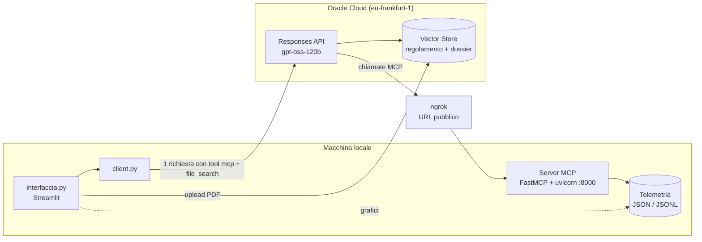
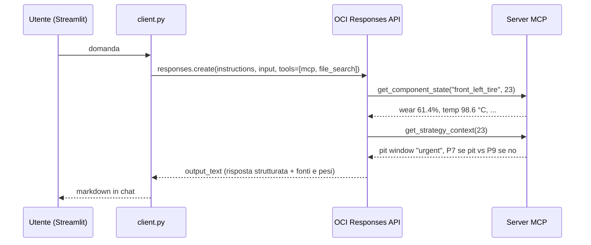
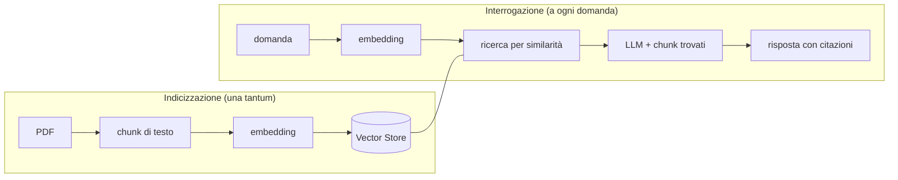
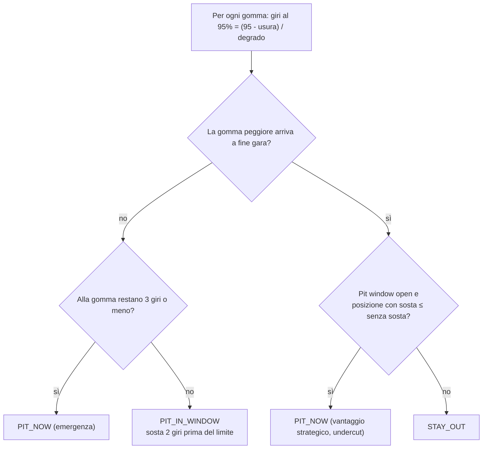
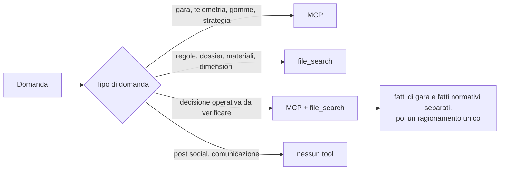

# Struffolihackaton — AI Race Engineer Copilot

> Documentazione tecnica del progetto sviluppato per la challenge Oracle *Formula Student AI Race Engineer Hackathon* (Università di Roma Tor Vergata).
> Team: **Valerio Bernardi, Alfredo Grande, Samuele De Santis, Luca Gugliotta**.

## 0. In breve

Abbiamo costruito un **copilota AI per l'ingegnere di pista** della (fittizia) Scuderia Tor Vergata, in grado di rispondere a domande su due mondi molto diversi:

- **cosa sta succedendo in gara** (telemetria, usura gomme, strategia pit stop) → dati letti tramite un **server MCP** scritto da noi;
- **cosa dice il regolamento** (conformità dei componenti sperimentali della vettura) → documenti recuperati da un **OCI Vector Store** tramite **RAG**.

Il modello (`openai.gpt-oss-120b` su **OCI Generative AI**) viene invocato con la **Responses API**, che gli permette di decidere da solo quale strumento usare, combinarli e dichiarare da quale fonte proviene ogni parte della risposta. Il tutto è accessibile da una **web app Streamlit** con dashboard, grafici, upload di PDF e chat.

Il punto chiave: **non è un semplice LLM**. Il modello non inventa numeri né regole: li va a prendere, e quando non li trova lo dice.

## Indice

- [0. In breve](#0-in-breve)
- [1. Introduzione e contesto](#1-introduzione-e-contesto)
- [2. Architettura generale](#2-architettura-generale)
- [3. Tecnologie utilizzate](#3-tecnologie-utilizzate)
- [4. I dati](#4-i-dati)
- [5. Task 1 — Server MCP](#5-task-1--server-mcp)
- [6. Task 2 — RAG di compliance](#6-task-2--rag-di-compliance)
- [7. Task 3 — Race Engineer Copilot](#7-task-3--race-engineer-copilot)
- [8. Prompt engineering](#8-prompt-engineering)
- [9. Installazione e configurazione](#9-installazione-e-configurazione)
- [10. Utilizzo](#10-utilizzo)
- [11. Limiti, problemi noti e sviluppi futuri](#11-limiti-problemi-noti-e-sviluppi-futuri)
- [12. Glossario](#12-glossario)
- [13. Riferimenti](#13-riferimenti)

---

## 1. Introduzione e contesto

### 1.1 La challenge Oracle e il team

La challenge, organizzata da Oracle, chiedeva di costruire un assistente AI per un team di Formula Student usando i servizi **OCI Generative AI**. Il focus non era "far parlare un chatbot", ma dimostrare come le tecnologie della piattaforma (Responses API, tool MCP, File Search, Vector Store) trasformino un LLM generico in un sistema affidabile, collegato a dati reali e documenti verificabili.

Ci sono stati forniti un dataset di telemetria simulata, un regolamento tecnico-sportivo e il dossier tecnico della vettura. Il resto (codice, prompt, interfaccia) è lavoro nostro.

### 1.2 Lo scenario: Scuderia Tor Vergata e la STV-E26

| Elemento | Valore |
| :--- | :--- |
| Serie | Formula Student AI Endurance Invitational (fittizia) |
| Vettura | **STV-E26**, monoposto elettrica con pacchetto aerodinamico e frenata rigenerativa |
| Circuito | Vallelunga Club Simulation, 3.222 km |
| Gara | 50 giri, partenza dalla P8 |
| Gomme | partenza su **M2** (medium slick), alternativa **H1** (hard slick) |

Tutti i dati sono simulati, ma costruiti per sembrare realistici e per contenere "trappole" precise (un'anomalia di usura, componenti fuori regolamento) su cui il sistema viene valutato.

### 1.3 Obiettivo del progetto e i tre task

| Task | Obiettivo | Tecnologie chiave | File principali |
| :--- | :--- | :--- | :--- |
| **1** | Rispondere a domande sulla telemetria di gara | MCP server, Responses API | `mcp-server-struffoli.py`, `mcp-client-struffoli.py` |
| **2** | Verificare la conformità dei componenti al regolamento | RAG, OCI Vector Store, File Search | `upload_file.py`, `file_search.py`, `chat_bot.py` |
| **3** | Unire i due mondi in un copilota con interfaccia web | MCP + File Search nella stessa chiamata, Streamlit | `client.py`, `interfaccia.py` |

Ogni task è costruito sopra il precedente: il Task 3 riusa il server MCP del Task 1 e il Vector Store popolato nel Task 2.

### 1.4 Il valore aggiunto: perché non è "solo un LLM"

Un LLM da solo è un generatore di testo plausibile: non ha accesso alla telemetria, non ha letto il *nostro* regolamento e, se glielo chiedi, risponde comunque con sicurezza. Il sistema che abbiamo costruito cambia proprio questo:

| Problema | LLM da solo | Il nostro sistema |
| :--- | :--- | :--- |
| Dati di gara | Li inventa o chiede di incollarli | Li legge tramite tool MCP, giro per giro |
| Calcoli (usura, previsioni) | Aritmetica approssimativa "a parole" | Calcolo deterministico in Python dentro i tool |
| Regolamento | Conoscenza generica dal training, spesso sbagliata | Recupera il testo del documento e cita la sezione |
| Informazioni mancanti | Risponde lo stesso | Dichiara "Insufficient information" |
| Tracciabilità | Nessuna | Dichiara la fonte usata (MCP / file_search) e il suo peso percentuale |
| Documenti nuovi | Riaddestramento o copia-incolla | Upload del PDF nel Vector Store dall'interfaccia |

> [!IMPORTANT]
> Il ruolo delle tecnologie Oracle è proprio questo: **OCI Generative AI** ospita il modello, la **Responses API** orchestra lato server le chiamate ai tool in un'unica richiesta, il **Vector Store** gestisce embedding e ricerca semantica senza che dobbiamo scrivere un database vettoriale. A noi resta la parte di valore: *quali* dati esporre, *come* calcolarli e *come* il modello deve ragionarci sopra.

### 1.5 Come si è svolto lo sviluppo

1. **Setup e analisi**: lettura dei requisiti, struttura modulare per task, ambiente virtuale e dipendenze.
2. **Challenge 1**: server MCP con i tool di analisi su JSON/JSONL, test di aggregazione (temperature, logica pit stop), poi due tool aggiuntivi di previsione e strategia.
3. **Challenge 2**: pipeline di ingestione dei PDF (estrazione, chunking, indicizzazione nel Vector Store) e servizio FastAPI per le domande di compliance.
4. **Challenge 3**: client unificato che interroga insieme telemetria e documenti, e web app Streamlit con dashboard, grafici, quick actions e chat.

---

## 2. Architettura generale

### 2.1 Visione d'insieme



Il client locale fa **una sola richiesta** a OCI. È poi il backend OCI a eseguire il ciclo "il modello chiede un tool → il tool risponde → il modello continua", sia verso il Vector Store (interno a OCI) sia verso il nostro server MCP (esterno, raggiunto tramite ngrok).

### 2.2 Il percorso di una domanda

Esempio: *"What is happening to the front-left tyre at lap 23, and should we pit?"*



Quali tool chiamare, in che ordine e quante volte **lo decide il modello**, guidato dalle descrizioni dei tool e dal system prompt (cap. 8).

### 2.3 Cosa gira in locale e cosa nel cloud Oracle

| Componente | Dove gira | Note |
| :--- | :--- | :--- |
| Streamlit (`interfaccia.py`, `chat_bot.py`) | Locale | Interfaccia utente |
| `client.py`, `upload_file.py` | Locale | Preparano le richieste verso OCI |
| Server MCP | Locale, **esposto pubblicamente con ngrok** | Deve essere raggiungibile da OCI |
| `file_search.py` (FastAPI) | Locale | Solo per il Task 2 |
| Modello `gpt-oss-120b` | OCI | Servizio gestito |
| Orchestrazione tool | OCI | Dentro la Responses API |
| Vector Store, embedding, ricerca | OCI | Servizio gestito |

> [!NOTE]
> **Perché serve ngrok.** Con il tool `"type": "mcp"` è il **server di OCI** a connettersi al nostro MCP, non il nostro PC. Un indirizzo come `localhost:8000` per OCI non esiste: serve un URL pubblico. Senza porte aperte sull'IP pubblico, ngrok crea un tunnel da un dominio pubblico alla porta locale. È la differenza rispetto al tool `"type": "function"`, dove è l'applicazione client a eseguire la funzione e a rimandare il risultato al modello.

### 2.4 Struttura delle cartelle

```text
Struffolihackaton/
├── Task1/
│   ├── .env                        # credenziali OCI + URL MCP
│   ├── mcp-server-struffoli.py     # server MCP con 9 tool
│   └── mcp-client-struffoli.py     # client di test via Responses API
├── Task2/
│   ├── .env
│   ├── upload_file.py              # PDF → chunk → Vector Store
│   ├── file_search.py              # API FastAPI /query (RAG)
│   └── chat_bot.py                 # UI Streamlit di test per il Task 2
├── Task3/
│   ├── .env
│   ├── client.py                   # client unificato MCP + file_search
│   ├── interfaccia.py              # web app finale
│   └── datatask3/                  # copia della telemetria per i grafici
├── data/                           # dataset e documenti forniti
│   ├── race_session_telemetry.json
│   ├── race_session_telemetry_stream.jsonl
│   ├── fs_ai_endurance_regulations.{pdf,md}
│   └── fs_e26_technical_dossier.{pdf,md}
├── report challenge oracle.md      # report consegnato
├── requirements.txt
└── tree.png                        # schema dei tre task
```

---
## 3. Tecnologie utilizzate

### 3.1 OCI Generative AI e `gpt-oss-120b`

**Cos'è.** OCI Generative AI è il servizio gestito di Oracle Cloud che ospita modelli linguistici e li espone tramite API. Oltre all'API nativa OCI, offre endpoint **compatibili con OpenAI** (`https://inference.generativeai.<region>.oci.oraclecloud.com/openai/v1`): si usa l'SDK `openai` di Python, ma autenticazione, esecuzione e risorse restano su OCI.

**Nel progetto.** Usiamo `openai.gpt-oss-120b`, il modello open-weight di OpenAI ospitato da OCI, nella regione `eu-frankfurt-1`. Il client si crea così (identico in tutti i file):

```python
client = OpenAI(
    base_url=os.environ["OCI_GENAI_BASE_URL"],   # endpoint OCI, non OpenAI
    api_key=os.environ["OCI_GENAI_API_KEY"],     # chiave OCI Generative AI
    project=os.environ["OCI_GENAI_PROJECT_ID"],  # progetto OCI che contiene le risorse
)
```

### 3.2 Responses API

**Cos'è.** È l'API "agentica" di OpenAI, supportata da OCI: in una singola richiesta si passano istruzioni, input e **tool**, e il backend gestisce il ciclo in cui il modello chiama i tool, legge i risultati e continua a ragionare fino alla risposta finale. Su OCI i tool supportati sono `file_search`, `code_interpreter`, `function` e `mcp`.

**Perché serve.** Con la vecchia Chat Completions il ciclo dei tool andava scritto a mano: ricevere la richiesta di tool, eseguirla, rimandare il risultato, ripetere. Con la Responses API il nostro client resta di poche righe:

```python
response = client.responses.create(
    model=MODEL,
    instructions=PROMPT,          # system prompt (cap. 8)
    input=question,               # domanda dell'utente
    tools=[{...mcp...}, {...file_search...}],
)
print(response.output_text)       # testo finale, già "ripulito" dalle chiamate intermedie
```

### 3.3 MCP (Model Context Protocol)

**Cos'è.** Un protocollo aperto, introdotto da Anthropic nel 2024, che standardizza il modo in cui un'applicazione AI accede a strumenti e dati esterni. Architettura client-server, messaggi JSON-RPC. Un server MCP espone:

- **tool**: funzioni invocabili dal modello, ciascuna con nome, descrizione e schema JSON dei parametri;
- **resource** e **prompt**: dati e template riutilizzabili (non li abbiamo usati).

L'analogia classica è la **porta USB-C per l'AI**: scrivi il server una volta e qualunque client compatibile (OCI Responses API, Claude Desktop, IDE, agenti) può usarlo senza integrazioni ad hoc.

**Perché serve nel progetto.**

- **Dati veri invece di dati inventati**: il modello non "ricorda" la telemetria, la interroga.
- **Calcoli deterministici**: gap di usura, soglie e previsioni sono codice Python testabile, non aritmetica generata dal modello.
- **Contesto ridotto**: invece di incollare 127 KB di JSON nel prompt, il modello chiede solo i giri o i componenti che gli servono.
- **Controllo**: esponiamo solo le operazioni che vogliamo (sola lettura) e con `allowed_tools` il client limita ulteriormente cosa è invocabile.
- **Disaccoppiamento**: il server non sa nulla del modello, il modello non sa nulla del formato dei file.

**Esempio.** Quando il modello decide di usare un tool, la richiesta verso il server è concettualmente questa:

```json
{ "jsonrpc": "2.0", "id": 7, "method": "tools/call",
  "params": { "name": "get_component_state",
              "arguments": { "component": "front_left_tire", "lap": 23 } } }
```

e il server risponde con il dizionario restituito dalla funzione Python (usura, temperatura, pressione…).

### 3.4 FastMCP e trasporto Streamable HTTP

**FastMCP** è l'API di alto livello dell'SDK Python ufficiale (`mcp`). Basta decorare una funzione con `@mcp.tool()`: nome, descrizione e schema dei parametri vengono generati automaticamente dal nome della funzione, dalla **docstring** e dai **type hint**. Per questo le docstring nei nostri tool non sono commenti decorativi: sono ciò che il modello legge per decidere quando e come usarli.

Il trasporto è **Streamable HTTP**: il server risponde su un endpoint HTTP (`/mcp`). La nostra configurazione:

```python
mcp = FastMCP(
    "Struffoli race analyzer",
    stateless_http=True,    # nessuna sessione da mantenere tra richieste
    json_response=True,     # risposte JSON semplici invece di stream SSE
    transport_security=TransportSecuritySettings(
        enable_dns_rebinding_protection=False,  # accetta l'header Host di ngrok
    ),
)
app = mcp.streamable_http_app()  # app ASGI servita da uvicorn
```

`stateless_http` e `json_response` sono la scelta naturale per un server che fa solo letture: ogni chiamata è indipendente, quindi niente stato da gestire.

### 3.5 RAG, embedding e OCI Vector Store

**Embedding.** Un vettore numerico (centinaia o migliaia di dimensioni) che rappresenta il *significato* di un testo: testi con significato simile producono vettori vicini, misurati tipicamente con la similarità coseno.

**Vector Store.** Un database che indicizza questi vettori e permette di trovare velocemente i più vicini a una query. OCI lo offre come risorsa gestita: carichi i file e il servizio si occupa di estrazione, suddivisione, calcolo degli embedding e indicizzazione.

**RAG (Retrieval-Augmented Generation).** Invece di sperare che il modello "sappia" il regolamento, si **recuperano** i passaggi pertinenti e li si fornisce al modello come contesto per **generare** la risposta.



**Esempio.** La domanda *"Can the BAT-X9 enclosure material be used?"* non contiene le parole "permitted enclosure materials", ma il suo embedding è vicino a quello del chunk che contiene la sezione 5.3 del regolamento: la ricerca semantica lo trova anche senza corrispondenza lessicale.

Nel progetto usiamo il tool **`file_search`** della Responses API: il modello decide da solo quando interrogare il Vector Store, e OCI gestisce embedding e ricerca.

### 3.6 Chunking

**Cos'è.** La suddivisione di un documento in pezzi (chunk) prima dell'indicizzazione. Serve perché un embedding di un intero documento "media" troppi argomenti, e perché al modello conviene passare solo i pezzi pertinenti.

**Parametri.** La dimensione del chunk e l'**overlap** (sovrapposizione tra chunk consecutivi, per non spezzare a metà una clausola). Nel Task 2 abbiamo scelto 1500 caratteri con overlap di 200, quindi il passo è 1300 caratteri:

```text
chunk 0: caratteri    0 – 1500
chunk 1: caratteri 1300 – 2800   ← i primi 200 ripetono la fine del chunk 0
chunk 2: caratteri 2600 – 4100
```

Il regolamento (~8.600 caratteri) diventa 7 chunk, il dossier (~5.600) ne diventa 5.

> [!TIP]
> Il trade-off: chunk piccoli sono precisi ma perdono contesto; chunk grandi mantengono il contesto ma "diluiscono" l'embedding. Un chunking **a lunghezza fissa** ignora la struttura del documento e può tagliare a metà una sezione: è la causa più probabile di alcune risposte imperfette nelle demo (cap. 10.2).

### 3.7 FastAPI e Uvicorn

**FastAPI** è un framework Python per costruire API HTTP a partire da funzioni decorate (`@app.post("/query")`), con serializzazione JSON automatica. **Uvicorn** è il server **ASGI** (lo standard asincrono per applicazioni web Python) che le esegue. Nel progetto uvicorn serve sia l'API RAG del Task 2 sia il server MCP, che è a sua volta un'app ASGI.

### 3.8 Streamlit

Framework per costruire interfacce web in puro Python. Il suo modello di esecuzione è particolare e va capito per leggere `interfaccia.py`:

- **a ogni interazione** (click, input) Streamlit **riesegue l'intero script** dall'alto;
- le variabili normali si perdono a ogni riesecuzione, quindi lo stato persistente va in **`st.session_state`**;
- `st.rerun()` forza una riesecuzione immediata.

Per questo i bottoni delle quick action non chiamano direttamente il modello: salvano un prompt in `session_state` e forzano un rerun, e la chat lo processa al giro successivo (cap. 7.2).

### 3.9 ngrok

Servizio di **tunneling**: esegue un agente locale che apre una connessione in uscita verso i server ngrok e assegna un URL pubblico HTTPS che inoltra il traffico a una porta locale. Nel progetto rende il server MCP raggiungibile da OCI (cap. 2.3) senza configurare router o firewall.

### 3.10 Librerie di supporto

| Libreria | Uso |
| :--- | :--- |
| `openai` | SDK usato per parlare con l'endpoint compatibile di OCI |
| `mcp` | SDK MCP ufficiale (FastMCP) |
| `python-dotenv` | Carica le variabili dal file `.env` |
| `PyPDF2` | Estrae il testo dai PDF prima del chunking (Task 2) |
| `pandas` | DataFrame per i grafici della web app |
| `requests` | Chiamate HTTP dal chatbot del Task 2 all'API FastAPI |

### 3.11 Tabella riassuntiva: quale problema risolve ogni tecnologia

| Tecnologia | Problema risolto |
| :--- | :--- |
| OCI Generative AI | Avere un LLM potente senza gestire GPU e infrastruttura |
| Responses API | Orchestrare più tool in una sola chiamata, senza scrivere il ciclo a mano |
| MCP | Dare al modello accesso a dati strutturati e calcoli affidabili |
| Vector Store + `file_search` | Ancorare le risposte normative al testo dei documenti |
| Chunking | Rendere il retrieval preciso su documenti lunghi |
| FastAPI / Uvicorn | Esporre i servizi (RAG, MCP) via HTTP |
| ngrok | Rendere raggiungibile da OCI un server locale |
| Streamlit | Interfaccia web per l'ingegnere senza scrivere frontend |

---
## 4. I dati

### 4.1 Telemetria di sessione (`race_session_telemetry.json`)

Un unico oggetto JSON con sei chiavi di primo livello:

| Chiave | Contenuto |
| :--- | :--- |
| `session_metadata` | Nome challenge, team, vettura, circuito, giri previsti, mescole |
| `schema_version` | Versione dello schema (`1.0.0`) |
| `field_notes` | Note di interpretazione: energia al posto del carburante, usura = vita consumata, usura attesa = modello di riferimento |
| `race_control_events` | Safety car al giro 14, restart al 16, bandiera gialla locale al 34 |
| `pit_stop_history` | L'unico pit stop, al giro 26, con azioni e motivazione |
| `laps` | 50 record, uno per giro |

Ogni record di `laps` contiene:

| Gruppo | Campi principali |
| :--- | :--- |
| Identità del giro | `lap`, `race_time_s`, `timestamp`, `stint_number`, `stint_lap` |
| Stato gara | `track_status` (`green`, `safety_car`, `yellow_flag`), `position` |
| Prestazione | `lap_time_s`, `delta_to_baseline_s`, `sector_times_s`, `vehicle_speed_kph` |
| Pilota | `driver_feedback` (testo libero), `notes` |
| Meteo | `air_temp_c`, `track_temp_c`, `humidity_pct`, `condition`, `track_grip_index` |
| Energia | `energy_remaining_kwh`, `battery_state_of_charge_pct`, `deployment_mode` |
| Gomme | `compound` e, per ognuno dei 4 angoli, `temperature_c`, `pressure_bar`, `wear_pct`, `expected_wear_pct`, `degradation_rate_pct_per_lap` |
| Freni | `brake_temperatures_c` per angolo |
| Contesto | `race_context` (distacchi, auto in finestra di undercut), `strategy_context` (giri rimanenti, stato pit window, perdita stimata, posizione finale prevista con/senza sosta), `pit_event` |

> [!NOTE]
> Il campo più importante per l'analisi è la coppia `wear_pct` / `expected_wear_pct`: la differenza tra le due (in **punti percentuali**) misura quanto una gomma si sta consumando più del previsto. Su questo gap si basano tutte le soglie di allarme del progetto.

### 4.2 Stream di telemetria (`race_session_telemetry_stream.jsonl`)

Formato **JSONL**: un oggetto JSON per riga. Contiene gli stessi 50 giri, uno per riga, e serve a **simulare un flusso live**: il tool `stream_live_telemetry` lo legge a blocchi con un cursore (indice della prossima riga), come farebbe un consumer di uno stream reale.

### 4.3 La storia della gara nei dati

Il dataset è costruito attorno a una storia precisa, ed è quella che il sistema deve saper ricostruire:

| Giri | Cosa succede | Segnali nei dati |
| :--- | :--- | :--- |
| 1–13 | Stint regolare su M2, risalita da P8 a P6 | Usura anteriore sinistra (FL) in linea con il modello |
| 14–15 | **Safety car** | Tempi sui 124 s, temperature gomme giù, perdita pit stimata dimezzata (9.3 s invece di 18.6) |
| 16–19 | Restart, inizia il problema | Degrado FL da 1.85 a 3.96 %/giro; pit window da `closed` a `monitor` |
| 20 | Bloccaggio in curva 4 | Nota: *brake lock-up*, picco di temperatura FL (94.6 °C) |
| 21–22 | Pit window `open` | Gap FL oltre 10 pp; il pilota: *"Front-left starting to go away"* |
| **23** | **Soglia critica** | FL 61.4 % contro 43.1 % atteso (**gap 18.3 pp**), 98.6 °C, pit window `urgent`, P7 |
| 24–25 | Il problema peggiora | FL oltre 100 °C, tempi in aumento |
| **26** | **Pit stop** | Cambio M2 → H1, un click in più di flap anteriore, P11 dopo la sosta |
| 27–33 | Stint su H1 | Usura in linea con il modello, rimonta fino a P8 |
| 34 | Bandiera gialla nel settore 2 | Tempo di 96.4 s: giro **neutralizzato**, non rappresentativo |
| 35–50 | Rimonta finale | Nota al giro 45: *undercut* recuperato, P5 fino al traguardo |

> [!TIP]
> Il giro 23 non è scelto a caso: è esattamente il giro in cui il gap FL supera la soglia critica di 18 pp usata nei nostri tool, e i dati stessi lo segnalano con una nota (*"crosses the alert threshold at 27 laps remaining"*). Ecco perché quasi tutte le demo ruotano attorno al giro 23.

### 4.4 Regolamento FS AI Endurance 2026

Handbook di 11 sezioni (sicurezza, aerodinamica, gomme, powertrain, materiali, dimensioni, verifiche tecniche, procedure sportive). Il documento stesso dichiara di essere strutturato per il retrieval e chiede risposte che citino le sezioni. Le sezioni rilevanti per le demo:

| Sezione | Regola |
| :--- | :--- |
| 3.2 | Ala posteriore: larghezza ≤ 1200 mm, corda di ogni elemento ≤ 300 mm, sporgenza ≤ 250 mm dietro l'asse posteriore |
| 3.3 | Endplate entro un rettangolo 820 × 420 mm |
| 3.5 | Carenature delle sospensioni: corda ≤ 35 mm, spessore ≤ 20 mm |
| 4.1–4.3 | Solo mescole approvate, pressione a caldo ≤ 1.85 bar, tracciabilità e modello di usura per ogni mescola |
| 5.3 | Contenitore accumulatore: alluminio 5xxx/6xxx ≥ 2.0 mm, acciaio ≥ 1.0 mm o composito certificato; **magnesio e leghe magnesio-litio vietati** |
| 8.3 | Tubi/inserti metallici delle sospensioni con parete ≥ 1.0 mm; carenature rimovibili e con punti di ispezione visibili |
| 10.1 | I giri neutralizzati (gialla, safety car) non vanno usati come passo rappresentativo |

### 4.5 Dossier tecnico e componenti sperimentali

Il dossier della STV-E26 descrive la vettura e un **registro di tre parti sperimentali** non ancora approvate. Confrontandole con il regolamento si ottiene la risposta corretta attesa, utile come riferimento per valutare le demo:

| Componente | Specifica (dossier) | Limite (regolamento) | Verdetto atteso |
| :--- | :--- | :--- | :--- |
| **RW-26C** ala posteriore | larghezza 1190 mm, corda 308 mm, sporgenza 286 mm, endplate 810 × 415 mm | 3.2, 3.3 | **Non conforme**: corda (+8 mm) e sporgenza (+36 mm) fuori limite |
| **BAT-X9** accumulatore | guscio in magnesio-litio da 1.5 mm, liner aramidico 3.0 mm | 5.3 | **Non conforme**: materiale espressamente vietato |
| **SA-LF-OPT** carenatura sospensione | corda 34 mm, spessore 18 mm, inserto acciaio 1.2 mm, ispezione visibile | 3.5, 8.3 | **Conforme**: tutti i valori entro i limiti |

---
## 5. Task 1 — Server MCP

### 5.1 `mcp-server-struffoli.py`: configurazione e caricamento dati

Il server è un singolo file: configurazione FastMCP (cap. 3.4), tre helper di caricamento e nove tool. I dati si rileggono dal disco **a ogni chiamata**: scelta semplice e stateless, accettabile vista la dimensione dei file.

```python
DATA_DIR = Path(__file__).parent / "data"   # cartella dati relativa al file del server

def _load_json(name: str) -> Any:            # telemetria completa
    with (DATA_DIR / name).open("r", encoding="utf-8") as f:
        return json.load(f)

def _load_jsonl(name: str) -> List[Dict[str, Any]]:  # stream: una riga = un evento
    events = []
    with (DATA_DIR / name).open("r", encoding="utf-8") as f:
        for line in f:
            if line.strip():                 # salta righe vuote
                events.append(json.loads(line))
    return events
```

> [!WARNING]
> `DATA_DIR` punta a `Task1/data/`, che nell'archivio non esiste: i dati sono nella cartella `data/` della root. Per avviare il server bisogna copiare lì i file (o correggere il percorso). Vedi cap. 11.2.

### 5.2 I sette tool di base

| Tool | Parametri | Restituisce | Domanda tipica |
| :--- | :--- | :--- | :--- |
| `get_session_overview` | — | Metadati di sessione e fotografia dell'ultimo giro (stint, posizione, mescola, pit window, n. eventi) | *"Com'è la situazione?"* |
| `get_lap_window` | `start_lap`, `end_lap` | Tutti i record completi nell'intervallo | *"Mostrami i giri 14–16"* |
| `get_component_state` | `component`, `lap` | Stato di una gomma, un freno o del sistema energetico | *"Stato della gomma FL al giro 23"* |
| `compare_to_wear_model` | `corner`, `start_lap`, `end_lap` | Usura osservata vs attesa giro per giro, gap, soglia, trend | *"L'usura è anomala?"* |
| `get_strategy_context` | `lap` | Pit window, perdita stimata, posizioni previste, distacchi, stato FL | *"Conviene fermarsi?"* |
| `list_race_control_events` | — | Safety car, restart, bandiere gialle | *"Ci sono state neutralizzazioni?"* |
| `stream_live_telemetry` | `cursor`, `batch_size` | Blocco di eventi dello stream + cursore successivo | *"Riproduci la fase di safety car"* |

Due tool meritano un'occhiata al codice.

**`get_component_state`** usa il nome del componente per capire *quale* sottosistema leggere, ricavando l'angolo dal suffisso:

```python
if component.endswith("_tire"):
    corner = component.replace("_tire", "")      # "front_left_tire" → "front_left"
    ...  # temperatura, pressione, usura, usura attesa, degrado di quell'angolo
elif component.endswith("_brake"):
    corner = component.replace("_brake", "")     # stesso schema per i freni
elif component == "energy_system":
    ...  # energia residua, SoC, modalità di deployment
```

Così un solo tool copre 9 componenti, e la docstring elenca i nomi validi, che il modello legge per costruire la chiamata.

**`compare_to_wear_model`** costruisce la serie osservato/atteso sull'intervallo e classifica **l'ultimo giro** con soglie sul gap:

```python
gap = observed - expected                  # punti percentuali
if latest_gap >= 18:   threshold_status = "critical"
elif latest_gap >= 10: threshold_status = "warning"
elif latest_gap >= 5:  threshold_status = "monitor"
else:                  threshold_status = "normal"
# trend: confronta il degrado del primo e dell'ultimo giro dell'intervallo
"rolling_wear_rate_trend": "increasing" if last_rate > first_rate else "stable_or_decreasing"
```

Per ogni giro allega anche contesto utile a interpretare il dato (stato pista, temperatura pista, delta tempo, feedback del pilota): il modello può così distinguere un calo di passo dovuto all'usura da uno dovuto a una bandiera gialla.

### 5.3 I tool aggiuntivi: `forecast_tyre_life` e `recommend_pit_strategy`

Nel codice sono marcati come *tool aggiuntivi*: non facevano parte dei sette di base, li abbiamo aggiunti per spostare dal modello al codice le decisioni numeriche più delicate.

**`forecast_tyre_life(corner, current_lap)`** stima quanti giri mancano all'uscita dalla finestra operativa, fissata al 95 % di usura, con una proiezione lineare:

```python
laps_to_window_exit = max(0.0, (95.0 - current_wear) / deg_rate)
recommended_pit_window = (current_lap + 1, current_lap + int(laps_to_window_exit) - 2)  # 2 giri di margine
status = "critical" if laps_to_window_exit < 8 else "normal"
```

*Esempio, FL al giro 23:* (95 − 61.4) / 5.48 = **6.1 giri** → finestra consigliata giri 24–27, stato `critical`.

**`recommend_pit_strategy(current_lap)`** valuta tutte e quattro le gomme e produce una decisione esplicita:



*Esempio, giro 23:* la gomma peggiore è la FL con 6 giri residui, a fronte di 27 giri da fare, quindi la sosta è obbligatoria; 6 > 3, quindi raccomandazione `PIT_IN_WINDOW` con giro obiettivo 23 + (6 − 2) = **27**. Nei dati la squadra si ferma al 26, pienamente dentro la finestra calcolata.

> [!NOTE]
> Il valore di questi tool: la decisione "fermarsi sì/no/quando" è **riproducibile e spiegabile** (restituisce anche `reasoning` e `impact_analysis`), mentre il modello si occupa di ciò in cui è bravo, cioè interpretare, contestualizzare e comunicare.

### 5.4 `mcp-client-struffoli.py`

Client minimo per testare il server attraverso OCI: una chiamata alla Responses API con il solo tool MCP.

```python
tools=[{
    "type": "mcp",
    "server_label": "race_engineer_server",
    "server_description": "MCP server exposing race telemetry, tyre data, ...",  # aiuta il modello a capire quando usarlo
    "server_url": os.environ["Struffoli_race_analyzer"],   # URL ngrok + /mcp
    "require_approval": "never",       # il modello chiama i tool senza conferma umana
    "allowed_tools": ["get_session_overview", "get_lap_window", ...],  # whitelist
}]
```

`require_approval: "never"` è comodo e sensato perché i tool sono tutti in sola lettura; con tool che modificano dati andrebbe valutata un'approvazione esplicita (cap. 9.6).

---

## 6. Task 2 — RAG di compliance

### 6.1 `upload_file.py`: estrazione, chunking e caricamento

Pipeline in tre passi, eseguita una volta per popolare il Vector Store con regolamento e dossier:

1. **Estrazione**: `PyPDF2` legge ogni pagina e concatena il testo.
2. **Chunking**: finestre di 1500 caratteri con overlap di 200 (cap. 3.6).
3. **Upload**: ogni chunk diventa un **file di testo separato**, caricato su OCI e associato al Vector Store con metadati.

```python
for index, testo_chunk in enumerate(chunks):
    file_virtuale = io.BytesIO(testo_chunk.encode("utf-8"))   # file in memoria, niente scrittura su disco
    file_virtuale.name = f"{nome_file_base}_chunk_{index}.txt" # l'API richiede un nome file

    uploaded_file = client.files.create(file=file_virtuale, purpose="user_data")
    client.vector_stores.files.create(
        vector_store_id=VECTOR_STORE_ID,
        file_id=uploaded_file.id,
        attributes={                                   # metadati per tracciabilità
            "source": "local_upload_chunked",
            "original_file": nome_file_base,
            "chunk_index": index,
        },
    )
```

**Perché il chunking manuale.** Caricando i chunk come file distinti decidiamo noi l'unità di retrieval e l'overlap, invece di affidarci ai parametri di default del servizio, e ogni chunk porta con sé il documento di origine e la posizione. Il rovescio della medaglia è che il taglio a lunghezza fissa non rispetta i confini delle sezioni (cap. 11.3).

### 6.2 `file_search.py`: servizio FastAPI per le domande di compliance

Espone un unico endpoint, `POST /query`, che riceve `{"query": "..."}` e restituisce `{"answer": "..."}`:

```python
@app.post("/query")
def query_vector_store(request: dict):
    response = client.responses.create(
        model=MODEL,
        instructions="""You are a mechanical engineering agent of the Scuderia Tor Vergata ...""",
        input=request["query"],
        tools=[{"type": "file_search", "vector_store_ids": [VECTOR_STORE_ID]}],
    )
    return {"answer": response.output_text}
```

Nonostante il nome, il file non implementa la ricerca: la ricerca semantica la fa OCI tramite il tool `file_search`. Il valore del file sta nel **system prompt di compliance**: un ingegnere "conservativo" che confronta specifiche e limiti, emette un verdetto a tre valori e assegna uno score di supporto documentale (cap. 8).

### 6.3 `chat_bot.py`: interfaccia di test

Una chat Streamlit minimale: salva la cronologia in `st.session_state.messages`, invia ogni domanda a `FILE_SEARCH_SERVER_URL + "/query"` con `requests` e mostra la risposta. Gestisce il caso di risposta non JSON stampando status e body per il debug. Serviva solo a provare il Task 2 isolato, prima dell'integrazione.

---
## 7. Task 3 — Race Engineer Copilot

### 7.1 `client.py`: client unificato MCP + file_search

È il cuore del Task 3 e contiene due funzioni più il system prompt completo (cap. 8).

**`ask_race_engineer(question)`** passa **entrambi i tool nella stessa richiesta**: il modello può usare solo MCP, solo `file_search` o entrambi, in base alla domanda.

```python
tools=[
    {
        "type": "mcp",
        "server_label": "race_telemetry_server",
        "server_description": "MCP server exposing endurance race telemetry, tyre wear model comparison, ...",
        "server_url": MCP_SERVER_URL,
        "require_approval": "never",
        "allowed_tools": ["get_session_overview", "get_lap_window", ..., "recommend_pit_strategy"],
    },
    {"type": "file_search", "vector_store_ids": [VECTOR_STORE_ID]},
]
```

**`upload_pdf_to_vector_store(uploaded_file)`** riceve un file dallo uploader di Streamlit e lo carica **intero** nel Vector Store, con metadati (`source: streamlit_upload`, nome file, task). Restituisce ID e `status` dell'indicizzazione, mostrati nell'interfaccia.

> [!NOTE]
> La funzione è **senza memoria**: ogni domanda viene inviata da sola, senza la cronologia della chat. Il modello non sa cosa si è detto nel messaggio precedente, quindi domande come *"e al giro dopo?"* non funzionano (cap. 11.3).

### 7.2 `interfaccia.py`: la web app finale

Layout a due colonne (38 % / 62 %):

| Colonna sinistra | Colonna destra |
| :--- | :--- |
| Grafici della gara in tab: tempo sul giro, energia residua, posizione | **Race control overview**: giro, posizione, stato pista, stato gomma FL dell'ultimo giro |
| Upload dei PDF verso il Vector Store | **Vehicle status** (a comparsa): dashboard completa di un giro scelto |
| Elenco dei documenti caricati nella sessione | **Quick actions**: Vehicle status, Critical issues, Best actions |
| | **Chat** con il copilota |
| | **Prompt suggestions**: domande pronte per le demo |

Alcune scelte implementative:

- **Dashboard coerente con il server MCP.** Lo stato di ogni gomma usa le stesse soglie di `compare_to_wear_model` (18 / 10 / 5 pp), con colori rosso/giallo/verde.
- **Lettura robusta dei campi.** `get_nested()` e `build_race_trend_dataframe()` provano più nomi possibili per l'energia (`energy_remaining_kwh`, `soc_pct`, …): l'interfaccia non si rompe se lo schema del dataset cambia leggermente.
- **Pattern `pending_prompt`.** Bottoni e chat convergono in un unico punto che chiama il modello:

```python
if st.button("🚨 Critical issues", ...):
    st.session_state.pending_prompt = """Analyze the current race session ..."""  # prompt dettagliato
    st.rerun()                        # riesegue lo script

# più in basso, a ogni esecuzione:
user_prompt = st.chat_input("Ask the AI Race Engineer")
if st.session_state.pending_prompt:   # un bottone ha lasciato un prompt in attesa
    user_prompt = st.session_state.pending_prompt
    st.session_state.pending_prompt = None
if user_prompt:
    answer = ask_race_engineer(user_prompt)   # unico punto di chiamata al modello
```

Questo evita di duplicare la logica della chat per ogni bottone e sfrutta il modello di riesecuzione di Streamlit (cap. 3.8). Le quick action sono **prompt ingegnerizzati**: *Critical issues* elenca cosa ispezionare (degrado, anomalie di temperatura/pressione, cali di passo non spiegati da neutralizzazioni…) e il formato di uscita; *Best actions* fa lo stesso per un giro scelto e chiede un controllo di conformità se l'azione ha implicazioni regolamentari.

> [!WARNING]
> Grafici e dashboard leggono il JSON locale in `Task3/datatask3/`, mentre il modello legge i dati tramite MCP da un'altra copia. Oggi i file sono identici, ma sono due fonti separate che possono divergere.

### 7.3 Cosa cambia rispetto al Task 2

Il Task 3 **non usa** `file_search.py`: chiama direttamente il tool `file_search` insieme al tool MCP.

| Aspetto | Task 2 | Task 3 |
| :--- | :--- | :--- |
| Accesso ai documenti | Client → API FastAPI → Responses API | Client → Responses API, direttamente |
| Tool disponibili | Solo `file_search` | `mcp` + `file_search` |
| Caricamento PDF | Script, chunking manuale 1500/200 | Da interfaccia, PDF intero (chunking gestito da OCI) |
| System prompt | Solo compliance | Routing, pesi delle fonti, 4 strutture di risposta |
| Interfaccia | Chat di test | Web app completa |

Il servizio FastAPI del Task 2 resta utile come esempio di **RAG esposto come microservizio**, riusabile da altre applicazioni.

---

## 8. Prompt engineering

Il system prompt (`instructions`) è la parte del progetto che trasforma "un modello con dei tool" in un assistente con un comportamento preciso. Quello del Task 3 è lungo e sezionato; qui ne riassumiamo le scelte.

### 8.1 Ruolo e comportamento conservativo

Il modello è definito come *race engineer* e *regulatory compliance engineer* **conservativo**. Il principio cardine è *"Do not guess"*, seguito da una lista esplicita di cose da non inventare mai: valori di telemetria, dati sul giro, output di strategia, clausole, numeri di sezione, limiti di materiale e dimensionali, conclusioni di conformità. Per i componenti critici per la sicurezza (accumulatore, freni, sospensioni, alta tensione…) la prudenza è richiesta esplicitamente.

### 8.2 Instradamento verso i tool



Il prompt specifica anche come **combinare** le due fonti: se la telemetria giustifica un'azione ma manca la conferma normativa, la risposta deve dire *"operativamente giustificata ma non confermata dal regolamento"*; se il regolamento la permette ma i dati non la giustificano, *"lecita ma non strategicamente motivata"*.

### 8.3 Dichiarazione delle fonti e percentuali di peso

Ogni risposta deve contenere una sezione obbligatoria:

```text
Evidence source and weighting:
- Source used: MCP only | file_search only | MCP + file_search | No tool evidence available
- MCP contribution: 45%
- file_search contribution: 55%
- Reason for weighting: ...
```

La percentuale non è una probabilità: indica **quanto ciascuna fonte ha contribuito al ragionamento**, e un tool non usato deve valere 0 %. Serve all'ingegnere per capire a colpo d'occhio su cosa si basa la risposta, e costringe il modello a rendere conto dei tool usati.

### 8.4 Documentation support score

Per le risposte di compliance il modello assegna uno score:

| Score | Significato |
| :--- | :--- |
| 90–100 % | Evidenza diretta e forte nei documenti |
| 70–89 % | Buona evidenza, con dettagli indiretti o incompleti |
| 40–69 % | Evidenza solo parziale |
| 0–39 % | Informazioni insufficienti per una conclusione affidabile |

Lo score misura **quanto la risposta è supportata dai documenti**, non quanto il componente sia conforme. Un "Non-compliant" può avere 94 %, un "Insufficient information" 45 %.

### 8.5 Strutture di risposta

Il prompt definisce quattro template, scelti dal modello in base alla domanda:

| Template | Quando | Sezioni principali |
| :--- | :--- | :--- |
| **A** Telemetria / strategia | Domande operative | Fonti e pesi, dati di gara, interpretazione, raccomandazione, rischio operativo, dati mancanti |
| **B** Compliance / dossier | Domande normative | Fonti e pesi, verdetto, specifiche vs requisiti, ragionamento, rischio, correzioni, fonti, score |
| **C** Mista | Decisioni operative da verificare | Fatti MCP e fatti normativi separati, ragionamento unito, rischio operativo e normativo, score |
| **D** Comunicazione | Post, annunci | Fonti e pesi, testo pubblico con tono entusiasta e hashtag, senza dettagli tecnici riservati |

> [!TIP]
> La sezione iniziale *"Understanding of the request"* presente in quasi tutti i template non è burocrazia: permette all'ingegnere di verificare subito se il modello ha capito la domanda, prima di leggere il resto.

---
## 9. Installazione e configurazione

### 9.1 Requisiti e ambiente virtuale

Serve Python 3.12, un account OCI con accesso a Generative AI (API key, progetto, Vector Store già creato) e ngrok.

```bash
python3.12 -m venv .venv
source .venv/bin/activate          # su Windows: .venv\Scripts\activate
pip install -r requirements.txt    # fastapi, openai, python-dotenv, mcp, uvicorn[standard], streamlit, PyPDF2
```

`pandas` e `requests` non sono in `requirements.txt` ma vengono installati come dipendenze di Streamlit; conviene comunque aggiungerli esplicitamente.

### 9.2 Variabili d'ambiente (`.env`)

Ogni task ha il proprio `.env`, letto dalla cartella del file che lo usa.

| Variabile | Significato | Usata in |
| :--- | :--- | :--- |
| `OCI_GENAI_API_KEY` | Chiave API di OCI Generative AI | Tutti |
| `OCI_GENAI_PROJECT_ID` | OCID del progetto OCI | Tutti |
| `OCI_GENAI_BASE_URL` | Endpoint compatibile OpenAI della regione | Tutti |
| `OCI_GENAI_MODEL` | `openai.gpt-oss-120b` | Tutti |
| `OCI_VECTOR_STORE_ID` | ID del Vector Store (`vs_...`) | Task 2, 3 |
| `OCI_FILE_PATH_1`, `OCI_FILE_PATH_2` | Percorsi dei due PDF da indicizzare | `upload_file.py` |
| `Struffoli_race_analyzer` | URL pubblico del server MCP, con suffisso `/mcp` | Task 1, 3 |
| `FILE_SEARCH_SERVER_URL` | URL dell'API FastAPI del Task 2 | `chat_bot.py` |

### 9.3 Esposizione pubblica con ngrok

```bash
ngrok http 8000
# → Forwarding https://<id>.ngrok-free.app -> http://localhost:8000
```

L'URL pubblico, **seguito da `/mcp`**, va in `Struffoli_race_analyzer`. Con il piano gratuito l'URL cambia a ogni riavvio di ngrok, quindi va aggiornato nei `.env`.

### 9.4 Ordine di avvio dei servizi

Ogni servizio va in un terminale separato, con il venv attivo.

| # | Terminale | Comando | Serve per |
| :--- | :--- | :--- | :--- |
| 1 | `Task1/` | `uvicorn mcp-server-struffoli:app --host 0.0.0.0 --port 8000` | Task 1, 3 |
| 2 | qualunque | `ngrok http 8000` | Task 1, 3 |
| 3 | `Task2/` | `python upload_file.py` (**una sola volta**) | Task 2, 3 |
| 4 | `Task2/` | `python file_search.py` | Solo Task 2 |
| 5 | `Task2/` | `streamlit run chat_bot.py` | Solo Task 2 |
| 6 | `Task3/` | `streamlit run interfaccia.py` | Task 3 |

> [!WARNING]
> `file_search.py` e il server MCP usano entrambi la porta **8000**. Per far girare insieme Task 1 e Task 2 bisogna spostare l'API FastAPI (ad esempio `uvicorn.run(app, port=8001)` e `FILE_SEARCH_SERVER_URL=http://localhost:8001`). Per la sola demo del Task 3 i passi 4 e 5 non servono.

### 9.5 Verifica del funzionamento

1. **Server MCP in locale**, senza modello di mezzo: con **MCP Inspector** (`npx @modelcontextprotocol/inspector`) ci si collega a `http://localhost:8000/mcp` con trasporto Streamable HTTP, si vedono i nove tool e li si può chiamare a mano. È il modo più rapido per separare i bug del server da quelli del modello.
2. **Server MCP da OCI**: `python mcp-client-struffoli.py` in `Task1/` deve stampare una sintesi dell'ultimo giro. Se fallisce ma l'Inspector funziona, il problema è in ngrok o nell'URL del `.env`.
3. **Vector Store**: `upload_file.py` stampa gli ID di file e chunk; dall'interfaccia del Task 3 lo `status` deve diventare `completed` prima che i documenti siano interrogabili.
4. **API RAG**:

   ```bash
   curl -X POST http://localhost:8001/query \
        -H "Content-Type: application/json" \
        -d '{"query": "Is the RW-26C rear wing compliant?"}'
   ```

5. **Web app**: la *Race control overview* deve mostrare il giro 50 in P5; un prompt suggerito deve restituire la sezione *Evidence source and weighting*.

### 9.6 Note di sicurezza

- **Chiavi nei `.env`.** Nell'archivio ci sono chiavi API reali: vanno escluse con `.gitignore` e revocate se il progetto è stato condiviso.
- **Server MCP pubblico senza autenticazione.** Chiunque conosca l'URL ngrok può invocare i tool. Qui i dati sono simulati e in sola lettura, ma in un contesto reale servirebbero token o OAuth.
- **Protezione DNS rebinding disattivata.** Necessaria per accettare le richieste che arrivano con l'host di ngrok; in produzione andrebbe riattivata con una lista di host consentiti.
- **`require_approval: "never"`.** Accettabile perché i tool non modificano nulla; con tool di scrittura servirebbe una conferma.
- **Documenti caricati dall'utente.** Un PDF caricato nel Vector Store finisce nel contesto del modello: un documento malevolo potrebbe contenere istruzioni (*prompt injection*). Va considerato se l'upload è aperto a terzi.

---

## 10. Utilizzo

### 10.1 Guida all'interfaccia

1. **Guardare lo stato**: la *Race control overview* in alto a destra riassume l'ultimo giro; *Quick actions → 📊 Vehicle status* apre la dashboard completa di un giro a scelta.
2. **Esplorare l'andamento**: i tab a sinistra mostrano tempo sul giro, energia residua e posizione per tutti i 50 giri.
3. **Aggiungere documenti**: si caricano i PDF a sinistra e si preme *Upload to vector store*; l'expander *Uploaded sources* mostra gli ID e lo stato.
4. **Analisi rapide**: *🚨 Critical issues* analizza l'intera sessione; *🎯 Best actions* analizza il giro scelto nel campo numerico sottostante.
5. **Domande libere**: si scrive in chat oppure si usa uno dei *Prompt suggestions*.

### 10.2 Demo Task 2: verifiche di compliance

Confronto tra le risposte registrate nel report e il verdetto atteso (cap. 4.5):

| Domanda | Risposta del sistema | Atteso | Esito |
| :--- | :--- | :--- | :--- |
| RW-26C conforme alle regole aerodinamiche? | **Non-compliant**: corda +8 mm, sporgenza +36 mm; score 88 % | Non conforme | ✅ Corretto e ben argomentato |
| Il materiale di BAT-X9 è ammesso? | **Insufficient information**: sezione 5.3 non recuperata; score 45 % | Non conforme | ⚠️ Prudente ma incompleto |
| SA-LF-OPT rispetta i vincoli dimensionali? | **Insufficient information**: ha preso i valori del dossier come se fossero limiti; score 84 % | Conforme | ⚠️ Retrieval mancato delle sezioni 3.5 e 8.3 |

> [!NOTE]
> Le due risposte imperfette sono comunque **sbagliate nel modo giusto**: invece di inventare un verdetto, il sistema dichiara che mancano informazioni e abbassa lo score. Il limite sta nel *retrieval* (le sezioni pertinenti non sono arrivate al modello), non nel ragionamento. Il rimedio più efficace è un chunking per sezioni (cap. 11.3).

### 10.3 Demo Task 3: domande miste, telemetria e comunicazione

**1. *"What is happening to the front-left tyre at lap 23, and should we pit?"*** → template A, **MCP 100 %**.
Tutti i numeri coincidono con il dataset: 98.6 °C, usura 61.4 % contro 43.1 % attesa, degrado 5.48 %/giro, pit window `urgent`, perdita 18.6 s, P7 con sosta contro P9 senza. Raccomandazione: fermarsi ai giri 24–25, coerente con la finestra calcolata dai tool (24–27) e con la sosta reale al 26.

**2. *"Can the BAT-X9 accumulator enclosure material be used under the safety rules?"*** → template B, **file_search 100 %**.
Verdetto **Non-compliant**, corretto, con citazione della sezione 5.3 (magnesio-litio vietato) e tre alternative conformi prese dal regolamento; score 94 %. Rispetto allo stesso quesito nel Task 2, qui il retrieval ha trovato la sezione giusta. Unico neo: la risposta attribuisce la sezione a un documento con un nome che non esiste (*"STV Organizer Pack 2026"*), segno che le citazioni vanno sempre ricontrollate.

**3. *"Generate an exciting social media post after our successful late-race tyre strategy."*** → template D, **nessun tool**.
Post entusiasta con gli hashtag previsti dal prompt e senza dettagli tecnici riservati.

**4. *"Telemetry recommends pitting between laps 24 and 26. Check whether the tyre change is allowed…"*** (prompt suggerito, risposta non registrata nel report) → caso **misto** (template C). Il comportamento atteso: dati MCP a sostegno della sosta, poi dal regolamento le regole sulle gomme (4.1 mescole approvate, 4.2 pressione ≤ 1.85 bar, 4.3 tracciabilità) e la 10.1 sui giri neutralizzati. La H1 è una slick asciutta presente nell'inventario approvato del dossier, quindi rientra nella 4.1; il regolamento però non contiene regole esplicite sulle soste, quindi la conclusione corretta è *"operativamente giustificata, conforme per quanto riguarda la mescola, nessuna norma specifica sul cambio gomme"*.

---
## 11. Limiti, problemi noti e sviluppi futuri

### 11.1 Limiti dichiarati nel report

- **Telemetria simulata**: il server MCP lavora su file JSON/JSONL, non su uno stream reale (ad esempio da bus CAN).
- **Tempi di indicizzazione**: un PDF appena caricato non è subito interrogabile.
- **Qualità del retrieval**: la precisione delle citazioni dipende dal chunking.
- **Disallineamento UI**: i grafici leggono il JSON locale, il modello ragiona sui dati del server MCP.

### 11.2 Bug individuati nel codice

Rileggendo il codice a distanza di tempo sono emersi alcuni problemi, quasi tutti di facile correzione:

| # | Dove | Problema | Effetto | Correzione |
| :--- | :--- | :--- | :--- | :--- |
| 1 | `mcp-server-struffoli.py` | `DATA_DIR` punta a `Task1/data/`, che non esiste | Tutti i tool falliscono con `FileNotFoundError` | `Path(__file__).parent.parent / "data"` oppure copiare i dati |
| 2 | `stream_live_telemetry` | Legge `telemetry_stream.jsonl`, ma il file è `race_session_telemetry_stream.jsonl` | Tool inutilizzabile | Correggere il nome |
| 3 | `stream_live_telemetry` | `end_of_stream` usa `next_cursor` prima di assegnarlo | `UnboundLocalError` a ogni chiamata | Calcolarlo dopo `next_cursor = min(...)` |
| 4 | `_load_telemetry` | Legge un inesistente `telemetry.json` | Nessuno, non è mai usata | Rimuoverla |
| 5 | `get_session_overview` | `pit_stops_count` restituisce la lista delle soste, non il numero | Campo con nome fuorviante | `len(session["pit_stop_history"])` |
| 6 | `forecast_tyre_life` | Con meno di 3 giri residui la fine della finestra precede l'inizio | Finestra incoerente | `max(start, ...)` sulla fine |
| 7 | `Task3/client.py` | `recommend_pit_strategy` compare due volte in `allowed_tools`, `forecast_tyre_life` manca | Nel Task 3 il modello non può usare la previsione | Sostituire il duplicato |
| 8 | `file_search.py` | Usa la porta 8000 come il server MCP | Task 1 e 2 non girano insieme | Porta 8001 |
| 9 | `requirements.txt` | Mancano `pandas` e `requests` | Funziona solo grazie alle dipendenze di Streamlit | Dichiararle |

> [!NOTE]
> I bug 2 e 3 indicano che il replay dello stream non è stato provato nella versione finale; l'1 fa pensare che durante l'hackathon i dati fossero copiati in `Task1/data/` e che la copia non sia finita nell'archivio.

### 11.3 Possibili sviluppi

- **Chunking per sezioni.** Il regolamento è già diviso in sezioni numerate: un chunk per sezione, con il numero nei metadati (`section: "5.3"`), eliminerebbe i retrieval mancati visti nelle demo del Task 2 e renderebbe le citazioni affidabili.
- **Valutazione automatica.** La tabella del cap. 4.5 e i valori del giro 23 sono già una *ground truth*: basterebbe uno script che pone le domande e confronta i verdetti a ogni modifica di prompt o chunking.
- **Memoria di conversazione.** Passare la cronologia al modello, o usare lo stato conversazionale gestito da OCI (Conversations API), per permettere domande di seguito.
- **Risposte in streaming** (`stream=True`) per non aspettare la risposta completa.
- **Una sola fonte dati.** Far leggere anche grafici e dashboard dal server MCP, eliminando la copia in `datatask3/`.
- **Deploy su OCI.** Ospitare il server MCP su OCI con autenticazione, al posto di ngrok su una macchina locale.
- **Telemetria reale.** Sostituire il file JSONL con una sorgente live (bus CAN, websocket), mantenendo invariata l'interfaccia dei tool.
- **Citazioni verificabili nell'interfaccia.** Mostrare i passaggi recuperati da `file_search` accanto alla risposta, così da controllare a colpo d'occhio che sezione e documento citati esistano davvero.

---

## 12. Glossario

**Termini tecnici**

| Termine | Significato |
| :--- | :--- |
| ASGI | Standard asincrono per applicazioni web Python (FastAPI, app MCP) |
| Chunk / overlap | Pezzo di documento indicizzato / porzione ripetuta tra chunk consecutivi |
| Embedding | Vettore numerico che rappresenta il significato di un testo |
| Hallucination | Contenuto plausibile ma inventato dal modello |
| JSON-RPC | Protocollo di chiamata remota su JSON, usato da MCP |
| JSONL | Un oggetto JSON per riga, adatto agli stream |
| MCP | Protocollo standard per collegare modelli a tool e dati esterni |
| Prompt injection | Istruzioni malevole nascoste in contenuti letti dal modello |
| RAG | Recupero di passaggi pertinenti prima della generazione della risposta |
| Responses API | API che gestisce in una chiamata modello e tool |
| `session_state` | Stato persistente di Streamlit tra le riesecuzioni dello script |
| System prompt (`instructions`) | Istruzioni che definiscono ruolo e comportamento del modello |
| Tool calling | Capacità del modello di chiedere l'esecuzione di funzioni esterne |
| Tunnel | Inoltro del traffico da un URL pubblico a una porta locale (ngrok) |
| Vector Store | Database che indicizza embedding per la ricerca semantica |

**Termini motoristici**

| Termine | Significato |
| :--- | :--- |
| Bandiera gialla locale | Pericolo in un settore: rallentare, vietato sorpassare lì |
| Corda (chord) | Distanza tra bordo d'attacco e d'uscita di un profilo alare |
| Degrado | Usura aggiunta a ogni giro, in %/giro |
| Delta to baseline | Differenza tra il tempo sul giro e il riferimento previsto |
| Endplate | Paratia laterale dell'ala posteriore |
| Giro neutralizzato | Giro sotto gialla o safety car, non rappresentativo del passo |
| Mescola (compound) | Tipo di gomma; qui M2 medium e H1 hard |
| Pit loss | Tempo perso per una sosta rispetto a restare in pista |
| Pit window | Intervallo di giri in cui una sosta è sensata (`closed`, `monitor`, `open`, `urgent`, `completed`) |
| Safety car | Auto che guida il gruppo a velocità ridotta dopo un incidente |
| Scrutineering | Verifiche tecniche di conformità della vettura |
| SoC | State of Charge, livello di carica della batteria |
| Stint | Tratto di gara tra due soste con lo stesso treno di gomme |
| Undercut | Fermarsi prima di un avversario per sfruttare le gomme nuove e superarlo quando si ferma lui |
| Wear model | Modello di usura attesa, riferimento per individuare anomalie |

---

## 13. Riferimenti

- OCI Generative AI, Responses API: <https://docs.oracle.com/en-us/iaas/Content/generative-ai/responses-api.htm>
- OCI Generative AI, endpoint compatibili OpenAI: <https://docs.oracle.com/en-us/iaas/Content/generative-ai/openai-compatible-api.htm>
- Model Context Protocol, specifica e guide: <https://modelcontextprotocol.io>
- SDK Python MCP (FastMCP): <https://github.com/modelcontextprotocol/python-sdk>
- MCP Inspector: <https://github.com/modelcontextprotocol/inspector>
- Streamlit: <https://docs.streamlit.io>
- FastAPI: <https://fastapi.tiangolo.com>
- ngrok: <https://ngrok.com/docs>
