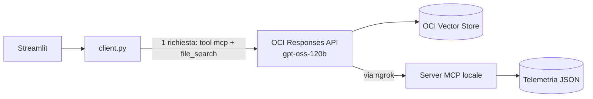

# Struffolihackaton — AI Race Engineer Copilot (versione short)

> Sintesi in 5 minuti. Per i dettagli su codice, prompt e dati vedi `Struffolihackaton_Documentazione.md`.
> Team: **Valerio Bernardi, Alfredo Grande, Samuele De Santis, Luca Gugliotta** — challenge Oracle *Formula Student AI Race Engineer Hackathon*, Tor Vergata.

## 1. Cosa abbiamo fatto

Un **copilota AI per l'ingegnere di pista** della Scuderia Tor Vergata (vettura elettrica STV-E26, gara simulata di 50 giri a Vallelunga). Risponde a due tipi di domande:

- **Gara**: telemetria, usura gomme, strategia pit stop → dati letti da un **server MCP** scritto da noi.
- **Regolamento**: conformità dei componenti sperimentali → testo recuperato da un **OCI Vector Store** (RAG).

Il modello (`openai.gpt-oss-120b` su **OCI Generative AI**) viene chiamato con la **Responses API**, sceglie da solo quali tool usare e dichiara da quale fonte arriva ogni risposta. Il tutto gira in una **web app Streamlit**.

## 2. Perché non è "solo un LLM"

| Problema | LLM da solo | Il nostro sistema |
| :--- | :--- | :--- |
| Dati di gara | Inventati | Letti via MCP, giro per giro |
| Calcoli | Approssimati "a parole" | Deterministici in Python (soglie, previsioni) |
| Regolamento | Conoscenza generica | Testo recuperato e sezione citata |
| Dati mancanti | Risponde lo stesso | "Insufficient information" |
| Tracciabilità | Nessuna | Fonte usata + peso percentuale |

## 3. Architettura



> [!NOTE]
> È **OCI** a chiamare il nostro server MCP, non il nostro PC: per questo il server deve avere un URL pubblico, e senza porte aperte abbiamo usato **ngrok**.

## 4. Tecnologie in una riga

| Tecnologia | Cos'è | Perché la usiamo |
| :--- | :--- | :--- |
| OCI Generative AI | Servizio gestito che ospita LLM, con endpoint compatibile OpenAI | LLM potente senza gestire infrastruttura |
| Responses API | API che gestisce modello + tool in una sola chiamata | Niente ciclo di tool calling scritto a mano |
| MCP | Protocollo standard per esporre tool e dati ai modelli | Dati veri e calcoli affidabili al posto di numeri inventati |
| FastMCP | SDK Python: `@mcp.tool()` genera lo schema da docstring e type hint | Server MCP in poche righe |
| Embedding / Vector Store | Vettori che rappresentano il significato / DB che li indicizza | Ricerca semantica nei documenti |
| RAG + `file_search` | Recupero dei passaggi pertinenti prima di generare | Risposte ancorate al regolamento |
| Chunking | Suddivisione dei documenti (qui 1500 caratteri, overlap 200) | Retrieval più preciso |
| FastAPI / Uvicorn | Framework API / server ASGI | Esporre RAG e MCP via HTTP |
| Streamlit | UI web in Python (riesegue lo script a ogni interazione) | Interfaccia senza frontend |
| ngrok | Tunnel da URL pubblico a porta locale | Rendere il server MCP raggiungibile da OCI |

## 5. I tre task

| Task | Cosa fa | File chiave |
| :--- | :--- | :--- |
| **1 — Server MCP** | 9 tool su telemetria: panoramica, finestra di giri, stato componente, confronto con il modello di usura (soglie 18/10/5 pp), contesto strategico, eventi di race control, replay dello stream + **2 tool aggiuntivi nostri**: `forecast_tyre_life` e `recommend_pit_strategy` | `mcp-server-struffoli.py` |
| **2 — RAG di compliance** | PDF → chunk → Vector Store; API FastAPI `/query` con prompt da "ingegnere conservativo" | `upload_file.py`, `file_search.py`, `chat_bot.py` |
| **3 — Copilot** | MCP + `file_search` nella stessa chiamata; web app con dashboard, grafici, upload PDF, quick actions e chat | `client.py`, `interfaccia.py` |

**Prompt engineering (Task 3).** Il system prompt impone: niente dati inventati, instradamento verso MCP / file_search / entrambi in base alla domanda, dichiarazione obbligatoria della fonte con percentuali, *documentation support score* per le risposte normative, 4 template di risposta (telemetria, compliance, mista, comunicazione).

## 6. La storia nei dati (utile per le demo)

- **Giri 14–15**: safety car.
- **Giri 16–22**: la gomma anteriore sinistra (FL) inizia a degradare in modo anomalo.
- **Giro 23**: gap FL di 18.3 pp sul modello, **soglia critica** superata; pit window `urgent`.
- **Giro 26**: pit stop, M2 → H1. `recommend_pit_strategy` al giro 23 indica una sosta entro il 27: coerente.
- **Giro 34**: bandiera gialla (giro non rappresentativo).
- **Arrivo**: P5, partendo dalla P8.

Componenti del dossier da verificare: **RW-26C** non conforme (corda e sporgenza), **BAT-X9** non conforme (magnesio-litio vietato), **SA-LF-OPT** conforme.

## 7. Come avviarlo

```bash
python3.12 -m venv .venv && source .venv/bin/activate
pip install -r requirements.txt
```

1. `Task1/`: `uvicorn mcp-server-struffoli:app --host 0.0.0.0 --port 8000`
2. `ngrok http 8000` → URL + `/mcp` nella variabile `Struffoli_race_analyzer` dei `.env`
3. `Task2/`: `python upload_file.py` (una volta sola, popola il Vector Store)
4. `Task3/`: `streamlit run interfaccia.py`

> [!WARNING]
> Prima di avviare: copiare la cartella `data/` in `Task1/data/` (il server la cerca lì), e non pubblicare i `.env`, che contengono chiavi API reali.

## 8. Risultati delle demo

| Domanda | Esito |
| :--- | :--- |
| Gomma FL al giro 23, fermarsi? | ✅ Tutti i numeri corretti, sosta consigliata ai giri 24–25 (MCP 100 %) |
| BAT-X9 ammesso? (Task 3) | ✅ Non conforme, sezione 5.3 citata (file_search 100 %) |
| RW-26C conforme? | ✅ Non conforme, scostamenti calcolati correttamente |
| BAT-X9 ammesso? (Task 2) | ⚠️ "Insufficient information": sezione non recuperata |
| SA-LF-OPT conforme? | ⚠️ "Insufficient information", ma sarebbe conforme |
| Post social | ✅ Nessun tool usato, dichiarato correttamente |

Gli errori sono **prudenti**: il sistema non inventa, dichiara che mancano dati. Il limite è nel retrieval, non nel ragionamento.

## 9. Problemi noti e prossimi passi

**Bug principali:** percorso dati del server MCP errato; `stream_live_telemetry` non funziona (nome file sbagliato e variabile usata prima di essere assegnata); nel Task 3 `forecast_tyre_life` manca dai tool ammessi; API del Task 2 e server MCP entrambi sulla porta 8000.

**Sviluppi:** chunking per sezioni del regolamento, memoria di conversazione, test automatici sulle risposte attese, un'unica fonte dati per UI e MCP, server MCP ospitato su OCI con autenticazione.
