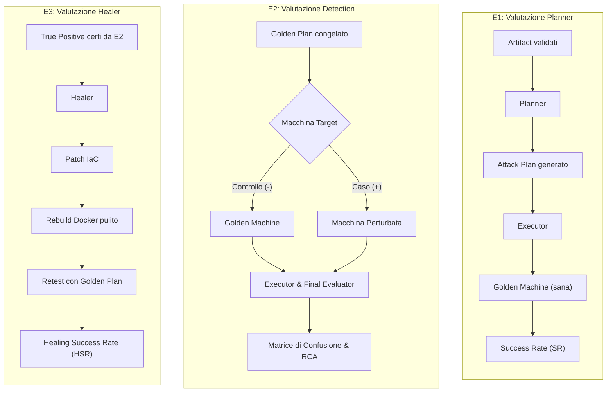

# VulcaTest & VulcaHealing: Metodologia Sperimentale e Benchmark

**Autore:** Luca Gugliotta  
**Oggetto:** Quadro metodologico, tassonomia delle perturbazioni e dimensionamento della campagna sperimentale per la valutazione di VulcaTest e VulcaHealing  

---

## 1. Razionale Scientifico e Obiettivo del Benchmark

La valutazione sperimentale convenzionale di sistemi agentici multi-stadio soffre tipicamente di **confounding causale**: sottoporre l'architettura a sessioni *end-to-end* monolitiche (pianificazione da zero, esecuzione a terminale e autoriparazione su un guasto non isolato) rende impossibile attribuire con certezza l'origine di un fallimento. Non si può discriminare se l'arresto sia dovuto a un'allucinazione del Planner, a un'ambiguità nell'oracolo, all'instabilità stocastica dell'Executor o all'incapacità dell'Healer.

Per garantire validità scientifica, interpretabilità diagnostica e riproducibilità, la campagna sperimentale adotta un principio metodologico rigoroso:

> **Qualificare e congelare preventivamente un terreno di verità empirico (Golden State e Golden Plan), per poi valutare in isolamento la generazione del piano (E1), la capacità di rilevazione dei guasti (E2) e l'efficacia dell'autoriparazione (E3).**

---

## 2. E0 — Qualificazione del Ground Truth

La fase E0 è preliminare alla campagna quantitativa e definisce le costanti di controllo sperimentali:

* **Golden Machine:** la versione del manifest IaC in VulcaForge verificata, stabile e pienamente conforme alla specifica didattica (*intended path*). Prima di ogni singola run di test o retest, l'ambiente viene resettato allo stato Golden (*clean slate* via Docker reset/rebuild senza cache).
* **Golden Plan:** il piano d'attacco validato empiricamente attraverso **tre esecuzioni consecutive con esito `COMPLETED` (senza fallimenti bloccanti) sulla rispettiva Golden Machine**. Il Golden Plan funge da oracolo operativo invariante per azzerare la variabilità del Planner nelle fasi successive.

---

## 3. Disegno Sperimentale e Metriche Formali (E1, E2, E3)

### E1 — Valutazione del Planner
* **Domanda di ricerca:** Con artifact documentali preventivamente curati e una macchina nota come corretta (Golden Machine), con quale frequenza il Planner genera un Attack Plan operativo e compatibile con l'Executor?
* **Configurazione:** Macchina Golden priva di perturbazioni. Piano generato da zero a partire da `description`, `storyline` e writeup validati in E0.
* **Assunzione di contratto:** L'Executor non deve interpretare euristicamente istruzioni vaghe per "salvare" un piano difettoso; se il piano prodotto è ambiguo, invalido o privo di evidenze concrete, il fallimento è attribuito interamente al Planner.
* **Metrica primaria:**
  $$SR_{Planner} = \frac{\text{Run con esito COMPLETED senza ticket}}{\text{Run totali}}$$
* **Dimensionamento:** Tutte le 11 macchine del progetto $\times$ 3 ripetizioni = **33 run** (~11–12 ore).

### E2 — Valutazione della Capacità di Rilevazione (Detection)
* **Domanda di ricerca:** Dato un Attack Plan validato e congelato (Golden Plan), con quale accuratezza VulcaTest distingue una macchina conforme da una contenente una perturbazione nota?
* **Configurazione:** La variabilità stocastica del Planner viene azzerata passando il Golden Plan tramite parametro CLI (`--plan`). L'esperimento valuta congiuntamente l'Executor (nel rilevare l'anomalia empirica a terminale) e il Final Evaluator (nel formalizzare la diagnosi).
* **Condizioni di controllo:**
  1. *Controllo Negativo (Clean run):* `Golden Plan` eseguito su `Golden Machine`. Esito atteso: `COMPLETED`, nessun ticket emesso.
  2. *Caso Perturbato:* `Golden Plan` eseguito su `Perturbed Machine`. Esito atteso: `FAILED`, emissione di ticket descrittivo del guasto.
* **Metriche di classificazione:**
  * Matrice di confusione binaria: **True Positive (TP)**, **False Negative (FN)**, **False Positive (FP)**, **True Negative (TN)**.
  * $\text{Recall (Sensitivity / TPR)} = \frac{TP}{TP + FN}$
  * $\text{Specificity (TNR)} = \frac{TN}{TN + FP}$
  * $\text{Precision (PPV)} = \frac{TP}{TP + FP}$
  * $F_1\text{-Score} = 2 \cdot \frac{\text{Precision} \cdot \text{Recall}}{\text{Precision} + \text{Recall}}$
  * **Accuratezza Diagnostica (RCA):** verifica della corretta corrispondenza dell'enum `defect_type` formalizzato nel ticket rispetto al guasto effettivamente iniettato.
* **Dimensionamento:** 8 macchine core $\times$ 15 perturbazioni $\times$ 3 repliche (45 run perturbate) + 8 controlli sani $\times$ 3 repliche (24 run clean) = **69 run** (~18–21 ore).

### E3 — Valutazione dell'Autoriparazione (Self-Healing)
* **Domanda di ricerca:** A fronte di una non conformità reale correttamente rilevata e diagnosticata, con quale frequenza il modulo di autoriparazione riesce a ripristinare la funzionalità dello scenario senza alterare gli invarianti didattici?
* **Criterio di ammissione rigoroso:** La fase E3 viene eseguita **esclusivamente sui True Positive certi provenienti da E2**. Non vengono inoltrati all'Healer falsi positivi né difetti non rilevati (FN).
* **Ciclo operativo a loop chiuso:**
  1. L'Healer esamina il ticket di anomalia e il manifest IaC (`vulcaforge/`);
  2. L'Healer applica la modifica al manifest IaC;
  3. La macchina viene interamente ricostruita (*clean build* senza cache e ridistribuzione del container);
  4. Viene rieseguito lo **stesso Golden Plan** impiegato in E2;
  5. Si verifica se lo scenario termina con esito `COMPLETED` senza recidive del guasto.
* **Metriche primarie:**
  $$HSR = \frac{\text{True Positive correttamente risolti post-retest}}{\text{True Positive totali sottoposti all'Healer}}$$
  Si registrano inoltre il tasso di successo al primo tentativo ($HSR_1$) e i tentativi medi di riparazione ($\text{MeanHealingAttempts}$).
* **Dimensionamento massimo:** $\le 45$ casi (fino a 45 run di retest, ~12–14 ore oltre a build e inferenza).

---

## 4. Tassonomia delle Perturbazioni Meccaniche (P1, P2, P3)

Le perturbazioni del core benchmark non si limitano a variazioni di permessi sul filesystem, ma coprono **cinque distinte categorie operative di disallineamento** iniettate direttamente nel codice IaC (`machines/<slug>.yaml`) prima della generazione del container Docker:

| # | Tipologia di Disallineamento | Classe | Manifestazione a Runtime | Esempi Concreti nel Benchmark |
|:--:|---|:---:|---|---|
| **1** | **Componenti e Risorse Mancanti** | **P1** | Errore immediato e bloccante (`404`, file o utente assente) | *Pizzeria* (deploy app assente), *GitPoison* (`.git` mancante), *Citadel* (utente `sysadmin` assente) |
| **2** | **Configurazioni Rete, Vhost e DNS** | **P1** | Risposta predefinita del server o record DNS assenti | *AuthGate* (vhost Nginx errato), *NetVault* (zona DNS AXFR mancante), *DataVault* (docroot errata) |
| **3** | **Valori, Credenziali e Chiavi** | **P2** | Silenzioso allo step (`exit 0`); errore differito a valle (`Auth failure`) | *Pizzeria* (password disallineata), *CryptoVault* (chiave `.key` alterata), *TunnelGate* (hash errato), *ConsoleGate* (token TCP errato) |
| **4** | **Runtime degli Interpreti** | **P2** | Upload riuscito, ma blocco semantico dell'esecuzione payload | *DataVault* e *WebMaster* (estensioni PHP bloccate da direttiva PHP-FPM mancante) |
| **5** | **Permessi e Gruppi Indebiti** | **P3** | Rilevabile da **controlli negativi** (scorciatoia didattica non prevista) | *GitPoison* e *PrivAudit* (`root.txt` `0644`), *Citadel* (script `0777`), *TunnelGate* (utente in gruppo `shadow`) |

### Le Categorie Operative nel Dettaglio

1. **Componenti e Risorse Mancanti (P1 — Blocco additivo):**
   * *Natura:* Il playbook IaC omette il deployment di un file o la creazione di un'utenza essenziale.
   * *Sintomo:* Errore immediato e bloccante a runtime (`404 Not Found`, comando o utente non trovato).
   * *Esempi:* Rimozione del deploy dell'applicazione web in *Pizzeria* (`P1-01`), rimozione della directory vulnerabile `.git` in *GitPoison* (`P1-14`), rimozione dell'utente di sistema `sysadmin` in *Citadel* (`P1-10`).

2. **Configurazioni di Rete, Virtual Host e DNS (P1 — Blocco additivo):**
   * *Natura:* Il servizio è in esecuzione, ma la configurazione del demone di rete è disallineata rispetto al percorso atteso.
   * *Sintomo:* Risposta predefinita del web server o assenza di record di rete.
   * *Esempi:* Vhost Nginx malconfigurato che serve la pagina di default anziché il portale in *AuthGate* (`P1-03`), rimozione della zona di trasferimento DNS AXFR in BIND per *NetVault* (`P1-16`), alterazione della document root Nginx in *DataVault* (`P1-04`).

3. **Credenziali, Token e Chiavi Disallineate (P2 — Guasto silenzioso differito):**
   * *Natura:* Tutti i componenti sono presenti ed eseguibili con exit code `0`, ma il dato letterale memorizzato o estratto non coincide con quello atteso dal servizio bersaglio.
   * *Sintomo:* Nessun errore durante la fase di estrazione; fallimento differito allo step dipendente successivo (`Authentication failure`).
   * *Esempi:* Password nello script di manutenzione disallineata rispetto all'utente in *Pizzeria* (`P2-04`), chiave di decodifica alterata di un singolo carattere in *CryptoVault* (`P2-03`), hash nel backup non corrispondente alla password reale in *TunnelGate* (`P2-07`), token del socket TCP alterato in *ConsoleGate* (`P2-06`).

4. **Configurazioni di Runtime degli Interpreti (P2 — Semantica di esecuzione):**
   * *Natura:* L'ambiente applicativo accetta il file caricato, ma l'interprete a monte blocca l'esecuzione semantica.
   * *Sintomo:* Upload completato con successo ma mancata esecuzione del payload.
   * *Esempi:* Disabilitazione dell'estensione multifile in PHP-FPM (`php-fpm-allow-extensions`) in *DataVault* (`P2-02`) e *WebMaster* (`P2-08`), che impedisce l'attivazione della webshell.

5. **Permessi Indebiti, Gruppi e Scorciatoie Didattiche (P3 — Hardening sottrattivo):**
   * *Natura:* La macchina è pienamente risolvibile ma eccessivamente permissiva, consentendo scorciatoie che scavalcherebbero il percorso formativo previsto.
   * *Sintomo:* Rilevabile unicamente mediante **controlli negativi di conformità didattica** (se un comando che dovrebbe fallire per un utente non privilegiato ha successo, la macchina è non conforme).
   * *Esempi:* Permessi `0644` anziché `0400` sulla flag `root.txt` in *GitPoison* (`P3-08`) e *PrivAudit* (`P3-04`), script sensibile reso world-writable `0777` in *Citadel* (`P3-02`), assegnazione indebita dell'utente `trainee` al gruppo `shadow` in *TunnelGate* (`P3-07`).

### Tassonomia Causale e Risposta dell'Healer

| Classe | Denominazione | Natura Meccanica | Sintomo a Runtime | Azione Attesa Healer |
|:--:|---|---|---|---|
| **P1** | **Blocco** *(Under-provisioning)* | Rimozione di componente, file, utente, vhost o zona DNS. | Errore esplicito e bloccante immediato (`404`, `502`, `Permission Denied`, `command not found`). | **Additiva:** reintroduce la risorsa, il task o la direttiva mancante nel manifest IaC. |
| **P2** | **Valore** *(Mis-provisioning)* | Componente presente ma dato alterato (credenziale, chiave, hash, token, flag interprete). | **Silenzioso a breve:** comando estrazione dà exit code `0`; errore differito al comando successivo (`Authentication failure`). | **Allineamento:** corregge il valore letterale disallineato senza alterare la struttura del codice. |
| **P3** | **Hardening** *(Over-provisioning)* | Configurazione troppo permissiva che apre scorciatoie rispetto al percorso didattico. | Intercettato da **controlli negativi di conformità** in checklist (se il comando proibito riesce, il check fallisce). | **Sottrattiva:** restringe permessi o revoca privilegi/gruppi spuri. |

> **Invarianti didattici:** Le vulnerabilità intenzionali previste dal percorso didattico (es. script periodico scrivibile per il privesc o permessi `0666` su `/etc/passwd`) non costituiscono guasti P3 e non devono mai essere modificate dall'Healer.

---

## 5. Composizione del Core Benchmark (8 Macchine, 15 Perturbazioni)

Il sottoinsieme principale adottato per le valutazioni quantitative E2 ed E3 comprende **8 macchine eterogenee** che ospitano complessivamente **15 perturbazioni meccaniche** (6 P1, 4 P2, 5 P3):

| # | Macchina | Dominio Tecnologico & Pattern di Attacco | P1 | P2 | P3 | Tot |
|:--:|---|---|:---:|:---:|:---:|:---:|
| 1 | **Pizzeria** | Web PHP / Nginx / Credential Hunting / GTFOBins Nano | P1-01 *(404 app)* | P2-04 *(password)* | — | 2 |
| 2 | **AuthGate** | Nginx / OpenSSH / Key abuse chmod 600 / GTFOBins Vi | P1-03 *(vhost)* | — | — | 1 |
| 3 | **Citadel** | Web LAMP / SQLi / Cronjob 0777 / SUID PATH Hijack | P1-10 *(utente)* | — | P3-02 *(permessi file)* | 2 |
| 4 | **CryptoVault** | SSH / Local Script Decrypt / SUID Tar wildcard | — | P2-03 *(chiave)* | P3-03 *(ownership file)* | 2 |
| 5 | **ConsoleGate** | Raw TCP Socket (nc) / Cronjob / Python Module Hijack | P1-13 *(permessi dir)* | P2-06 *(token demone)* | — | 2 |
| 6 | **NetVault** | BIND DNS AXFR / 7z John / Writable /etc/passwd | P1-16 *(zona DNS)* | — | P3-06 *(zona spuria)* | 2 |
| 7 | **GitPoison** | Exposed .git / Hydra form brute-force / Log Poisoning | P1-14 *(leak .git)* | — | P3-08 *(root.txt lasco)* | 2 |
| 8 | **TunnelGate** | SSH Local Port Forwarding / Unshadow / Gruppo Shadow | — | P2-07 *(hash backup)* | P3-07 *(gruppo shadow)* | 2 |
| **TOT** | | | **6** | **4** | **5** | **15** |

---

## 6. Elementi Esclusi dal Benchmark Quantitativo e Motivazioni

### Perturbazioni di Classe P4 (Difetti di Specifica / Oracolo)
* **Natura del problema:** Nelle perturbazioni P4 la macchina è integra, corretta e pienamente funzionante; la discrepanza nasce da una richiesta errata introdotta nella specifica didattica o nella checklist dell'oracolo (es. imposizione di comandi contrari ai protocolli di sicurezza standard di OpenSSH).
* **Comportamento atteso:** L'agente **non deve alterare la macchina** (modificare il software per compiacere una specifica difettosa danneggerebbe un sistema legittimo). L'azione corretta è l'emissione della diagnosi `SPECIFICATION_DEFECT` e un **rifiuto motivato di intervento (*Decline / No patch*)**, demandando la correzione della documentazione all'istruttore umano (*Human-in-the-Loop*).
* **Collocazione nello studio:** La classe P4 non produce file `.patch` sul codice IaC (`patch: n/a`). Per preservare la purezza della metrica di riparazione del codice ($HSR$), P4 è esclusa dal testbench quantitativo batch e analizzata come **studio qualitativo del discernimento causale e del rifiuto di intervento**.

### Le 3 Macchine Opzionali (DataVault, WebMaster, PrivAudit)
* **Motivazione del perimetro:** Eseguire E2 ed E3 sull'intero catalogo di 11 macchine avrebbe comportato oltre 75 ore di calcolo continuative su singolo host. Il nucleo di 8 macchine core copre già in modo esaustivo l'intero spettro tassonomico delle vulnerabilità.
* **Ruolo nel piano:** Le 3 macchine escluse da E2/E3 sono regolarmente integrate nella **fase E1** (valutazione generativa del Planner su tutte le 11 macchine, 33 run totali). Le loro 6 perturbazioni (P1-04, P2-02, P1-08, P2-08, P2-05, P3-04) sono già interamente codificate con relative patch nel repository, costituendo un'estensione opzionale immediatamente attivabile.

---

## 7. Dimensionamento della Campagna e Budget Temporale

| Fase Sperimentale | Configurazione / Target | Numero Run | Durata Media / Run | Stima Oraria Totale |
|---|---|:---:|:---:|:---:|
| **E1 — Planner** | 11 macchine sane $\times$ 3 run | 33 | 20–22 min | ~11.0–12.1 h |
| **E2 — Detection** | 15 perturbazioni $\times$ 3 run + 8 clean $\times$ 3 run | 69 | 16–18 min | ~18.4–20.7 h |
| **E3 — Healing** | $\le 45$ True Positive $\times$ 1 retest | $\le 45$ | 16–18 min (+ build) | $\ge 12.0–13.5$ h |
| **TOTALE CAMPAGNA** | **E1 + E2 + E3** | **$\le 147$** | — | **~45–50 ore effettive** |

La stima include i tempi necessari per il reset deterministico dei container Docker, la ricompilazione delle immagini senza cache e l'esecuzione dei controlli a terminale.

---

## 8. Protocollo di Tracciamento Dati

Ogni esecuzione viene registrata in maniera deterministica e atomica nel dataset strutturato (`ledger.jsonl` e `per_run.csv`), monitorando per ogni run:
* Tracciamento identificativi (`machine_id`, git commit baseline, hash sha256 del piano congelato, run progressiva);
* Tipologia di condizione (`experiment_id`, `perturbation_id`, classe tassonomica P1–P3);
* Esiti di classificazione (`ticket_generated`, classificazione in matrice TP/FP/TN/FN);
* Accuratezza diagnostica (coerenza tra `diagnosis_expected` e `diagnosis_observed`);
* Esiti di healing (`healing_called`, numero tentativi, esito del retest, percorsi dei report e diff unificate);
* Risorse computazionali (token di input/output aggregati per ruolo ed `execution_time_seconds`).
